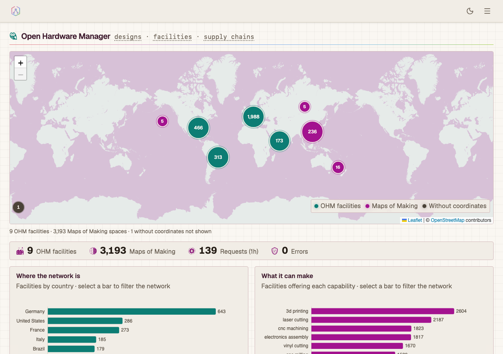
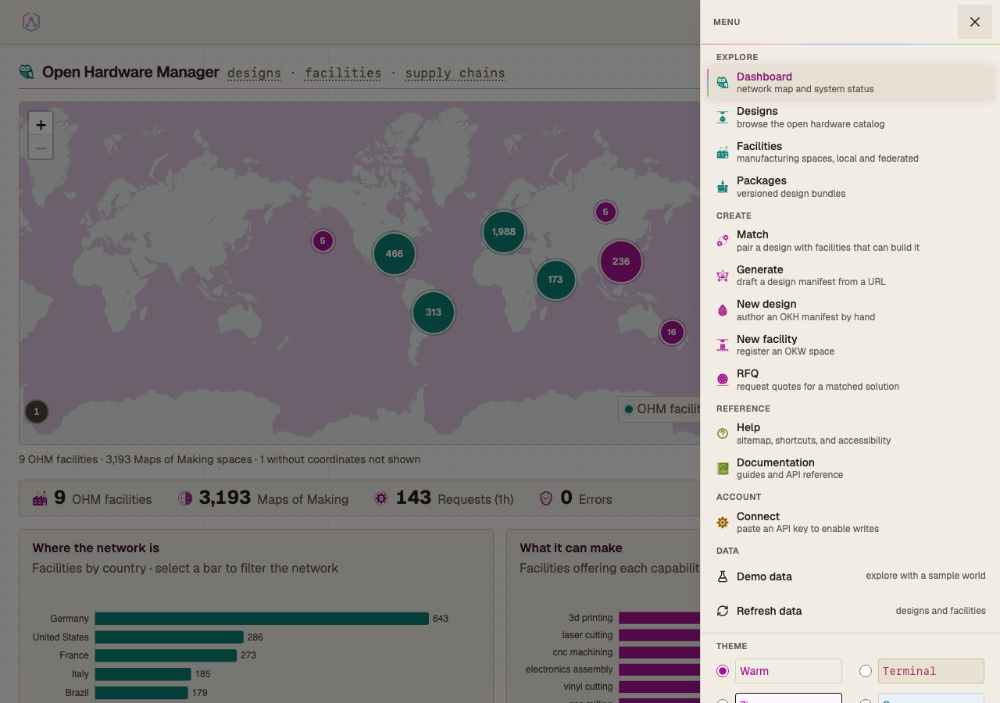
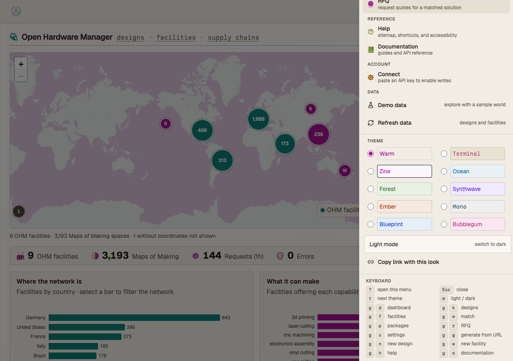
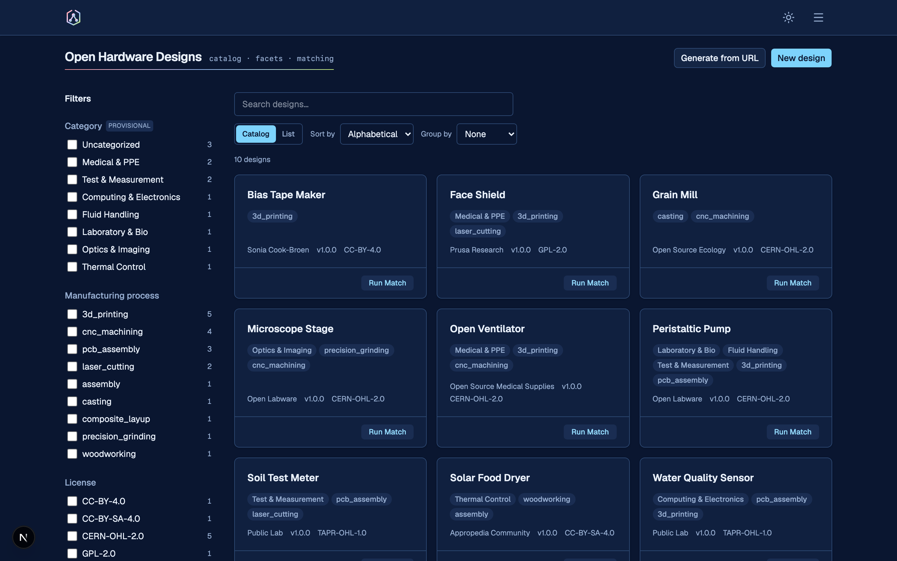
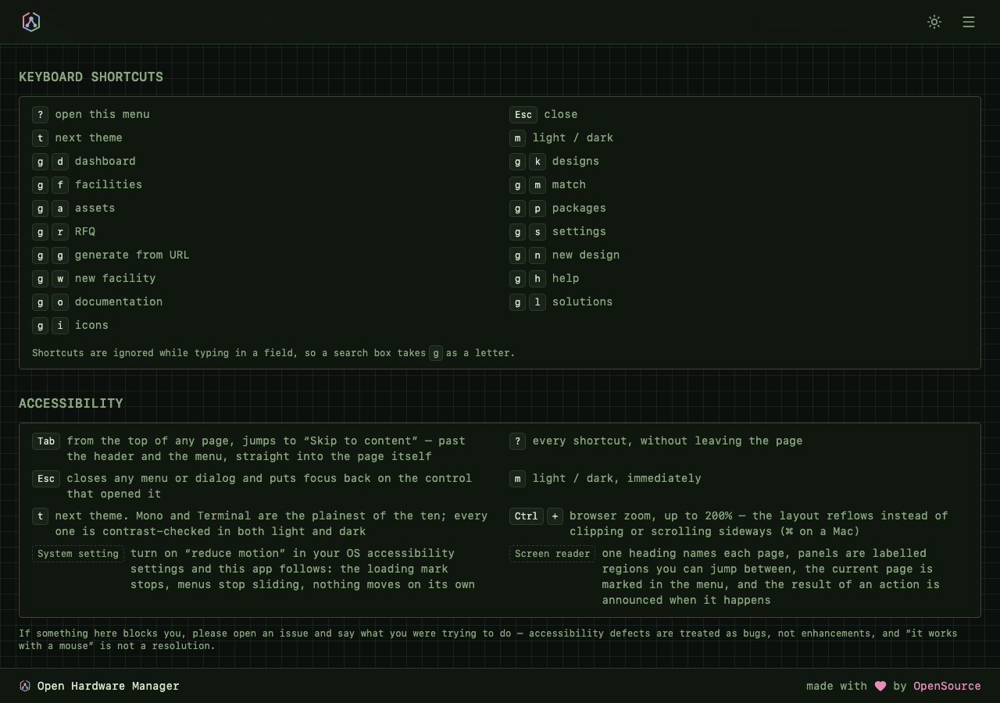
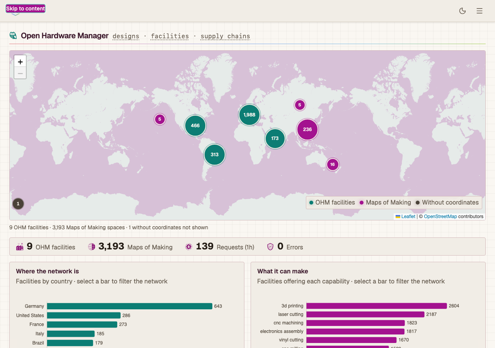
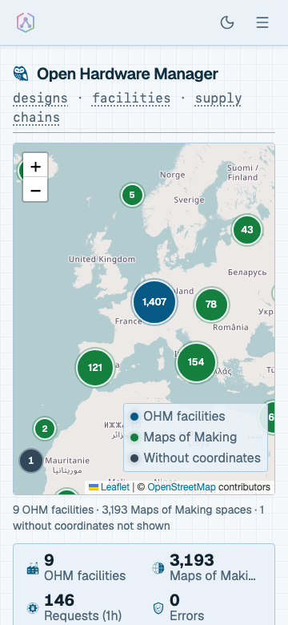

# Open Hardware Manager (OHM)

Open hardware has a licensing story and a publishing story. What it does not have
is a manufacturing story.

A design is released under an open licence. The files are online. Anyone is
legally free to build it. And then, in practice, almost nobody does — because
finding someone who *can* build it is a research project every single time.

Inside a closed supply chain, that question is easy: one organisation owns the
designs, the formats, and the system of record. Open hardware has no owner and
no shared format. Designs are scattered across repositories, wikis, and PDFs;
workshops that could build them are scattered too. So the most basic question
in the field — *who can make this?* — has gone largely unanswered for years.

**OHM is an attempt to answer it.** It holds structured records of open hardware
designs and of real production facilities, works out which facilities can build
a given design, and hands you what you need to go ask them. It is not a
marketplace or a broker — the conversation that follows is between you and the
workshop.

Most of the work is not the matching. It is **normalisation**: absorbing
heterogeneous design and facility data into a form that can be reasoned about,
rather than demanding that the world adopt one format first. Everyday use is
also what makes mutual aid possible under pressure — in a crisis there is no
time to build this network from scratch.

The hosted instance at [openhardwaremanager.org](https://www.openhardwaremanager.org)
is a convenience, not the product. OHM is open-source software you can run
yourself.

**Read more:** [What is OHM?](docs-site/docs/about/what-is-ohm.md) ·
[The problem](docs-site/docs/about/the-problem.md) ·
[Docs site](https://www.openhardwaremanager.org/docs/)

---

## The interface

**Live demo: [supply-graph-ai.thetechmargin.com](https://supply-graph-ai.thetechmargin.com/)**



The frontend is a Next.js App Router application that ships with the API and
serves its own UI. It is built to be driven by keyboard alone, at 360px wide, in
light or dark, and in any of ten colour themes. Each of those is a gate in CI
rather than a claim: **542 unit tests** and **160 Playwright E2E specs**,
including a twenty-variant accessibility matrix and a narrow-viewport lane that
measures every route at 360px and 768px.

Every route is reachable from one hamburger sitemap, grouped by purpose, each
entry carrying a role line rather than a bare label. Adding a page requires
deciding nothing about its chrome.



### Themes

Ten themes x light/dark — twenty palettes behind shadcn's token names, so
components re-theme without being edited. Colour is defined in one token file; a
unit test fails the build on a raw hex or a hardcoded Tailwind shade anywhere
else.



Each row in the picker is drawn in its own theme's ink on its own theme's
ground, resolved from the live tokens rather than from a second copy of the
palette that would be free to drift.

| | |
|---|---|
|  |  |
| The dashboard in Synthwave dark | The design catalog in Blueprint dark |

Data surfaces read the same tokens. The Leaflet map, the cytoscape supply-tree
graph, and the ECharts charts resolve their colours from the live token layer
instead of carrying private palettes. OpenStreetMap's raster tiles arrive from
their server already painted, so the token layer cannot reach them the way it
reaches the rest of the page; a filter chain computed from the active theme's
accent rotates them onto its hue instead, leaving land and water separated by
lightness rather than flattening the tile to one wash.

Theme and mode ride in the query string, as do filters, view mode, sort,
grouping, and page, so a copied URL reopens what the sender was looking at.

### Keyboard

Every route in the menu has a shortcut, and the reference is generated from the
same constants the key handler reads — a shortcut that works but is undocumented
fails a unit test.



| Keys | Action |
|---|---|
| `?` | open the menu, with the full reference |
| `Esc` | close any menu or dialog, returning focus to the control that opened it |
| `t` / `m` | next theme / light-dark |
| `g` then `d` `k` `f` `m` `p` `r` `s` | dashboard, designs, facilities, match, packages, RFQ, settings |
| `g` then `g` `n` `w` `h` `o` | generate from URL, new design, new facility, help, documentation |

Shortcuts are ignored while typing in a field or a contenteditable editor, so a
search box takes `g` as a letter and the JSON editor takes `t` as one.

### Accessibility

An axe scan covers all twenty theme variants in CI, reading token values
resolved from the live page rather than numbers copied into a test — so adding a
theme extends the matrix without editing it. Four feature journeys carry their
own scans. Colours a DOM scanner cannot see, such as chart axis labels drawn on
a canvas and the theme picker's own names, are solved against the surface they
land on.



One header, sitemap drawer, and footer serve every route, with focus trapping,
`aria-current`, skip-to-content, 44px targets, and animation behind
`prefers-reduced-motion`. `/help` documents the accessibility contract next to
the keyboard one, both generated from the source the app uses.

### Responsive

The narrow lane runs every route at 360px and 768px and asserts two properties
measured from the live layout: nothing overflows the viewport horizontally, and
interactive controls meet the WCAG 2.5.8 target size. It runs a narrow desktop
window rather than device emulation deliberately — Chrome's mobile emulation
applies Android form-control metrics that round undersized controls up past the
minimum, hiding the defect the lane exists to catch.



The map frames where the network is dense instead of fitting a whole world that
will not fit; one-finger swipes scroll the page while two fingers move the map;
charts drop the axis furniture a narrow screen only crowds.

### Consistency and failure

- **One spelling per control.** Fields, panels, and heading roles come from
  shared constants, enforced by unit tests that read the source.
- **One vocabulary for failures.** Every error — a dead connection, a rate
  limit, a record that is gone — becomes a title, a sentence, and whether
  retrying could help, so the same fault reads the same in a panel, a toast, and
  the catch-all error page. An unknown address returns a real 404 with the
  sitemap on it; a thrown render lands on a page that keeps the app's chrome.
- **A deterministic demo dataset** (`make seed-demo`) — ten designs and seven
  facilities covering the golden path, with content-derived ids so deep links
  survive reseeding. The **Demo data** chip in the header is derived from the
  records themselves rather than a build flag.
- **Loading states draw the product's logo** from the same geometry the favicon
  is generated from.

The images above are captured, not curated: `npx playwright test
--project=assets` regenerates all eight from the mocked fixture world, so a
README that no longer matches the interface is a one-command fix rather than a
screenshot session.

**Two independent ways to get a demo world, both optional:**

*As a visitor* — open the sitemap and switch on **Demo data**. The app swaps its
data source to a bundled sample world, needs no backend at all, and switches
back the same way. It is a source swap at the fetch boundary, not a mode the
components know about, so everything you see runs the same code path real data
does.

*As an operator* — seed the records server-side:

```bash
make seed-demo   # then restart the API — list responses are cached for an hour
```

---

## Software

OHM exposes a FastAPI HTTP API that can be run locally via Docker Compose, from a
[published Docker image](https://hub.docker.com/r/touchthesun/openhardwaremanager),
or deployed using the configurations in `deploy/`. A reference frontend ships in
`frontend/`.

**Current release:** `0.10.7` — see [CHANGELOG.md](CHANGELOG.md) and [Release process](docs/RELEASE.md).

## Quick Start for New Users

### Prerequisites

| Tool | Purpose | Install |
|------|---------|---------|
| **Git** | Clone the repository | https://git-scm.com/downloads |
| **Docker Desktop** | Run the API server | https://www.docker.com/products/docker-desktop/ |
| **uv** | Python env + CLI (local dev) | `curl -LsSf https://astral.sh/uv/install.sh \| sh` or `brew install uv` |
| **Node.js ≥ 18** | Reference frontend | https://nodejs.org/ |

> Docker Desktop is sufficient if you only want to run the API. Install `uv` when you need the `ohm` CLI, to run tests, or to work on Python code.

After installing, open a new terminal so the tools are on your PATH.

### Option A: Published Docker image (fastest — no clone required)

**Local storage (no credentials needed):**

```bash
docker pull touchthesun/openhardwaremanager:0.10.7
docker run -p 8001:8001 \
  -e STORAGE_PROVIDER=local \
  -e LLM_ENABLED=false \
  touchthesun/openhardwaremanager:0.10.7
```

**Remote storage (Azure Blob, AWS S3, or GCS):**

The published image does not include a `.env` file — you must pass your storage credentials at runtime. The simplest way is `--env-file`:

```bash
# Copy the template, fill in your provider and credentials, then:
docker run -p 8001:8001 \
  --env-file .env \
  touchthesun/openhardwaremanager:0.10.7
```

The minimum `.env` keys for Azure Blob are:

```
STORAGE_PROVIDER=azure_blob
AZURE_STORAGE_ACCOUNT=<your-account-name>
AZURE_STORAGE_KEY=<your-account-key>
AZURE_STORAGE_CONTAINER=<your-container-name>
```

See [Container / self-host guide](docs-site/docs/guides/run-your-own-node.md) and `.env.example` for storage env vars (Azure, AWS S3, GCS).

> **How configuration resolves.** Non-secret defaults (storage provider / account
> / container, `OKW_SOURCE`, CORS) are checked in per environment under
> `config/environments/<ENVIRONMENT>.toml` and selected by `ENVIRONMENT`; anything
> you pass as an env var (or in `.env`) overrides them. Secrets — `AZURE_STORAGE_KEY`,
> `API_KEYS`, `LLM_*` — are never in those files (use `.env` or an Azure `secretRef`).
> In `production` the app hard-fails on missing/invalid storage config, and `/health`
> reports the resolved storage target + object counts. See `.env.example` and
> [run your own node](docs-site/docs/guides/run-your-own-node.md).

The API is at `http://localhost:8001`. Docs: `http://localhost:8001/v1/docs`. Check version: `curl -s http://localhost:8001/health`.

Images support **linux/amd64** and **linux/arm64** (Apple Silicon and x86-64). Federation is **disabled by default**. Enable with `-e OHM_FEDERATION_ENABLED=true` only when you intend to run peer sync (see [federation infra](docs/ops/federation-infra.md)).

### Option B: API server from source (Docker Compose)

```bash
# 1. Clone
git clone https://github.com/helpfulengineering/supply-graph-ai.git
cd supply-graph-ai

# 2. Create your environment file (defaults work for local development)
cp .env.example .env

# 3. Build and start the API
docker compose up ohm-api
```

The API is now available at `http://localhost:8001`. Interactive API docs are at `http://localhost:8001/v1/docs`.

### Option C: Local development with uv (CLI + tests + scripts)

`uv` manages both the Python version and the virtual environment — no separate Python installation or conda is needed.

```bash
# 1. Clone
git clone https://github.com/helpfulengineering/supply-graph-ai.git
cd supply-graph-ai

# 2. Create your environment file
cp .env.example .env

# 3. Provision the environment (one step)
make setup

# 4. Activate the virtual environment
source .venv/bin/activate          # macOS / Linux
# .venv\Scripts\activate           # Windows

# 5. Verify the CLI is available
ohm --help

# 6. Start the API server
docker compose up -d ohm-api
```

`make setup` creates `.venv`, installs **all** dependencies (runtime + dev tools
for tests, so `uv run pytest` uses this venv rather than a foreign interpreter on
`PATH`), **including the spaCy NLP model** `en_core_web_md` — which is pinned in
`uv.lock`, so you never install it by hand. It then verifies the environment is
fully online, and is safe to re-run any time to repair or refresh it.

You can also run one-off commands without activating the venv:

```bash
uv run ohm system health
uv run pytest tests -m unit
```

### Helpful Docker commands

```bash
# Start in the background
docker compose up -d ohm-api

# Tail logs
docker compose logs -f ohm-api

# Rebuild after Python source changes
docker compose up --build ohm-api

# Stop everything
docker compose down
```

### Reference demo frontend (optional)

The repository includes a Next.js App Router reference UI under `frontend/` — the interface shown above. It provides a browser-based interface for browsing OKH designs, running matches, and visualising supply-chain solutions.

**Step 1 — start the API** (must be running before the frontend is useful):

```bash
docker compose up -d ohm-api
```

**Step 2 — start the frontend dev server** (requires Node.js ≥ 18):

```bash
cd frontend
npm install   # first time only — installs JS dependencies
npm run dev
```

Open the URL Next prints (`http://localhost:5173`).

The dev server proxies all `/v1` requests to the OHM API. If your API is not at the default `http://localhost:8001`, copy `frontend/.env.example` to `frontend/.env` and set `OHM_API_BASE_URL` accordingly.

> **Hot-reload:** The frontend picks up TypeScript/CSS changes automatically while `npm run dev` is running. Python backend changes require rebuilding and restarting the Docker container (`docker compose up --build ohm-api`).

## Documentation

This README provides a quick start guide and basic project information. For full documentation, run MkDocs locally.

### Building Documentation Locally

The OHM documentation is built using [MkDocs](https://www.mkdocs.org/).

```bash
# Install docs dependencies (MkDocs + plugins) into the project venv
uv sync --extra docs

# Serve with live reload
uv run mkdocs serve
```

Open your browser to `http://localhost:8000/`.

> Port 8000 is the MkDocs server. The API server runs on port 8001.

### Documentation Structure

Our documentation covers:

- **Architecture Guide**: System design, components, and data flow
  - System architecture overview
  - Data flow diagrams
  - Component interactions
  - Validation and matching pipelines

- **Domain Implementations**:
  - Manufacturing domain (OKH/OKW matching)
  - Cooking domain (Recipe/Kitchen matching)
  - Domain extension guidelines

- **API Reference**:
  - RESTful API endpoints
  - Authentication
  - Request/Response formats
  - Usage examples

- **Developer Guide**:
  - Setup and installation
  - Contributing guidelines
  - Testing procedures
  - Best practices


## Project Structure

```markdown
supply-graph-ai/
├── docs/                   # Documentation files (MkDocs)
├── deploy/                 # Cloud agnostic deployment
├── scripts/                # Utility scripts for dev & testing
├── src/                    # Source code
│   ├── core/               # Core framework components
│   │   ├── api/            # API endpoints
│   │   ├── domains/        # Domain implementations
│   │   ├── errors/         # Centralized error handling
│   │   ├── generation/     # Create OKH from external project
│   │   ├── llm/            # LLM service and provider abstraction layer
│   │   ├── matching/       # Matching Rules Manager
│   │   ├── models/         # Data models
│   │   ├── packaging/      # Service for building and storing OKH Packages
│   │   ├── registry/       # Domain registry
│   │   ├── services/       # Core services
│   │   ├── storage/        # Storage service for remote file mgmt
│   │   ├── utils/          # Utility functions
│   │   └── validation/     # Validation Engine
│   ├── cli/                # Command Line Interface
│   └── config/             # Config management
├── synth/                  # synthetic data for development, remove in prod
├── tests/                  # Test files for development
├── mkdocs.yml              # Documentation configuration
├── bin/                    # Development entrypoint scripts
│   └── ohm                 # Development CLI entrypoint (fallback)
├── pyproject.toml          # Package metadata and dependencies
├── uv.lock                 # Locked dependency versions (managed by uv)
└── docker-compose.yml      # Local service orchestration
```

## Running the Application

### API server (Docker)

```bash
# Start (or rebuild) the API server
docker compose up --build ohm-api

# API base URL:      http://localhost:8001
# Interactive docs:  http://localhost:8001/v1/docs
```

### CLI commands (requires uv setup from Option C above)

```bash
# Health check
ohm system health

# Or without activating the venv
uv run ohm system health
```

For container / self-host guidance, see [run your own node](docs-site/docs/guides/run-your-own-node.md).
