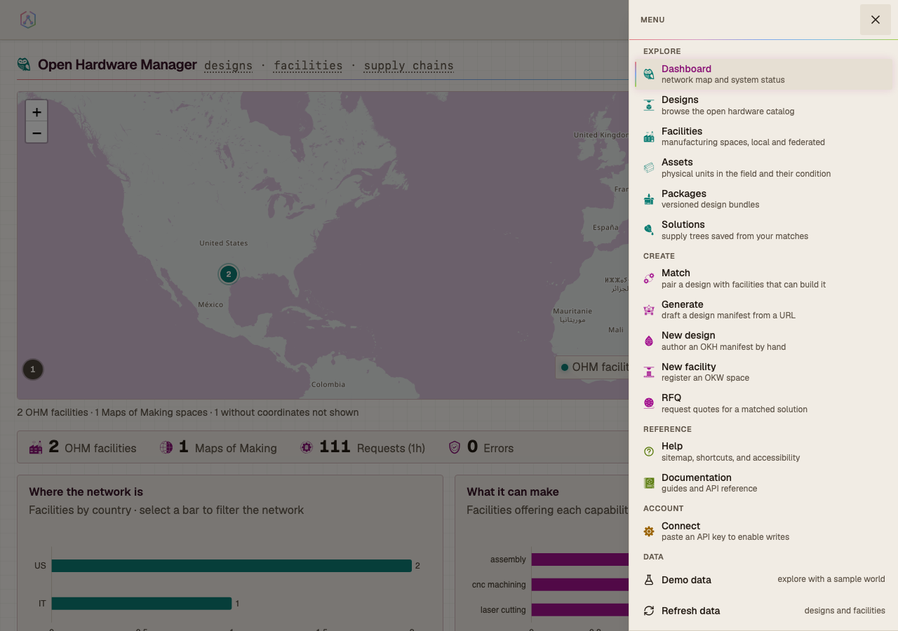
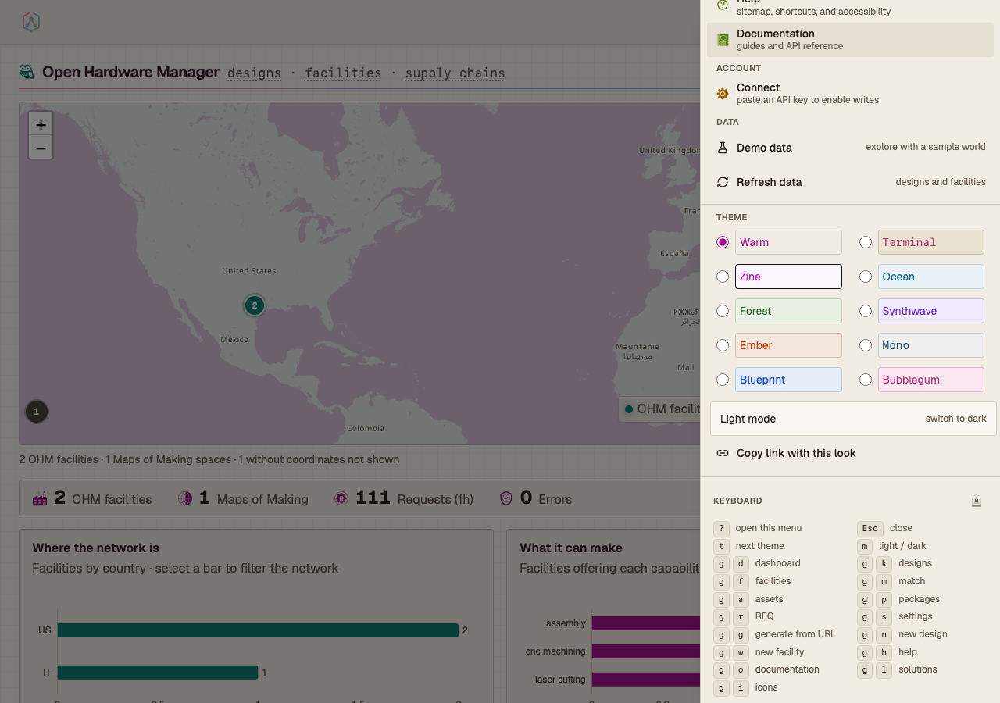
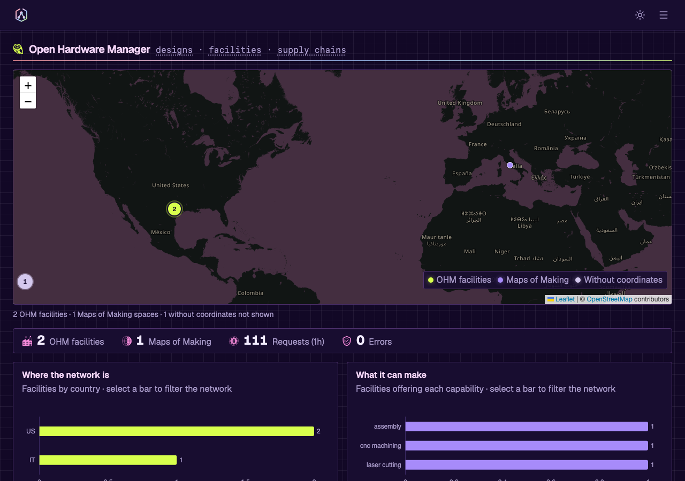
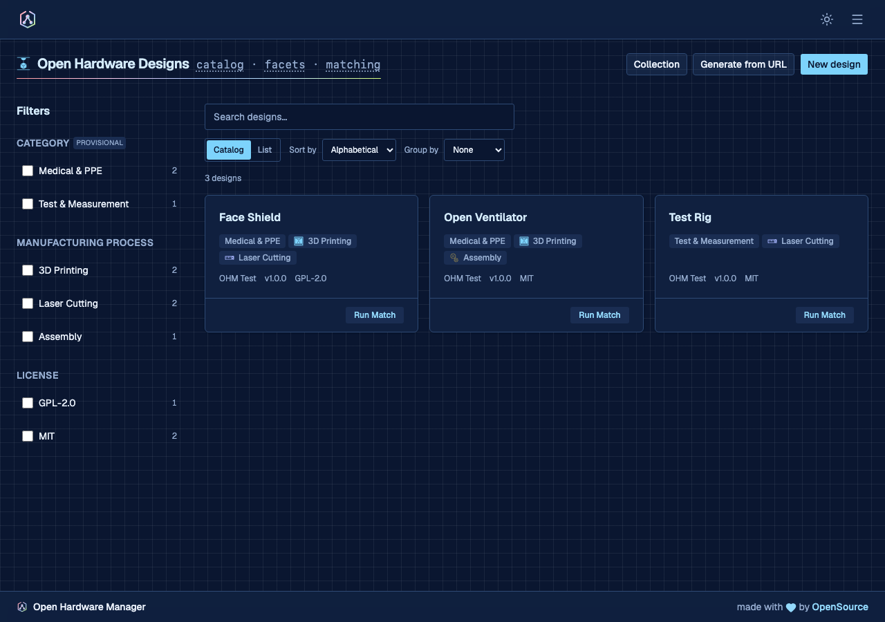

# The web interface

The UI was redesigned, and much improved, by Sonia of
[the-tech-margin.com](https://the-tech-margin.com) — the theme picker, the
keyboard shortcuts and the logo among much else.


A Next.js App Router application, served by the API. Ten themes in light and
dark, drivable by keyboard, and laid out down to 360px. Those three are enforced
by **647 unit tests** and **227 Playwright specs**, including an axe matrix over
all twenty theme variants and a narrow-viewport lane at 360px and 768px.

One hamburger sitemap reaches every route, grouped by purpose, each entry
carrying a role line. Header, drawer, and footer are a single implementation, so
a new page inherits its chrome.

Six browse surfaces: designs, facilities, **assets**, packages, solutions, and
the dashboard that frames them. Assets are the physical units built from those
designs — what condition each is in, what triage concluded, and which of its
parts another unit could use.



### Themes

Ten themes x light/dark is twenty palettes, bound to shadcn's token names so
components re-theme without being edited. Colour lives in
`frontend/src/styles/tokens.css`; a unit test fails the build on a raw hex or a
hardcoded Tailwind shade anywhere else.



The picker paints each row in that theme's own ink on its own ground, resolved
from the live tokens at runtime. There is no second copy of the palette.

| | |
|---|---|
|  |  |
| The dashboard in Synthwave dark | The design catalog in Blueprint dark |

The Leaflet map, the cytoscape supply-tree graph, and the ECharts charts read
the same tokens instead of carrying private palettes. OpenStreetMap's raster
tiles arrive from the tile server already painted, so `tileFilter.ts` computes a
CSS filter chain from the active accent and rotates them onto its hue; land and
water stay separated by lightness.

The process chips on facility and design cards read that same categorical ramp:
each tool glyph is painted in its family of making — additive, subtractive,
forming, joining, finishing — so a card says what kind of shop it is before its
labels are read. The glyph carries the colour rather than a swatch beside it,
which keeps one mark per chip instead of two.

Theme, mode, filters, view mode, sort, grouping, and page are all held in the
query string, so copying the URL reproduces the view.

### Keyboard

Every route in the sitemap has a chord. `CHORD_ROUTES` and `SHORTCUTS` in
`frontend/src/components/layout/shortcuts.ts` drive the key handler, the
drawer's help block, and `/help`. A unit test fails if a sitemap route has no
chord — it reads every group, including the ones the drawer hides, so a route
cannot fall outside the keyboard contract by being outside the menu. Two
exemptions are named in that test rather than left implicit: bare
`/visualization`, which redirects to `/solutions` and would otherwise cost two
keys for one destination, and `/operator-tools`, which only exists when the
instance runs the site layer — a static chord for a conditional route would
land on a 404 wherever it does not.


| Keys | Action |
|---|---|
| `?` | open the menu, with the full reference |
| `Esc` | close any menu or dialog, returning focus to the control that opened it |
| `t` / `m` | next theme / light-dark |
| `g` then `d` `k` `f` `m` `a` `p` `r` `s` | dashboard, designs, facilities, match, assets, packages, RFQ, settings |
| `g` then `g` `n` `w` `h` `o` | generate from URL, new design, new facility, help, documentation |
| `g` then `l` `i` | solutions, icons |

Shortcuts are suppressed while typing in an input, textarea, select, or
contenteditable, so a search box takes `g` as a letter.

The drawer and `/help` are not the same list, and the difference is deliberate:
the drawer is a menu — places worth going — while `/help` is the sitemap, and it
renders the unlisted routes too. `/icons` is the case that forced the
distinction. It documents the glyph set rather than being somewhere to go, so it
left the menu for a single mark in the drawer's footer; it keeps its chord, and
`/help` is where that chord is explained.

### Navigation inside the page

The role line under each page title and the trail above it are links, rendered
by `PageHero` and `Breadcrumb` rather than written out per view. A term links
only where the crumb is the only route to its target: Settings names
`session · keys · identities` directly above a tab bar of the same three, so
those stay text rather than becoming a duplicate control.

Where a term names a section rather than a sibling page, it links to that
section. A page with no tab strip has no other route to its own parts, which is
exactly the condition for a crumb term to lead somewhere: an asset's
`components · triage report · sourcing` and the collection page's
`export · compare · import` are both the page's own structure, addressable.
Terms that genuinely name no place still stay text, and each one carries the
reason beside it.

Trails carry `aria-label="Breadcrumb"`, mark their last term `aria-current="page"`,
and meet the 24px target minimum — they sit in a flex container, so the WCAG
2.5.8 exception for inline targets does not apply to them. `crumb.spec.ts` and
`breadcrumb.spec.ts` tab to every link, assert a visible focus ring, and press
Enter.

### Accessibility

axe scans all twenty theme variants in CI, reading token values resolved from
the live page, so adding a theme extends the matrix without editing it. Four
feature journeys carry their own scans. Chart axis labels drawn on a canvas and
the theme picker's own names are out of a DOM scanner's reach, so their contrast
is computed against the surface they sit on.


The chrome provides focus trapping, `aria-current`, skip-to-content, 44px
targets, and animation behind `prefers-reduced-motion`. `/help` renders its
keyboard and accessibility tables from the same constants the app uses.

The densest control surface is asset triage — one row per component, each with
a condition control and up to three follow-up questions — and it is where the
accessibility rules and the data model meet. Those follow-ups are
`Optional[bool]` on the server, where `null` is not `false`: the server infers a
null flag from the condition and the design's own flags, and reads a stated
`false` as the technician overruling that. A checkbox cannot say which of those
it means, so they are three-option controls, shown only where the condition
implies work and cleared when it stops implying it. One `<fieldset>` wraps the
whole checklist rather than one per component, and every choice is a
`SegmentedControl` — arrow-key operable, full-width at 360px.

### Responsive

`responsive.spec.ts` runs every route at 360px and 768px and asserts two
properties measured from the live layout: nothing overflows the viewport
horizontally, and interactive controls meet the WCAG 2.5.8 minimum of 24px. It
uses a narrow desktop window rather than device emulation, because Chrome's
mobile emulation applies Android form-control metrics that round undersized
controls up past the minimum.


The map frames the dense part of the network rather than the whole world. One
finger scrolls the page and two fingers pan the map. Charts drop their axis
labels below 640px.

### Consistency and failure

- Field names, panel titles, and heading roles come from shared constants, with
  unit tests that read the source.
- Errors normalise to a title, a sentence, and whether retrying can help, so the
  same fault reads the same in a panel, a toast, and the error page. An unknown
  address returns a 404 with the sitemap on it; a thrown render keeps the app's
  chrome instead of the browser's default.
- `make seed-demo` seeds ten designs and seven facilities with content-derived
  ids, so deep links survive reseeding. The **Demo data** chip reads the records
  rather than a build flag.
- Loading states animate the logo from the same geometry that generates the
  favicon.
- Every path the API serves is either called by the frontend or carries a row
  saying why not — `tests/parity/test_api_coverage.py`. `fe_api_prefixes` asks
  whether the frontend touches a *tag*, which one call satisfies; this asks per
  *endpoint*, and the difference was 91 of 158 paths. The gate runs both ways:
  an endpoint nothing calls and no row explains fails it, and so does a recorded
  endpoint the UI has since started calling — so the backlog shrinks by
  deletion rather than accreting.

The eight screenshots above are generated: `npx playwright test
--project=assets` recaptures them from the mocked fixture world.

### Demo data

Two independent routes to a demo world, both optional.

*In the browser* — open the sitemap and switch on **Demo data**. The app reads a
bundled sample world instead of the API, needs no backend, and switches back the
same way. The swap happens at the fetch boundary, so components run the same
code path they do against real data.

*On the server* — seed the records:

```bash
make seed-demo   # then restart the API — list responses are cached for an hour
```

### What the app reaches

Every OHM capability with a web surface, and where it lives:

| Surface | What it does |
|---|---|
| `/okh`, `/okh/collection` | Browse designs; move a whole catalogue between nodes with a compare step before any write |
| `/facilities` | The network, local and federated, on a map and as a list |
| `/assets` | Physical units in the field: triage a unit component by component, resolve where its parts come from, and claim a part from another unit |
| `/match` | Pair a design with facilities, in a chosen domain or a detected one |
| `/solutions`, `/visualization` | Saved supply trees, what they are made of, and when they expire |
| `/packages` | Built archives, local and remote, with pin and signature verification |
| `/settings/matching` | The capability rules and taxonomies behind every match — validate a file, see what importing it would change, then import |
| `/settings/llm` | Provider keys, and whether generation will actually work right now |

Anything the API serves that is deliberately *not* here — the federation wire
protocol, bulk-destructive operations, endpoints superseded by another — is
recorded with its reason in `tests/parity/manifest.py`, not merely absent.
