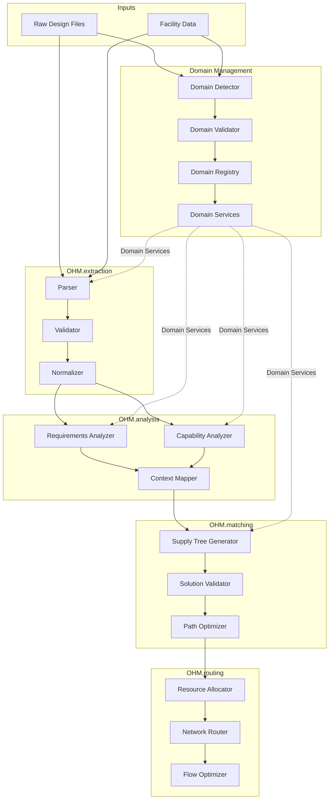

# Open Hardware Manager Architecture

## Core Components

The OHM is designed as a set of independent components that can be used individually or composed into complete processing pipelines. Each component has its own well-defined interfaces, storage requirements, and processing capabilities.

### 0. Domain Management System
Provides unified domain management across all OHM components, enabling multi-domain operation with consistent behavior.

#### Key Features
- Multi-domain support (manufacturing, cooking, etc.)
- Domain detection and validation
- Domain-specific component registration
- Unified API across domains
- Health monitoring and management

#### Independent Usage
```python
from src.core.registry.domain_registry import DomainRegistry, DomainMetadata, DomainStatus
from src.core.services.domain_service import DomainDetector

# Register a new domain
metadata = DomainMetadata(
    name="new_domain",
    display_name="New Domain",
    description="Description of the new domain",
    version="1.0.0",
    status=DomainStatus.ACTIVE,
    supported_input_types={"input_type1", "input_type2"},
    supported_output_types={"output_type1", "output_type2"}
)

DomainRegistry.register_domain(
    domain_name="new_domain",
    extractor=NewDomainExtractor(),
    matcher=NewDomainMatcher(),
    validator=NewDomainValidator(),
    metadata=metadata
)

# Detect domain from input
result = DomainDetector.detect_domain(requirements, capabilities)
print(f"Detected domain: {result.domain} with confidence: {result.confidence}")
```

#### Storage
- Domain registry and metadata
- Domain-specific configurations
- Health check results
- Type mappings and keywords

### 1. OHM.extraction
Converts unstructured or semi-structured input into normalized, validated formats.

#### Key Features
- Multi-stage parsing pipeline
- Domain-specific extractors
- Validation against standard schemas
- Confidence scoring for extracted data

#### Independent Usage
```python
from ome.extraction import Extractor

extractor = Extractor()
result = extractor.process_input(
    input_data="raw_design_file.md",
    target_schema="okh"  # OpenKnowHow schema
)
```

#### Storage
- Permanent storage for validated OKH/OKW files
- Cache for extraction metadata
- Feedback storage for extraction quality

### 2. OHM.analysis
Analyzes structured data to identify requirements, capabilities, and constraints.

#### Key Features
- Requirements identification
- Capability analysis
- Constraint extraction
- Context mapping

#### Independent Usage
```python
from ome.analysis import Analyzer

analyzer = Analyzer()
requirements = analyzer.analyze_design(
    okh_data=validated_okh,
    context="manufacturing"
)
```

#### Storage
- Requirements database
- Capability mappings
- Analysis metadata
- Validation contexts

### 3. OHM.matching
Matches requirements to capabilities using multi-stage processing.

#### Key Features
- Supply Tree generation
- Multi-context validation
- Progressive matching layers
- Solution ranking

#### Independent Usage
```python
from ome.matching import Matcher

matcher = Matcher()
solutions = matcher.find_matches(
    requirements=design_requirements,
    capabilities=available_facilities,
    context="hobby"
)
```

#### Storage
- Supply Tree database
- Match results cache
- Validation results
- Solution rankings

### 4. OHM.routing
Handles material and workflow routing through manufacturing networks.

#### Key Features
- Resource allocation
- Path optimization
- Failure handling
- Network coordination

#### Independent Usage
```python
from ome.routing import Router

router = Router()
route = router.optimize_path(
    supply_tree=validated_solution,
    constraints=routing_constraints
)
```

#### Storage
- Route database
- Network state
- Resource availability
- Optimization metadata

## Component Integration

### Pipeline Configuration
```yaml
# ohm-pipeline.yaml
components:
  extraction:
    enabled: true
    cache_ttl: 3600
    validators:
      - schema
      - domain_specific
  
  analysis:
    enabled: true
    contexts:
      - manufacturing
      - hobby
  
  matching:
    enabled: true
    strategies:
      - exact
      - heuristic
      - nlp
      - ml
  
  routing:
    enabled: true
    optimizers:
      - time
      - cost
      - quality
```

### Composing Components
```python
from ome import Pipeline

pipeline = Pipeline.from_config("ohm-pipeline.yaml")

# Full pipeline execution
result = pipeline.process(
    input_data=design_file,
    target_facilities=facility_list,
    context="manufacturing"
)

# Or step by step
extracted = pipeline.extraction.process(design_file)
analyzed = pipeline.analysis.process(extracted)
matched = pipeline.matching.process(analyzed)
routed = pipeline.routing.process(matched)
```

## Data Flow



## Storage Architecture

### Permanent Storage
- Validated OKH/OKW documents
- Supply Tree solutions
- Network configurations
- Validation contexts
- Domain registry and metadata

### Cache Layer
- Extraction results
- Analysis metadata
- Match scores
- Route optimizations
- Domain detection results
- Health check results

### Feedback System
- Extraction quality metrics
- Validation results
- Match confidence scores
- Routing performance
- Domain detection accuracy
- Component health status

## Extension Points

Each component provides well-defined extension points:

### Domain Management
- Custom domain definitions
- Domain-specific extractors
- Domain-specific matchers
- Domain-specific validators
- Domain detection algorithms
- Type mappings and keywords

### OHM.extraction
- Custom parsers
- Domain validators
- Normalization rules

### OHM.analysis
- Requirement analyzers
- Capability matchers
- Context definitions

### OHM.matching
- Matching strategies
- Validation rules
- Scoring algorithms

### OHM.routing
- Optimization strategies
- Resource handlers
- Network protocols

## Best Practices

### Component Development
1. Maintain component independence
2. Define clear interfaces
3. Handle component-specific storage
4. Implement proper validation
5. Support async operations

### Pipeline Integration
1. Use configuration files
2. Implement proper error handling
3. Maintain state isolation
4. Support partial execution
5. Enable monitoring

### Data Management
1. Use appropriate storage types
2. Implement caching strategies
3. Handle component-specific data
4. Maintain data consistency
5. Support data migration

## Future Considerations

### Scalability
- Component-level scaling
- Distributed storage
- Async processing
- Load balancing

### Integration
- External system interfaces
- API versioning
- Event handling
- Monitoring and metrics

### Extension
- Plugin architecture
- Custom components
- Domain-specific optimizations
- Enhanced validation