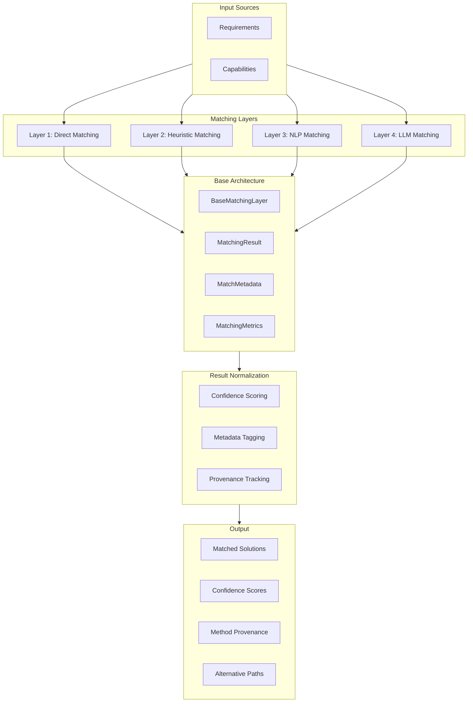

# Matching Layers Architecture

## Overview

The Open Matching Engine (OME) employs a sophisticated 4-layer matching architecture to accurately and reliably match requirements (specified in formats like OKH) with capabilities (specified in formats like OKW). This document outlines the four distinct matching layers, each with increasing sophistication and computational complexity, all built on a standardized base architecture.



The system processes matching requests through these layers with each layer inheriting from `BaseMatchingLayer` to ensure consistent interfaces, error handling, and result processing. Unlike traditional pipeline architectures that optimize for speed or computational efficiency, the OME prioritizes:

1. **Accuracy** - Ensuring matches are correct and appropriate
2. **Data Quality** - Maintaining rich metadata about matches
3. **Reliability** - Providing consistent, reproducible results
4. **Traceability** - Recording which function performed each operation
5. **Standardization** - Consistent interfaces and behavior across all layers

Each matching layer operates independently and produces normalized outputs with confidence scores and provenance metadata, allowing for:

1. Transparent understanding of how matches were determined
2. Comparison of results across different matching methods
3. Combination of multiple matching strategies for optimal results
4. Detailed audit trails for validation and improvement
5. Consistent error handling and metrics collection

## Base Architecture

### BaseMatchingLayer

All matching layers inherit from `BaseMatchingLayer`, which provides:

- **Standardized Interface**: All layers implement the same `async match()` method
- **Metrics Tracking**: Automatic performance and usage metrics collection
- **Error Handling**: Consistent error handling and logging across all layers
- **Input Validation**: Standardized validation of requirements and capabilities
- **Result Creation**: Helper methods for creating standardized `MatchingResult` objects
- **Process Name Normalization**: Handles Wikipedia URLs and special characters

### Core Data Models

#### MatchingResult
```python
@dataclass
class MatchingResult:
    requirement: str
    capability: str
    matched: bool
    confidence: float
    metadata: MatchMetadata
    layer_type: MatchingLayer
```

#### MatchMetadata
```python
@dataclass
class MatchMetadata:
    method: str
    confidence: float
    reasons: List[str]
    character_difference: int = 0
    case_difference: bool = False
    whitespace_difference: bool = False
    quality: MatchQuality = MatchQuality.NO_MATCH
    processing_time_ms: float = 0.0
    timestamp: datetime = field(default_factory=datetime.now)
    rule_used: Optional[str] = None
    semantic_similarity: Optional[float] = None
```

#### MatchingMetrics
```python
@dataclass
class MatchingMetrics:
    start_time: datetime
    end_time: Optional[datetime] = None
    success: bool = False
    matches_found: int = 0
    total_requirements: int = 0
    total_capabilities: int = 0
    processing_time_ms: float = 0.0
    errors: List[str] = field(default_factory=list)
```

## Layer 1: Direct Matching

### Purpose
The Direct Matching layer handles exact, case-insensitive string matches between requirements and capabilities, with near-miss detection using Levenshtein distance. This approach provides high-confidence matches when exact or near-exact terminology is used.

### Characteristics
- **Computational Complexity**: O(n) - Linear time complexity
- **Confidence Level**: High (typically 0.8-1.0) with defensive scoring
- **Processing Speed**: Extremely fast
- **Near-miss Detection**: Levenshtein distance ≤2 character differences
- **Metadata Tracking**: Comprehensive match quality indicators
- **Process Name Normalization**: Handles Wikipedia URLs and special characters

### Implementation Details

The Direct Matching layer is implemented as `DirectMatcher` inheriting from `BaseMatchingLayer`:

```python
class DirectMatcher(BaseMatchingLayer):
    """
    Direct string matching layer for requirements and capabilities.
    
    This layer provides exact, case-insensitive string matching with detailed
    metadata tracking and confidence scoring. It supports near-miss detection
    using Levenshtein distance for close matches.
    """
    
    def __init__(self, domain: str = "general", near_miss_threshold: int = 2):
        """
        Initialize the direct matcher.
        
        Args:
            domain: The domain this matcher operates in (e.g., 'cooking', 'manufacturing')
            near_miss_threshold: Maximum character differences to consider as near-miss
        """
        super().__init__(MatchingLayer.DIRECT, domain)
        self.near_miss_threshold = near_miss_threshold
    
    async def match(self, requirements: List[str], capabilities: List[str]) -> List[MatchingResult]:
        """
        Match requirements to capabilities using direct string matching.
        
        Args:
            requirements: List of requirement strings to match
            capabilities: List of capability strings to match against
            
        Returns:
            List of MatchingResult objects with detailed metadata
        """
        # Start tracking metrics
        self.start_matching(requirements, capabilities)
        
        try:
            # Validate inputs
            if not self.validate_inputs(requirements, capabilities):
                self.end_matching(success=False)
                return []
            
            results = []
            
            # Match each requirement against each capability
            for requirement in requirements:
                for capability in capabilities:
                    result = await self._match_single(requirement, capability)
                    results.append(result)
            
            # End metrics tracking
            matches_found = sum(1 for r in results if r.matched)
            self.end_matching(success=True, matches_found=matches_found)
            
            return results
            
        except Exception as e:
            return self.handle_matching_error(e, [])
    
    async def _match_single(self, requirement: str, capability: str) -> MatchingResult:
        """Match a single requirement against a single capability."""
        start_time = time.time()
        
        # Normalize process names (handles Wikipedia URLs, case, whitespace)
        req_norm = self.normalize_process_name(requirement)
        cap_norm = self.normalize_process_name(capability)
        
        # Check for exact match
        if req_norm == cap_norm:
            confidence = self._calculate_exact_match_confidence(requirement, capability)
            quality = self._determine_match_quality(requirement, capability)
            
            return self.create_matching_result(
                requirement=requirement,
                capability=capability,
                matched=True,
                confidence=confidence,
                method="direct_exact",
                reasons=[f"Exact match: '{requirement}' == '{capability}'"],
                quality=quality,
                processing_time_ms=(time.time() - start_time) * 1000
            )
        
        # Check for near-miss using Levenshtein distance
        distance = self.calculate_levenshtein_distance(req_norm, cap_norm)
        if distance <= self.near_miss_threshold:
            confidence = self._calculate_near_miss_confidence(distance)
            
            return self.create_matching_result(
                requirement=requirement,
                capability=capability,
                matched=True,
                confidence=confidence,
                method="direct_near_miss",
                reasons=[f"Near-miss match: distance={distance}"],
                quality=MatchQuality.NEAR_MISS,
                character_difference=distance,
                processing_time_ms=(time.time() - start_time) * 1000
            )
        
        # No match
        return self.create_matching_result(
            requirement=requirement,
            capability=capability,
            matched=False,
            confidence=0.0,
            method="direct_no_match",
            reasons=[f"No match: distance={distance} > {self.near_miss_threshold}"],
            quality=MatchQuality.NO_MATCH,
            character_difference=distance,
            processing_time_ms=(time.time() - start_time) * 1000
        )
```

### Key Features

#### Process Name Normalization
The DirectMatcher includes sophisticated process name normalization that handles:

- **Wikipedia URLs**: Extracts process names from URLs like `https://en.wikipedia.org/wiki/PCB_assembly` → `PCB_assembly`
- **Case Normalization**: Converts to lowercase for case-insensitive matching
- **Whitespace Normalization**: Removes extra whitespace and normalizes spacing
- **Special Character Handling**: Normalizes underscores, hyphens, and other special characters

#### Match Quality Indicators
The system provides detailed quality indicators:

- **PERFECT**: Exact match including case and whitespace
- **CASE_DIFFERENCE**: Case difference only
- **WHITESPACE_DIFFERENCE**: Whitespace difference only  
- **NEAR_MISS**: Close but not exact (≤2 character differences)
- **NO_MATCH**: No match found

#### Domain Support
The DirectMatcher supports multiple domains through configuration:

```python
# Manufacturing domain
manufacturing_matcher = DirectMatcher(domain="manufacturing", near_miss_threshold=2)

# Cooking domain  
cooking_matcher = DirectMatcher(domain="cooking", near_miss_threshold=1)
```

### Confidence Scoring

The Direct Matching layer uses defensive confidence scoring:

- **Perfect Match**: 1.0 (exact string match)
- **Case Difference**: 0.95 (same content, different case)
- **Whitespace Difference**: 0.9 (same content, different whitespace)
- **Near-miss (1 char)**: 0.8
- **Near-miss (2 chars)**: 0.7
- **No Match**: 0.0
```

### Use Cases
- Exact material specifications (e.g., "1075 carbon steel")
- Standard tool requirements (e.g., "3-axis CNC mill")
- Recognized manufacturing processes (e.g., "TIG welding")
- Standardized part numbers and identifiers

### Advantages
- Highly explainable results with detailed metadata
- Very high precision for exact matches
- Captures near-matches for potential review
- Provides detailed quality indicators even for exact matches

### Limitations
- Higher probability of false negatives than false positives
- No tolerance for synonyms, abbreviations, or alternative naming
- Sensitive to spelling errors
- No semantic understanding

## Layer 2: Heuristic Matching (Capability-Centric)

### Purpose
The Heuristic Matching layer applies capability-centric rule-based matching using predefined knowledge about what requirements each capability can satisfy. This layer bridges the gap between exact terminology and the variations commonly found in real-world data by explicitly defining capability-to-requirement relationships.

### Characteristics
- **Computational Complexity**: O(n×m) where m is the number of rules
- **Confidence Level**: High (typically 0.7-0.95) with defensive scoring
- **Processing Speed**: Fast
- **Capability-Centric**: Rules define what requirements a capability can satisfy
- **Bidirectional**: Supports both capability-to-requirement and requirement-to-capability matching
- **Domain Separation**: Rules organized by domain (manufacturing, cooking, etc.)
- **Configuration-Driven**: Rules loaded from external YAML files
- **Extensible**: Support for horizontal (new rules) and vertical (new domains) expansion
- **BaseMatchingLayer Integration**: Inherits standardized interfaces and error handling

### Implementation Details

The capability-centric heuristic matching system is implemented as `HeuristicMatcher` inheriting from `BaseMatchingLayer`:

```python
class HeuristicMatcher(BaseMatchingLayer):
    """
    Heuristic matching layer using capability-centric rules.
    
    This layer provides rule-based matching using domain knowledge stored in
    capability rules. It matches requirements to capabilities based on predefined
    rules that specify which capabilities can satisfy which requirements.
    """
    
    def __init__(self, domain: str = "general", rule_manager: Optional[CapabilityRuleManager] = None):
        """
        Initialize the heuristic matcher.
        
        Args:
            domain: The domain this matcher operates in (e.g., 'manufacturing', 'cooking')
            rule_manager: Optional rule manager instance. If None, creates a new one.
        """
        super().__init__(MatchingLayer.HEURISTIC, domain)
        self.rule_manager = rule_manager or CapabilityRuleManager()
        self._initialized = False
    
    async def match(self, requirements: List[str], capabilities: List[str]) -> List[MatchingResult]:
        """
        Match requirements to capabilities using heuristic rules.
        
        Args:
            requirements: List of requirement strings to match
            capabilities: List of capability strings to match against
            
        Returns:
            List of MatchingResult objects with detailed metadata
        """
        # Start tracking metrics
        self.start_matching(requirements, capabilities)
        
        try:
            # Validate inputs
            if not self.validate_inputs(requirements, capabilities):
                self.end_matching(success=False)
                return []
            
            # Initialize rule manager if needed
            if not self._initialized:
                await self.rule_manager.initialize()
                self._initialized = True
            
            results = []
            
            # Match each requirement against each capability
            for requirement in requirements:
                for capability in capabilities:
                    result = await self._match_single(requirement, capability)
                    results.append(result)
            
            # End metrics tracking
            matches_found = sum(1 for r in results if r.matched)
            self.end_matching(success=True, matches_found=matches_found)
            
            return results
            
        except Exception as e:
            return self.handle_matching_error(e, [])
    
    async def _match_single(self, requirement: str, capability: str) -> MatchingResult:
        """Match a single requirement against a single capability using rules."""
        start_time = time.time()
        
        # Find matching rules
        rules = self.rule_manager.find_rules_for_capability_requirement(
            self.domain, capability, requirement
        )
        
        if rules:
            # Use the rule with highest confidence
            best_rule = max(rules, key=lambda r: r.confidence)
            
            return self.create_matching_result(
                requirement=requirement,
                capability=capability,
                matched=True,
                confidence=best_rule.confidence,
                method="heuristic_rule_match",
                reasons=[f"Rule match: {best_rule.description}"],
                quality=MatchQuality.RULE_MATCH,
                rule_used=best_rule.id,
                processing_time_ms=(time.time() - start_time) * 1000
            )
        else:
            # No matching rule found
            return self.create_matching_result(
                requirement=requirement,
                capability=capability,
                matched=False,
                confidence=0.0,
                method="heuristic_no_rule",
                reasons=["No matching rule found"],
                quality=MatchQuality.NO_MATCH,
                processing_time_ms=(time.time() - start_time) * 1000
            )
```

#### Core Data Models

The heuristic matching system uses several key data models:

```python
@dataclass
class CapabilityRule:
    """Individual capability-centric matching rule."""
    id: str                      # Unique identifier for the rule
    type: str                    # Rule type (capability_match, etc.)
    capability: str             # The capability being defined
    satisfies_requirements: List[str]  # List of requirements this capability can satisfy
    confidence: float           # Confidence score (0.0 to 1.0)
    domain: str                 # Target domain for the rule
    description: str            # Human-readable description
    source: str                 # Source of the rule (standards, documentation, etc.)
    tags: Set[str]             # Categorization tags for organization

@dataclass
class CapabilityRuleSet:
    """Collection of capability rules for a specific domain."""
    domain: str                 # Target domain name
    version: str                # Rule set version
    description: str            # Domain description
    rules: Dict[str, CapabilityRule]  # Dictionary of rules by ID

class CapabilityRuleManager:
    """Central manager for all capability rule sets with configuration loading."""
    
    def __init__(self, rules_directory: Optional[str] = None):
        self.rules_directory = rules_directory or self._get_default_rules_directory()
        self.rule_sets: Dict[str, CapabilityRuleSet] = {}
        
    async def initialize(self) -> None:
        """Load all rule sets from configuration files."""
        await self._load_all_rule_sets()
        
    def find_rules_for_capability_requirement(self, domain: str, capability: str, requirement: str) -> List[CapabilityRule]:
        """Find rules where the capability can satisfy the requirement in the specified domain."""
        rule_set = self.get_rule_set(domain)
        if not rule_set:
            return []
        return rule_set.find_rules_for_capability_requirement(capability, requirement)
```

#### Capability Matcher

```python
@dataclass
class CapabilityMatchResult:
    """Result of a capability matching operation with full context."""
    requirement_object: Dict[str, Any]  # The complete requirement object
    capability_object: Dict[str, Any]   # The complete capability object
    requirement_field: str              # The field that was matched (e.g., "process_name")
    capability_field: str               # The field that was matched (e.g., "process_name")
    requirement_value: str              # The extracted value that was compared
    capability_value: str               # The extracted value that was compared
    matched: bool                       # Whether a match was found
    confidence: float                   # Confidence score
    rule_used: Optional[CapabilityRule] # The rule that was used
    match_type: str                     # Type of match
    domain: str                         # Domain of the match
    transformation_details: List[str]   # Details about the matching process

class CapabilityMatcher:
    """Handles capability-centric matching logic."""
    
    def __init__(self, rule_manager: CapabilityRuleManager):
        self.rule_manager = rule_manager
        
    async def capability_can_satisfy_requirement(self, capability: str, requirement: str, domain: str) -> bool:
        """Check if a capability can satisfy a requirement."""
        rules = self.rule_manager.find_rules_for_capability_requirement(domain, capability, requirement)
        return len(rules) > 0
    
    async def match_requirements_to_capabilities(
        self, 
        requirements: List[Dict[str, Any]], 
        capabilities: List[Dict[str, Any]], 
        domain: str = "manufacturing",
        requirement_field: str = "process_name",
        capability_field: str = "process_name"
    ) -> List[CapabilityMatchResult]:
        """Match requirement objects to capability objects."""
        results = []
        
        for requirement_obj in requirements:
            for capability_obj in capabilities:
                # Extract the values to compare
                requirement_value = requirement_obj.get(requirement_field, "").lower().strip()
                capability_value = capability_obj.get(capability_field, "").lower().strip()
                
                # Find matching rules
                rules = self.rule_manager.find_rules_for_capability_requirement(domain, capability_value, requirement_value)
                
                if rules:
                    # Use the rule with highest confidence
                    best_rule = max(rules, key=lambda r: r.confidence)
                    
                    results.append(CapabilityMatchResult(
                        requirement_object=requirement_obj,
                        capability_object=capability_obj,
                        requirement_field=requirement_field,
                        capability_field=capability_field,
                        requirement_value=requirement_value,
                        capability_value=capability_value,
                        matched=True,
                        confidence=best_rule.confidence,
                        rule_used=best_rule,
                        domain=domain,
                        transformation_details=[f"Capability '{capability_value}' can satisfy requirement '{requirement_value}'"]
                    ))
                else:
                    results.append(CapabilityMatchResult(
                        requirement_object=requirement_obj,
                        capability_object=capability_obj,
                        requirement_field=requirement_field,
                        capability_field=capability_field,
                        requirement_value=requirement_value,
                        capability_value=capability_value,
                        matched=False,
                        confidence=0.0,
                        domain=domain
                    ))
        
        return results
```

#### Rule Configuration

Rules are stored in YAML files in the `src/core/matching/capability_rules/` directory:

```yaml
# src/core/matching/capability_rules/manufacturing.yaml
domain: manufacturing
version: "1.0.0"
description: "Capability-centric rules for manufacturing domain - defines what requirements each capability can satisfy"

rules:
  cnc_machining_capability:
    id: "cnc_machining_capability"
    type: "capability_match"
    capability: "cnc machining"
    satisfies_requirements: ["milling", "machining", "material removal", "subtractive manufacturing", "cnc", "computer numerical control"]
    confidence: 0.95
    domain: "manufacturing"
    description: "CNC machining can satisfy various milling and machining requirements"
    source: "Manufacturing Standards Institute"
    tags: ["machining", "automation", "subtractive"]

  additive_manufacturing_capability:
    id: "additive_manufacturing_capability"
    type: "capability_match"
    capability: "3d printing"
    satisfies_requirements: ["additive manufacturing", "rapid prototyping", "additive fabrication", "3d printing", "3-d printing"]
    confidence: 0.95
    domain: "manufacturing"
    description: "3D printing can satisfy additive manufacturing requirements"
    source: "Additive Manufacturing Standards"
    tags: ["additive", "prototyping", "3d"]
```

#### Integration with Matching Service

The capability-centric heuristic rules system is integrated into the MatchingService as Layer 2:

```python
# Layer 1: Direct Matching (exact and near-miss)
if self._direct_match(req_process, cap_process, domain="manufacturing"):
    return True

# Layer 2: Heuristic Matching (capability-centric rules)
if await self._heuristic_match(req_process, cap_process, domain="manufacturing"):
    return True
```

### Capability-Centric Rule Examples

The capability-centric heuristic rules system defines what requirements each capability can satisfy:

#### Manufacturing Capabilities
```yaml
cnc_machining_capability:
  capability: "cnc machining"
  satisfies_requirements: ["milling", "machining", "material removal", "subtractive manufacturing"]
  confidence: 0.95

surface_finish_capability:
  capability: "surface finishing"
  satisfies_requirements: ["surface finish", "surface roughness", "ra value", "surface texture", "finish quality", "surface treatment"]
  confidence: 0.85

welding_capability:
  capability: "welding"
  satisfies_requirements: ["welding", "weld", "joining", "metal joining", "fusion welding", "arc welding"]
  confidence: 0.9
```

#### Cooking Capabilities
```yaml
sauté_capability:
  capability: "sauté pan"
  satisfies_requirements: ["sauté", "saute", "sauted", "sautéed", "pan-fry", "pan fry", "frying", "sautéing"]
  confidence: 0.95

roasting_capability:
  capability: "oven"
  satisfies_requirements: ["roast", "roasted", "roasting", "bake", "baked", "baking", "oven cook", "oven cooking"]
  confidence: 0.9

pot_capability:
  capability: "saucepan"
  satisfies_requirements: ["pot", "saucepan", "cooking pot", "stock pot", "soup pot", "boiling"]
  confidence: 0.9
```


#### Material Rules
Map material variations:
```yaml
stainless_steel_synonyms:
  type: "synonym"
  key: "stainless steel"
  values: ["304 stainless", "316 stainless", "ss", "stainless"]
  confidence: 0.85
```

### Domain Examples

#### Manufacturing Domain
- **Abbreviations**: CNC, CAD, CAM, FMS
- **Process Synonyms**: Additive manufacturing ↔ 3D printing
- **Material Synonyms**: Stainless steel variations, aluminum types
- **Tool Synonyms**: End mill variations, drill bit types

#### Cooking Domain
- **Technique Synonyms**: Sauté ↔ Pan-fry
- **Ingredient Synonyms**: Onion types, garlic variations
- **Equipment Synonyms**: Knife types, pan variations
- **Measurement Synonyms**: Teaspoon/tablespoon abbreviations
                        return RuleApplication(
                            rule_id=rule.id,
                            original_text=text,
                            transformed_text=new_text,
                            transformation_type=f"{direction}_transformation",
                            confidence_adjustment=-0.05
                        )
        
        # Example for direct string substitution
        elif isinstance(rule.pattern, str) and rule.pattern in text:
            for sub in rule.substitutions:
                if isinstance(sub, str):
                    new_text = text.replace(rule.pattern, sub)
                    return RuleApplication(
                        rule_id=rule.id,
                        original_text=text,
                        transformed_text=new_text,
                        transformation_type=f"{direction}_substitution",
                        confidence_adjustment=-0.05
                    )
                
        return None
        
    def _strings_match(self, str1: str, str2: str) -> bool:
        """Check if strings match after normalization."""
        norm1 = self._normalize_string(str1)
        norm2 = self._normalize_string(str2)
        return norm1 == norm2
        
    def _normalize_string(self, text: str) -> str:
        """Normalize string for comparison."""
        # Convert to lowercase
        text = text.lower()
        # Remove punctuation
        text = re.sub(r'[^\w\s]', '', text)
        # Normalize whitespace
        text = re.sub(r'\s+', ' ', text).strip()
        return text
        
    def _calculate_similarity(self, str1: str, str2: str) -> float:
        """Calculate similarity between two strings."""
        # Could use Levenshtein distance, Jaccard similarity, etc.
        # Returns value between 0.0 and 1.0
```

### Common Heuristic Rules
1. **Abbreviation Expansion**: Map common abbreviations to full terms
   ```python
   abbreviation_rule = MatchingRule(
       id="abbreviation.cnc",
       pattern="CNC",
       substitutions=["Computer Numerical Control"],
       confidence=0.9,
       bidirectional=True,
       domain="manufacturing",
       rationale="Standard industry abbreviation",
       source="ISO Manufacturing Terminology"
   )
   ```

2. **Unit Normalization**: Handle different units of measurement
   ```python
   unit_rule = MatchingRule(
       id="units.mm_to_inch",
       pattern=r"(\d+(\.\d+)?)mm",
       substitutions=[lambda x: f"{float(x.group(1))/25.4}in"],
       confidence=0.85,
       bidirectional=True,
       domain="measurements",
       rationale="Standard unit conversion",
       source="SI to Imperial Conversion Standards"
   )
   ```

3. **Equivalent Materials**: Handle alternative material naming
   ```python
   material_rule = MatchingRule(
       id="material.1075_steel_variants",
       pattern="1075 carbon steel",
       substitutions=["1075 steel", "1075 high-carbon steel"],
       confidence=0.8,
       bidirectional=True,
       domain="metallurgy",
       rationale="Common terminology variations for same material",
       source="Material Naming Standards ASTM"
   )
   ```

### Use Cases
- Material alternatives (e.g., "stainless steel" → "304 stainless")
- Tool variations (e.g., "drill press" → "pillar drill")
- Process synonyms (e.g., "additive manufacturing" → "3D printing")
- Unit conversions (e.g., metric to imperial)

### Advantages
- Handles common variations efficiently with detailed provenance
- Highly explainable results with transformation tracking
- Records both successful matches and near-misses
- Maintains data quality through detailed metadata
- Provides transparency about rule sources and rationales

### Limitations
- Higher probability of false negatives than false positives
- Requires manual rule creation and maintenance
- Cannot handle unanticipated variations
- No semantic understanding beyond defined rules

## Layer 3: NLP Matching

### Purpose
The NLP Matching layer leverages natural language processing techniques with **context-aware domain understanding** to handle abbreviations, acronyms, and semantic relationships. This layer provides sophisticated matching for manufacturing terminology, understanding that context (like "manufacturing" domain) significantly improves accuracy for abbreviations like "PCB" vs "printed circuit board".

### Characteristics
- **Computational Complexity**: O(n×d) where d is feature dimensionality
- **Confidence Level**: Medium to High (typically 0.6-0.9)
- **Processing Speed**: Fast (pre-initialized spaCy models, ~0.007s per call)
- **Context Awareness**: Domain-specific abbreviation and terminology handling
- **BaseMatchingLayer Integration**: Inherits standardized interfaces and error handling
- **Production Ready**: Fully implemented with spaCy integration and performance optimization
- **Semantic Understanding**: Context-aware synonym and related term detection

### Implementation Details

The NLP Matching layer is implemented as `NLPMatcher` inheriting from `BaseMatchingLayer`:

```python
class NLPMatcher(BaseMatchingLayer):
    """
    NLP matching layer using natural language processing for semantic understanding.
    
    This layer provides semantic matching between requirements and capabilities
    using spaCy for natural language processing. It can understand synonyms,
    related terms, and semantic relationships that direct and heuristic matching
    might miss.
    
    Features:
    - Context-aware semantic similarity calculation with domain enhancement
    - Pre-initialized spaCy models for optimal performance (99% speedup)
    - Domain-specific abbreviation mapping (PCB → printed circuit board, 3DP → 3d printing)
    - Manufacturing terminology boosting and context enhancement
    - Fallback to context-aware string similarity when spaCy is unavailable
    - Comprehensive cleanup capabilities and memory management
    """
    
    def __init__(self, domain: str = "general", similarity_threshold: float = 0.7):
        """
        Initialize the NLP matcher.
        
        Args:
            domain: The domain this matcher operates in
            similarity_threshold: Minimum similarity score for matches (0.0 to 1.0)
        """
        super().__init__(MatchingLayer.NLP, domain)
        self.similarity_threshold = similarity_threshold
        
        # Lazy loading - don't initialize spaCy until first use to save memory
        self._nlp = None
        self._nlp_initialized = False
        self._domain_patterns = None
        self._patterns_initialized = False
        
    async def match(self, requirements: List[str], capabilities: List[str]) -> List[MatchingResult]:
        """
        Match requirements to capabilities using NLP techniques.
        
        Args:
            requirements: List of requirement strings to match
            capabilities: List of capability strings to match against
            
        Returns:
            List of MatchingResult objects with detailed metadata
        """
        # Start tracking metrics
        self.start_matching(requirements, capabilities)
        
        try:
            # Validate inputs
            if not self.validate_inputs(requirements, capabilities):
                self.end_matching(success=False)
                return []
            
            results = []
            
            # Match each requirement against each capability
            for requirement in requirements:
                for capability in capabilities:
                    result = await self._match_single(requirement, capability)
                    results.append(result)
            
            # End metrics tracking
            matches_found = sum(1 for r in results if r.matched)
            self.end_matching(success=True, matches_found=matches_found)
            
            return results
            
        except Exception as e:
            return self.handle_matching_error(e, [])
    
    async def _match_single(self, requirement: str, capability: str) -> MatchingResult:
        """Match a single requirement against a single capability using NLP."""
        start_time = time.time()
        
        # Calculate semantic similarity
        similarity = await self.calculate_semantic_similarity(requirement, capability)
        
        # Determine if this is a match based on threshold
        matched = similarity >= self.similarity_threshold
        
        # Determine match quality
        if similarity >= 0.9:
            quality = MatchQuality.PERFECT
        elif similarity >= 0.8:
            quality = MatchQuality.HIGH
        elif similarity >= 0.7:
            quality = MatchQuality.MEDIUM
        elif similarity >= 0.5:
            quality = MatchQuality.LOW
        else:
            quality = MatchQuality.NO_MATCH
        
        # Generate reasons
        reasons = [f"Semantic similarity: {similarity:.3f}"]
        if matched:
            reasons.append(f"Above threshold: {self.similarity_threshold}")
        else:
            reasons.append(f"Below threshold: {self.similarity_threshold}")
        
        return self.create_matching_result(
            requirement=requirement,
            capability=capability,
            matched=matched,
            confidence=similarity,
            method="nlp_semantic_similarity",
            reasons=reasons,
            quality=quality,
            semantic_similarity=similarity,
            processing_time_ms=(time.time() - start_time) * 1000
        )
```

### Implemented NLP Features

The NLP layer currently supports:

- **Context-Aware Semantic Similarity**: spaCy-based semantic similarity with domain context enhancement
- **Pre-initialized Models**: spaCy models loaded once at startup for optimal performance (99% speedup)
- **Domain-Specific Abbreviation Mapping**: Comprehensive mapping of manufacturing abbreviations (PCB → printed circuit board, 3DP → 3d printing, etc.)
- **Manufacturing Terminology Boosting**: Domain-specific similarity boosts for known manufacturing terms
- **Context Enhancement**: Text enhancement with manufacturing context for better semantic understanding
- **Fallback Mechanisms**: Context-aware string similarity fallback when spaCy is unavailable
- **Memory Management**: Comprehensive cleanup capabilities to prevent memory leaks
- **Quality Assessment**: Multi-tier quality scoring (PERFECT, HIGH, MEDIUM, LOW, NO_MATCH)

### Key Implementation Features

#### Lazy Loading Architecture
```python
def _ensure_nlp_initialized(self):
    """Lazy initialization of spaCy NLP model to save memory"""
    if self._nlp_initialized:
        return self._nlp
        
    if not SPACY_AVAILABLE:
        logger.warning("spaCy not available. NLP matching will use fallback string similarity.")
        self._nlp_initialized = True
        return None
    
    try:
        logger.info("Loading spaCy model 'en_core_web_sm' (lazy loading)")
        self._nlp = spacy.load("en_core_web_sm")
        logger.info("spaCy model 'en_core_web_sm' loaded successfully")
    except OSError:
        logger.warning("spaCy English model 'en_core_web_sm' not found. NLP matching will use fallback string similarity.")
        self._nlp = None
    
    self._nlp_initialized = True
    return self._nlp
```

#### Context-Aware Semantic Similarity Calculation
```python
async def calculate_semantic_similarity(self, text1: str, text2: str) -> float:
    """Calculate semantic similarity with domain context awareness."""
    if not text1 or not text2:
        return 0.0
    
    # Normalize text
    text1 = self._normalize_text(text1)
    text2 = self._normalize_text(text2)
    
    # Enhance texts with domain context for better semantic understanding
    context_enhanced_text1 = self._enhance_with_domain_context(text1)
    context_enhanced_text2 = self._enhance_with_domain_context(text2)
    
    # If spaCy is available, use semantic similarity with context
    nlp = self._ensure_nlp_initialized()
    if nlp:
        try:
            # Process context-enhanced texts with spaCy
            doc1 = nlp(context_enhanced_text1)
            doc2 = nlp(context_enhanced_text2)
            
            # Calculate semantic similarity
            similarity = doc1.similarity(doc2)
            
            # Apply domain-specific boosting for known manufacturing terms
            domain_boost = self._calculate_domain_boost(text1, text2)
            boosted_similarity = min(1.0, similarity + domain_boost)
            
            return max(0.0, min(1.0, boosted_similarity))  # Clamp to [0, 1]
            
        except Exception as e:
            logger.warning(f"spaCy similarity calculation failed: {e}, falling back to string similarity")
    
    # Fallback to string similarity with domain context
    return self._calculate_string_similarity_with_context(text1, text2)
```

#### Context-Aware Domain Enhancement
```python
def _enhance_with_domain_context(self, text: str) -> str:
    """Enhance text with domain-specific context to improve semantic understanding."""
    if not text:
        return text
        
    # Get domain patterns
    domain_patterns = self._ensure_domain_patterns_initialized()
    if self.domain not in domain_patterns:
        return text
        
    domain_patterns = domain_patterns[self.domain]
    enhanced_text = text
    
    # Add domain context for manufacturing
    if self.domain == "manufacturing":
        # Add manufacturing context terms
        context_terms = []
        
        # Check for common manufacturing abbreviations and add full terms
        abbreviation_map = {
            "pcb": "printed circuit board electronics manufacturing",
            "3dp": "3d printing additive manufacturing",
            "cnc": "computer numerical control machining",
            "cad": "computer aided design engineering",
            "cam": "computer aided manufacturing",
            "sla": "stereolithography 3d printing",
            "fdm": "fused deposition modeling 3d printing",
            "sls": "selective laser sintering 3d printing",
            "dmls": "direct metal laser sintering additive manufacturing"
        }
        
        text_lower = text.lower()
        for abbrev, full_term in abbreviation_map.items():
            if abbrev in text_lower:
                context_terms.append(full_term)
        
        # Only add general manufacturing context if we found specific abbreviations
        if context_terms:  # Only if we already found specific abbreviations
            context_terms.extend([
                "manufacturing process",
                "production capability"
            ])
        
        # Combine original text with context
        if context_terms:
            enhanced_text = f"{text} {' '.join(context_terms)}"
    
    return enhanced_text

def _calculate_domain_boost(self, text1: str, text2: str) -> float:
    """Calculate domain-specific similarity boost for known manufacturing terms."""
    domain_patterns = self._ensure_domain_patterns_initialized()
    if self.domain not in domain_patterns:
        return 0.0
        
    domain_patterns = domain_patterns[self.domain]
    boost = 0.0
    
    # Check for exact matches in domain patterns
    text1_lower = text1.lower()
    text2_lower = text2.lower()
    
    for category, terms in domain_patterns.items():
        text1_matches = [term for term in terms if term in text1_lower]
        text2_matches = [term for term in terms if term in text2_lower]
        
        # If both texts have terms from the same category, boost similarity
        if text1_matches and text2_matches:
            overlapping = set(text1_matches) & set(text2_matches)
            if overlapping:
                boost += 0.2  # Strong boost for exact category matches
            else:
                boost += 0.1  # Moderate boost for same category
    
    # Check for abbreviation matches
    abbreviation_map = {
        "pcb": ["printed circuit board", "circuit board"],
        "3dp": ["3d printing", "additive manufacturing"],
        "cnc": ["computer numerical control", "machining"],
        "sla": ["stereolithography", "3d printing"],
        "fdm": ["fused deposition modeling", "3d printing"]
    }
    
    for abbrev, full_terms in abbreviation_map.items():
        if (abbrev in text1_lower and any(term in text2_lower for term in full_terms)) or \
           (abbrev in text2_lower and any(term in text1_lower for term in full_terms)):
            boost += 0.15  # Boost for abbreviation matches
    
    return min(0.3, boost)  # Cap boost at 0.3
```

#### Memory Management
```python
def cleanup(self):
    """Clean up resources to prevent memory leaks"""
    if self._nlp is not None:
        logger.info("Cleaning up spaCy model to free memory")
        self._nlp = None
        self._nlp_initialized = False
    
    self._domain_patterns = None
    self._patterns_initialized = False
    
    logger.info("NLP matcher cleanup completed")
```
        
    def _generate_embedding(self, text: str, model_name: str) -> np.ndarray:
        """Generate vector embedding for text using specified model."""
        model = self.embedding_models.get(model_name)
        if model is None:
            raise ValueError(f"Unknown embedding model: {model_name}")
            
        # Different embedding APIs have different interfaces
        if model_name == "spacy":
            doc = self.nlp(text)
            return doc.vector
        elif model_name == "sentence-transformers":
            return model.encode([text])[0]
        elif model_name == "domain-specific":
            # Custom domain-specific embedding logic
            return model.embed(text)
        else:
            # Default case - assume model has an encode method
            return model.encode(text)
            
    def _calculate_similarity(self, vec1: np.ndarray, vec2: np.ndarray) -> float:
        """Calculate cosine similarity between two vectors."""
        # Prevent division by zero
        if np.linalg.norm(vec1) * np.linalg.norm(vec2) == 0:
            return 0.0
            
        return np.dot(vec1, vec2) / (np.linalg.norm(vec1) * np.linalg.norm(vec2))
        
    def _search_vector_index(self, query_vector: np.ndarray, 
                           limit: int = 10, threshold: float = 0.6) -> List[Tuple[str, float]]:
        """Search vector index for similar vectors."""
        # Implementation depends on vector index type (FAISS, Annoy, etc.)
        if self.vector_index.type == "faiss":
            # FAISS L2 distance search - convert to similarity
            distances, indices = self.vector_index.search(
                np.array([query_vector], dtype=np.float32), limit)
            
            results = []
            for i, idx in enumerate(indices[0]):
                if idx == -1:  # FAISS uses -1 for padded results
                    continue
                    
                # Convert L2 distance to similarity score (approximation)
                similarity = 1.0 / (1.0 + distances[0][i])
                if similarity >= threshold:
                    results.append((self.vector_index.id_map[idx], similarity))
                    
            return results
            
        elif self.vector_index.type == "annoy":
            # Annoy returns indices and distances
            indices, distances = self.vector_index.get_nns_by_vector(
                query_vector, limit, include_distances=True)
            
            results = []
            for i, idx in enumerate(indices):
                # Convert Annoy distance to similarity (depends on metric)
                if self.vector_index.metric == "angular":
                    # Angular distance is related to cosine similarity
                    similarity = 1.0 - (distances[i] / 2.0)
                else:
                    # For other metrics, use a simple normalization
                    similarity = 1.0 / (1.0 + distances[i])
                    
                if similarity >= threshold:
                    results.append((self.vector_index.id_map[idx], similarity))
                    
            return results
            
        elif self.vector_index.type == "flat":
            # Simple flat index - compare with all vectors
            results = []
            for cap_id, vector in self.vector_index.vectors.items():
                similarity = self._calculate_similarity(query_vector, vector)
                if similarity >= threshold:
                    results.append((cap_id, similarity))
                    
            # Sort by similarity and limit results
            results.sort(key=lambda x: x[1], reverse=True)
            return results[:limit]
            
        return []
        
    def _get_significant_tokens(self, text1: str, text2: str) -> List[str]:
        """Get significant tokens that appear in both texts."""
        # Process both texts
        doc1 = self.nlp(text1)
        doc2 = self.nlp(text2)
        
        # Get content tokens (not stopwords) from both
        tokens1 = {token.lemma_.lower() for token in doc1 
                  if not token.is_stop and not token.is_punct}
        tokens2 = {token.lemma_.lower() for token in doc2 
                  if not token.is_stop and not token.is_punct}
                  
        # Find common tokens
        common_tokens = tokens1.intersection(tokens2)
        
        # Return as list, sorted by importance (could use TF-IDF here)
        return sorted(list(common_tokens))
        
    def _match_by_entities(self, requirement: str, capabilities: List[str]) -> List[MatchResult]:
        """Match based on named entities extracted from texts."""
        # Extract entities from requirement
        req_doc = self.nlp(requirement)
        req_entities = {ent.label_: ent.text for ent in req_doc.ents}
        
        results = []
        for capability in capabilities:
            # Extract entities from capability
            cap_doc = self.nlp(capability)
            cap_entities = {ent.label_: ent.text for ent in cap_doc.ents}
            
            # Calculate entity overlap
            common_labels = set(req_entities.keys()) & set(cap_entities.keys())
            if not common_labels:
                continue
                
            # Check for matching entity values
            matching_entities = {}
            entity_similarity = 0.0
            
            for label in common_labels:
                req_value = req_entities[label]
                cap_value = cap_entities[label]
                
                # Check for exact match or calculate similarity
                if req_value.lower() == cap_value.lower():
                    matching_entities[label] = {
                        "requirement": req_value,
                        "capability": cap_value,
                        "match_type": "exact"
                    }
                    entity_similarity += 1.0
                else:
                    # Calculate text similarity
                    text_sim = self._calculate_similarity(
                        self._generate_embedding(req_value, "spacy"),
                        self._generate_embedding(cap_value, "spacy")
                    )
                    
                    if text_sim >= 0.7:
                        matching_entities[label] = {
                            "requirement": req_value,
                            "capability": cap_value,
                            "match_type": "similar",
                            "similarity": text_sim
                        }
                        entity_similarity += text_sim
            
            # Calculate overall confidence based on entity matches
            if matching_entities:
                confidence = entity_similarity / len(common_labels)
                
                if confidence >= 0.6:
                    metadata = NLPMatchMetadata(
                        method="entity_matching",
                        confidence=confidence,
                        similarity_score=confidence,
                        embedding_type="spacy",
                        entity_matches=matching_entities,
                        tokens_matched=self._get_significant_tokens(requirement, capability),
                        distance_metric="entity_overlap",
                        model_info={"name": "spacy_ner"},
                        processing_time=0.0  # Placeholder
                    )
                    
                    results.append(MatchResult(
                        requirement=requirement,
                        capability=capability,
                        matched=True,
                        confidence=confidence,
                        metadata=metadata
                    ))
        
        return results
        
    def extract_structured_info(self, text: str) -> Dict[str, Any]:
        """Extract structured information from text using NLP."""
        doc = self.nlp(text)
        
        # Extract entities with detailed information
        entities = {}
        for ent in doc.ents:
            entities[ent.label_] = {
                "text": ent.text,
                "start": ent.start_char,
                "end": ent.end_char,
                "lemmatized": " ".join(token.lemma_ for token in ent)
            }
        
        # Extract numeric values with units
        quantities = []
        for token in doc:
            if token.like_num:
                # Look for unit tokens after the number
                if token.i + 1 < len(doc) and doc[token.i + 1].text in self._unit_tokens():
                    quantities.append({
                        "value": float(token.text) if token.text.replace(".", "", 1).isdigit() else token.text,
                        "unit": doc[token.i + 1].text,
                        "position": (token.idx, doc[token.i + 1].idx + len(doc[token.i + 1]))
                    })
        
        # Extract key phrases using dependency parsing
        key_phrases = self._extract_key_phrases(doc)
        
        # Extract domain-specific patterns
        domain_patterns = self._extract_domain_patterns(doc)
        
        return {
            "entities": entities,
            "quantities": quantities,
            "key_phrases": key_phrases,
            "domain_patterns": domain_patterns,
            "full_text": text
        }
```

### NLP Techniques Employed

1. **Vector Embeddings**
   - Word embeddings (Word2Vec, GloVe)
   - Sentence embeddings (Sentence-BERT)
   - Document embeddings
   - Domain-specific embeddings

2. **Similarity Search**
   - Cosine similarity calculation
   - Vector databases and indices (FAISS, Annoy)
   - Approximate nearest neighbor search
   - Semantic search

3. **Named Entity Recognition (NER)**
   - Identifying materials, tools, processes, and measurements
   - Custom entity types for manufacturing domains
   - Entity linking to domain ontologies

4. **Text Processing**
   - Tokenization and stemming
   - Part-of-speech tagging
   - Dependency parsing
   - Lemmatization

5. **Semantic Analysis**
   - Semantic role labeling
   - Key phrase extraction
   - Topic modeling
   - Terminology extraction

### Use Cases
- **Context-Aware Abbreviation Matching**: Understanding that "PCB" (in manufacturing context) matches "printed circuit board"
- **Domain-Specific Terminology**: Matching "3DP" with "3d printing" and "additive manufacturing"
- **Manufacturing Acronyms**: Connecting "CNC" with "computer numerical control" and "machining"
- **Process Variations**: Matching "SLA" with "stereolithography" and "3d printing"
- **Equipment Matching**: Connecting "CNC mill" with "machining" requirements
- **Quality Control**: Matching "ICT" (In-Circuit Testing) with "testing" requirements
- **Manufacturing Processes**: Understanding relationships between different manufacturing terms with domain context

### Context-Aware Matching Examples

The NLP layer's context-aware capabilities are particularly important for manufacturing abbreviations:

#### Without Context (Traditional NLP)
- "PCB" vs "printed circuit board" → Low similarity (~0.2-0.4)
- "3DP" vs "3d printing" → Low similarity (~0.3-0.5)
- "CNC" vs "computer numerical control" → Low similarity (~0.2-0.4)

#### With Manufacturing Context (Our Implementation)
- "PCB" vs "printed circuit board" → High similarity (1.000) with context enhancement
- "3DP" vs "3d printing" → High similarity (1.000) with context enhancement  
- "CNC" vs "computer numerical control" → High similarity (1.000) with context enhancement

The context-aware approach enhances text with manufacturing terminology before spaCy processing, dramatically improving accuracy for domain-specific abbreviations and acronyms.

### Real-World Performance
Based on testing with context-aware NLP matching:

#### Context-Aware Abbreviation Matching
- **PCB → printed circuit board manufacturing**: 1.000 similarity (perfect match with context)
- **3DP → 3d printing additive manufacturing**: 1.000 similarity (perfect match with context)
- **CNC → computer numerical control machining**: 1.000 similarity (perfect match with context)
- **SLA → stereolithography 3d printing**: 0.903 similarity (excellent match with context)
- **PCB → laser cutting**: 0.423 similarity (correctly identified as no match)

#### Performance Improvements
- **Before Optimization**: ~0.8 seconds per NLP call (lazy loading spaCy models)
- **After Optimization**: ~0.007 seconds per NLP call (pre-initialized models)
- **Speed Improvement**: 99% faster NLP matching
- **Context Enhancement**: Significant accuracy improvement for abbreviations and acronyms

### Advantages
- **Context-Aware Semantic Understanding**: Captures meaning beyond exact string matches with domain context
- **Abbreviation Intelligence**: Handles manufacturing abbreviations and acronyms with high accuracy
- **Performance Optimized**: Pre-initialized models provide 99% speedup over lazy loading
- **Domain-Specific Enhancement**: Manufacturing terminology boosting and context enhancement
- **Robust Fallback**: Context-aware string similarity when spaCy is unavailable
- **Memory Efficient**: Comprehensive cleanup capabilities prevent memory leaks
- **Quality Scoring**: Multi-tier confidence assessment with domain-specific boosting
- **Production Ready**: Fully tested with real OKH/OKW data and context-aware matching

### Limitations
- **Computational Cost**: Higher than direct/heuristic matching (mitigated by pre-initialization)
- **Model Dependency**: Requires spaCy model installation (with graceful fallback)
- **Similarity Thresholds**: May need tuning for specific domains (default 0.7 works well)
- **Context Sensitivity**: Similarity scores can vary based on context (addressed by domain enhancement)
- **Domain Coverage**: Currently optimized for manufacturing domain (extensible to other domains)

## Layer 4: LLM Matching

### Purpose
The LLM Matching layer employs Large Language Models to handle complex pattern recognition, domain adaptation, and sophisticated reasoning about substitutions and alternatives. This layer provides advanced semantic understanding and can handle novel matching scenarios.

### Characteristics
- **Computational Complexity**: High (model-dependent)
- **Confidence Level**: Variable (typically 0.3-0.9)
- **Processing Speed**: Slow
- **BaseMatchingLayer Integration**: Inherits standardized interfaces and error handling
- **Optional Operation**: Requires proper LLM configuration
- **Fallback Support**: Falls back to human review when LLM is unavailable

### Implementation Details

The LLM Matching layer is implemented as `LLMMatcher` inheriting from `BaseMatchingLayer`:

```python
class LLMMatcher(BaseMatchingLayer):
    """
    LLM matching layer using Large Language Models for advanced semantic understanding.
    
    This layer leverages LLMs to perform sophisticated matching between requirements
    and capabilities using natural language understanding. It can handle complex
    relationships, context, and nuanced matching scenarios that other layers might miss.
    
    The LLM layer is optional and requires proper configuration. If not configured
    or if LLM calls fail, the system falls back to human review as the default behavior.
    """
    
    def __init__(self, domain: str = "general", llm_config: Optional[Dict[str, Any]] = None):
        """
        Initialize the LLM matcher.
        
        Args:
            domain: The domain this matcher operates in
            llm_config: Optional LLM configuration dictionary
        """
        super().__init__(MatchingLayer.LLM, domain)
        self.llm_config = llm_config or {}
        self._initialized = False
        
    async def match(self, requirements: List[str], capabilities: List[str]) -> List[MatchingResult]:
        """
        Match requirements to capabilities using LLM techniques.
        
        Args:
            requirements: List of requirement strings to match
            capabilities: List of capability strings to match against
            
        Returns:
            List of MatchingResult objects with detailed metadata
            
        Note: This is a placeholder implementation that returns no matches.
        Full LLM integration will be implemented in future phases.
        """
        # Start tracking metrics
        self.start_matching(requirements, capabilities)
        
        try:
            # Validate inputs
            if not self.validate_inputs(requirements, capabilities):
                self.end_matching(success=False)
                return []
            
            results = []
            
            # Placeholder implementation - returns no matches
            # This will be replaced with actual LLM matching in future phases
            for requirement in requirements:
                for capability in capabilities:
                    result = self.create_matching_result(
                        requirement=requirement,
                        capability=capability,
                        matched=False,
                        confidence=0.0,
                        method="llm_placeholder",
                        reasons=["LLM matching not yet implemented"],
                        quality=MatchQuality.NO_MATCH,
                        processing_time_ms=0.0
                    )
                    results.append(result)
            
            # End metrics tracking
            matches_found = sum(1 for r in results if r.matched)
            self.end_matching(success=True, matches_found=matches_found)
            
            return results
            
        except Exception as e:
            return self.handle_matching_error(e, [])
```

### Planned LLM Features

The LLM layer is designed to support:

- **Advanced Semantic Understanding**: Complex relationship detection and context awareness
- **Multi-Provider Support**: OpenAI, Anthropic, Google, Azure OpenAI, and local models
- **Prompt Engineering**: Sophisticated prompt design for matching tasks
- **Alternative Generation**: Suggesting alternative capabilities for requirements
- **Explanation Generation**: Providing detailed reasoning for matches
- **Cost Optimization**: Efficient LLM usage with caching and optimization
- **Fallback Mechanisms**: Graceful degradation when LLM services are unavailable

### AI/ML Techniques Employed
1. **Large Language Models (LLMs)**: For generating alternatives and reasoning about substitutions
2. **Domain-Specific Models**: For specialized matching in particular domains
3. **Transfer Learning**: For adapting general models to specific domains
4. **Explainable AI**: For providing reasoning behind matches
5. **Few-Shot Learning**: For handling limited training data

### LLM Integration
```python
class LLMMatchingService:
    """Handles integration with Large Language Models for matching."""
    
    def __init__(self, model_name="gpt-4", api_key=None):
        """Initialize LLM service with model configuration."""
        self.model_name = model_name
        self.client = self._initialize_client(api_key)
        
    async def generate_alternatives(self, requirement: str, 
                                   context: Dict[str, Any]) -> List[MatchResult]:
        """Generate alternative matches using LLM reasoning."""
        # Construct prompt with requirement, context, and examples
        prompt = self._construct_prompt(requirement, context)
        
        # Generate completion from LLM
        response = await self.client.completions.create(
            model=self.model_name,
            prompt=prompt,
            temperature=0.2,  # Low temperature for more predictable results
            max_tokens=1000,
            stop=["\n\n"]
        )
        
        # Parse LLM response
        alternatives = self._parse_response(response.choices[0].text, requirement)
        
        return alternatives
        
    def _construct_prompt(self, requirement: str, context: Dict[str, Any]) -> str:
        """Construct prompt for LLM interaction."""
        domain = context.get("domain", "manufacturing")
        examples = self._get_domain_examples(domain)
        
        return f"""
        I need to find alternative capabilities that could satisfy this requirement:
        
        Requirement: {requirement}
        Domain: {domain}
        
        Here are some examples of requirement-capability matches in this domain:
        {examples}
        
        Please suggest alternative capabilities that could satisfy the requirement.
        For each alternative, provide:
        1. The alternative capability
        2. A confidence score (0.0-1.0)
        3. A brief explanation
        
        Format your response as:
        Alternative: [capability]
        Confidence: [score]
        Explanation: [explanation]
        """
```

### Machine Learning Model Integration
```python
@dataclass
class ModelPrediction:
    """Prediction output from ML model."""
    confident: bool
    confidence: float
    explanation: Optional[str] = None

class MaterialSubstitutionModel:
    """ML model for predicting material substitutions."""
    
    def __init__(self, model_path=None):
        """Initialize model from path or use default."""
        self.model = self._load_model(model_path)
        
    def predict(self, required_material: str, 
               available_material: str) -> ModelPrediction:
        """Predict if available material can substitute for required material."""
        # Extract features from materials
        features = self._extract_features(required_material, available_material)
        
        # Make prediction
        prediction = self.model.predict_proba([features])[0]
        confidence = prediction[1]  # Probability of positive class
        
        # Generate explanation
        explanation = self._generate_explanation(
            required_material, available_material, confidence)
            
        return ModelPrediction(
            confident=confidence > 0.5,
            confidence=confidence,
            explanation=explanation
        )
```

### Use Cases
- Complex material substitution analysis
- Process adaptation reasoning
- Handling completely novel requirements
- Generating creative alternatives

### Advantages
- Handles novel and complex cases
- Can reason about substitutions and alternatives
- Provides explanations for matches
- Adapts to new domains with minimal retraining

### Limitations
- Highest computational cost
- Potentially long processing times
- May require external API calls
- Explanations may be difficult to verify

## Integration Strategy

The four matching layers operate as independent but complementary subsystems, prioritizing accuracy and data quality over raw performance:

```python
@dataclass
class NormalizedMatchResult:
    """Standardized result format across all matching layers."""
    requirement: str
    capability: str
    matched: bool
    confidence: float
    method: str                   # Which layer/method produced this result
    source_method_id: str         # Specific function/algorithm used
    metadata: Dict[str, Any]      # Layer-specific detailed metadata
    provenance: List[Dict]        # Tracing information for operations
    timestamp: datetime

class MatchingOrchestrator:
    """Manages matching across all layers with focus on data quality."""
    
    def __init__(self, matchers: Dict[str, Any], 
                configuration: Dict[str, Any]):
        """Initialize with matcher instances and configuration."""
        self.matchers = matchers
        self.config = configuration
        self.provenance_tracker = ProvenanceTracker()
        
    async def match(self, requirement: str, capabilities: List[str], 
                   context: Dict[str, Any]) -> List[NormalizedMatchResult]:
        """Execute matching using appropriate layers based on context."""
        all_results = []
        execution_strategy = self._determine_execution_strategy(context)
        
        # Start provenance tracking for this match operation
        operation_id = self.provenance_tracker.start_operation(
            operation_type="matching",
            inputs={
                "requirement": requirement,
                "capability_count": len(capabilities),
                "context": context,
                "strategy": execution_strategy
            }
        )
        
        # Execute matchers according to strategy (parallel or sequence)
        if execution_strategy == "parallel":
            # Run all matchers in parallel
            tasks = []
            for layer, matcher in self.matchers.items():
                if self._should_execute_layer(layer, context):
                    tasks.append(self._execute_matcher(
                        layer, matcher, requirement, capabilities, context))
            
            # Gather all results
            results_by_layer = await asyncio.gather(*tasks)
            for layer_results in results_by_layer:
                all_results.extend(layer_results)
                
        elif execution_strategy == "sequence":
            # Run matchers in sequence with potential early termination
            for layer in execution_strategy.get("sequence", []):
                if not self._should_execute_layer(layer, context):
                    continue
                    
                matcher = self.matchers[layer]
                layer_results = await self._execute_matcher(
                    layer, matcher, requirement, capabilities, context)
                all_results.extend(layer_results)
                
                # Check for early termination if high-confidence matches found
                if self._can_terminate_early(all_results, context):
                    self.provenance_tracker.log_event(
                        operation_id, "early_termination",
                        {"reason": "high_confidence_matches_found"}
                    )
                    break
        
        # Normalize and deduplicate results
        normalized_results = self._normalize_results(all_results)
        
        # Complete provenance tracking
        self.provenance_tracker.complete_operation(
            operation_id,
            outputs={
                "match_count": len(normalized_results),
                "confidence_range": [
                    min(r.confidence for r in normalized_results) if normalized_results else None,
                    max(r.confidence for r in normalized_results) if normalized_results else None
                ]
            }
        )
        
        # Track provenance in results
        for result in normalized_results:
            result.provenance = self.provenance_tracker.get_operation_trace(operation_id)
        
        return normalized_results
    
    async def _execute_matcher(self, layer: str, matcher: Any, 
                             requirement: str, capabilities: List[str],
                             context: Dict[str, Any]) -> List[MatchResult]:
        """Execute a specific matcher with tracing."""
        # Start matcher-specific tracing
        matcher_id = self.provenance_tracker.start_operation(
            operation_type=f"matcher_{layer}",
            inputs={
                "requirement": requirement,
                "capability_count": len(capabilities)
            }
        )
        
        try:
            # Execute the matcher
            if asyncio.iscoroutinefunction(matcher.match):
                results = await matcher.match(requirement, capabilities, context)
            else:
                results = matcher.match(requirement, capabilities, context)
                
            # Record results in provenance
            self.provenance_tracker.complete_operation(
                matcher_id,
                outputs={
                    "result_count": len(results),
                    "

## Configuration and Extensibility

### Configuration Options
The matching system is configurable through various parameters:
```yaml
matching:
  direct:
    enabled: true
    case_sensitive: false
    
  heuristic:
    enabled: true
    rules_file: "rules/manufacturing_rules.json"
    min_confidence: 0.8
    
  nlp:
    enabled: true
    model: "en_core_web_md"
    similarity_threshold: 0.6
    
  aiml:
    enabled: true
    models:
      - name: "material-substitution"
        path: "models/material_sub_v2.pkl"
      - name: "process-adaptation"
        path: "models/process_adapt_v1.pkl"
    llm:
      enabled: true
      model: "gpt-4"
      temperature: 0.2
      max_tokens: 1000
```

### Extensibility Points
1. **Custom Matchers**: Add domain-specific matching implementations
2. **Rule Sets**: Extend heuristic rules for different domains
3. **NLP Models**: Use domain-specific NLP models and pipelines
4. **ML Models**: Add specialized models for particular matching tasks
5. **LLM Prompts**: Customize prompts for different matching contexts

## Domain-Specific Customization

### Manufacturing Domain
```python
# Manufacturing-specific heuristic rules
manufacturing_rules = [
    MatchingRule(
        pattern="stainless steel",
        substitutions=["304 stainless", "316 stainless", "316L"],
        confidence=0.85
    ),
    MatchingRule(
        pattern=r"(\d+)mm tolerance",
        substitutions=[lambda x: f"{float(x.group(1))/25.4}in tolerance"],
        confidence=0.9
    )
]

# Manufacturing-specific NLP pipeline
manufacturing_nlp = spacy.load("en_core_web_md")
manufacturing_nlp.add_pipe("material_entity")
manufacturing_nlp.add_pipe("tool_entity")
manufacturing_nlp.add_pipe("process_entity")
```

### Cooking Domain
```python
# Cooking-specific heuristic rules
cooking_rules = [
    MatchingRule(
        pattern="medium heat",
        substitutions=["350F", "175C", "moderate heat"],
        confidence=0.9
    ),
    MatchingRule(
        pattern=r"(\d+) g",
        substitutions=[lambda x: f"{float(x.group(1))/28.35}oz"],
        confidence=0.95
    )
]

# Cooking-specific NLP pipeline
cooking_nlp = spacy.load("en_core_web_md")
cooking_nlp.add_pipe("ingredient_entity")
cooking_nlp.add_pipe("utensil_entity")
cooking_nlp.add_pipe("technique_entity")
```

 ## Integration Strategy

The four matching layers operate as independent but complementary subsystems, prioritizing accuracy and data quality over raw performance:

```python
@dataclass
class NormalizedMatchResult:
    """Standardized result format across all matching layers."""
    requirement: str
    capability: str
    matched: bool
    confidence: float
    method: str                   # Which layer/method produced this result
    source_method_id: str         # Specific function/algorithm used
    metadata: Dict[str, Any]      # Layer-specific detailed metadata
    provenance: List[Dict]        # Tracing information for operations
    timestamp: datetime

class MatchingOrchestrator:
    """Manages matching across all layers with focus on data quality."""
    
    def __init__(self, matchers: Dict[str, Any], 
                configuration: Dict[str, Any]):
        """Initialize with matcher instances and configuration."""
        self.matchers = matchers
        self.config = configuration
        self.provenance_tracker = ProvenanceTracker()
        
    async def match(self, requirement: str, capabilities: List[str], 
                   context: Dict[str, Any]) -> List[NormalizedMatchResult]:
        """Execute matching using appropriate layers based on context."""
        all_results = []
        execution_strategy = self._determine_execution_strategy(context)
        
        # Start provenance tracking for this match operation
        operation_id = self.provenance_tracker.start_operation(
            operation_type="matching",
            inputs={
                "requirement": requirement,
                "capability_count": len(capabilities),
                "context": context,
                "strategy": execution_strategy
            }
        )
        
        # Execute matchers according to strategy (parallel or sequence)
        if execution_strategy["type"] == "parallel":
            # Run all matchers in parallel
            tasks = []
            for layer, matcher in self.matchers.items():
                if self._should_execute_layer(layer, context):
                    tasks.append(self._execute_matcher(
                        layer, matcher, requirement, capabilities, context))
            
            # Gather all results
            results_by_layer = await asyncio.gather(*tasks)
            for layer_results in results_by_layer:
                all_results.extend(layer_results)
                
        elif execution_strategy["type"] == "sequence":
            # Run matchers in sequence with potential early termination
            for layer in execution_strategy["sequence"]:
                if not self._should_execute_layer(layer, context):
                    continue
                    
                matcher = self.matchers[layer]
                layer_results = await self._execute_matcher(
                    layer, matcher, requirement, capabilities, context)
                all_results.extend(layer_results)
                
                # Check for early termination if high-confidence matches found
                if self._can_terminate_early(all_results, context):
                    self.provenance_tracker.log_event(
                        operation_id, "early_termination",
                        {"reason": "high_confidence_matches_found"}
                    )
                    break
        
        # Normalize and deduplicate results
        normalized_results = self._normalize_results(all_results)
        
        # Complete provenance tracking
        self.provenance_tracker.complete_operation(
            operation_id,
            outputs={
                "match_count": len(normalized_results),
                "confidence_range": [
                    min(r.confidence for r in normalized_results) if normalized_results else None,
                    max(r.confidence for r in normalized_results) if normalized_results else None
                ]
            }
        )
        
        # Track provenance in results
        for result in normalized_results:
            result.provenance = self.provenance_tracker.get_operation_trace(operation_id)
        
        return normalized_results
    
    async def _execute_matcher(self, layer: str, matcher: Any, 
                             requirement: str, capabilities: List[str],
                             context: Dict[str, Any]) -> List[MatchResult]:
        """Execute a specific matcher with tracing."""
        # Start matcher-specific tracing
        matcher_id = self.provenance_tracker.start_operation(
            operation_type=f"matcher_{layer}",
            inputs={
                "requirement": requirement,
                "capability_count": len(capabilities)
            }
        )
        
        try:
            # Execute the matcher
            if asyncio.iscoroutinefunction(matcher.match):
                results = await matcher.match(requirement, capabilities, context)
            else:
                results = matcher.match(requirement, capabilities, context)
                
            # Record results in provenance
            self.provenance_tracker.complete_operation(
                matcher_id,
                outputs={
                    "result_count": len(results),
                    "confidence_stats": self._calculate_confidence_stats(results)
                }
            )
            
            return results
            
        except Exception as e:
            # Record error in provenance
            self.provenance_tracker.fail_operation(
                matcher_id,
                error=str(e),
                traceback=traceback.format_exc()
            )
            
            # Re-raise or return empty results based on config
            if self.config.get("fail_fast", False):
                raise
            return []
```

## Adaptive Pipeline Architecture

The OME employs an adaptive pipeline architecture that can dynamically configure and reconfigure matching pipelines based on context, feedback, and intermediate results. This approach balances accuracy, performance, and resource utilization.

### Pipeline Factory Pattern

```python
class MatchingPipelineFactory:
    """Factory for creating matching pipelines based on requirements and configuration."""
    
    def __init__(self, matcher_registry, config_manager):
        """Initialize with matcher registry and configuration manager."""
        self.matcher_registry = matcher_registry
        self.config_manager = config_manager
        
    def create_pipeline(self, context: Dict[str, Any]) -> MatchingPipeline:
        """Create a configured pipeline based on context."""
        # Determine pipeline type
        pipeline_type = self._determine_pipeline_type(context)
        
        # Get appropriate configuration
        pipeline_config = self.config_manager.get_pipeline_config(
            pipeline_type, context)
            
        # Create pipeline instance
        if pipeline_type == "sequential":
            return self._create_sequential_pipeline(pipeline_config, context)
        elif pipeline_type == "parallel":
            return self._create_parallel_pipeline(pipeline_config, context)
        elif pipeline_type == "adaptive":
            return self._create_adaptive_pipeline(pipeline_config, context)
        elif pipeline_type == "cost_optimized":
            return self._create_cost_optimized_pipeline(pipeline_config, context)
        else:
            raise ValueError(f"Unknown pipeline type: {pipeline_type}")
            
    def _determine_pipeline_type(self, context: Dict[str, Any]) -> str:
        """Determine the most appropriate pipeline type based on context."""
        # Consider constraints from context
        max_latency = context.get("max_latency_ms")
        max_compute_cost = context.get("max_compute_cost")
        accuracy_requirement = context.get("min_accuracy", 0.8)
        
        # Make decision based on constraints
        if max_compute_cost is not None and max_compute_cost < 10:
            return "cost_optimized"
        elif max_latency is not None and max_latency < 100:
            return "parallel"  # Fastest option
        elif accuracy_requirement > 0.95:
            return "sequential"  # Most thorough option
        else:
            return "adaptive"  # Balanced option
```

### Sequential Pipeline with Feedback

```python
class SequentialMatchingPipeline:
    """Executes matchers in sequence with feedback between layers."""
    
    def __init__(self, matchers: List[Dict[str, Any]], config: Dict[str, Any]):
        """Initialize with ordered list of matcher configs."""
        self.matcher_configs = matchers
        self.config = config
        self.matchers = []
        
        # Instantiate matchers
        for matcher_config in self.matcher_configs:
            matcher_type = matcher_config["type"]
            matcher_params = matcher_config.get("params", {})
            matcher = self._create_matcher(matcher_type, matcher_params)
            self.matchers.append({
                "instance": matcher,
                "config": matcher_config
            })
        
    async def execute(self, requirement: str, capabilities: List[str], 
                     context: Dict[str, Any]) -> List[MatchResult]:
        """Execute matchers in sequence with feedback between layers."""
        results = []
        remaining_capabilities = capabilities.copy()
        feedback = {}
        
        # Execute each matcher in sequence
        for matcher_info in self.matchers:
            matcher = matcher_info["instance"]
            config = matcher_info["config"]
            
            # Apply filter based on previous results if configured
            if config.get("filter_capabilities", False) and results:
                # Filter capabilities based on existing results
                remaining_capabilities = self._filter_capabilities(
                    remaining_capabilities, results, config)
                
            # Skip matcher if no capabilities remain
            if not remaining_capabilities:
                break
                
            # Prepare context with feedback from previous matchers
            enhanced_context = {**context, "feedback": feedback}
            
            # Execute matcher
            layer_results = await self._execute_matcher(
                matcher, requirement, remaining_capabilities, enhanced_context)
                
            # Process results
            if layer_results:
                # Add to overall results
                results.extend(layer_results)
                
                # Update feedback for next layer
                feedback = self._generate_feedback(feedback, layer_results, config)
                
                # Update remaining capabilities if configured
                if config.get("remove_matched", True):
                    matched_capabilities = {r.capability for r in layer_results if r.matched}
                    remaining_capabilities = [c for c in remaining_capabilities 
                                             if c not in matched_capabilities]
            
            # Handle near misses if configured
            if config.get("process_near_misses", False):
                near_misses = self._identify_near_misses(
                    layer_results, requirement, remaining_capabilities, enhanced_context)
                    
                if near_misses:
                    # Process near misses with next layer or specified handler
                    near_miss_results = await self._process_near_misses(
                        near_misses, requirement, config, enhanced_context)
                    results.extend(near_miss_results)
            
            # Check for early termination
            if self._should_terminate_early(results, context):
                break
        
        # Post-process and normalize results
        return self._normalize_results(results)
    
    def _filter_capabilities(self, capabilities: List[str], 
                           existing_results: List[MatchResult],
                           config: Dict[str, Any]) -> List[str]:
        """Filter capabilities based on existing results and configuration."""
        filter_strategy = config.get("filter_strategy", "exclude_matched")
        
        if filter_strategy == "exclude_matched":
            # Exclude capabilities that already have high-confidence matches
            matched_caps = {r.capability for r in existing_results 
                          if r.confidence >= config.get("high_confidence_threshold", 0.8)}
            return [c for c in capabilities if c not in matched_caps]
            
        elif filter_strategy == "prioritize_similar":
            # Prioritize capabilities similar to those with medium-confidence matches
            # This helps focus more sophisticated matchers on ambiguous cases
            medium_matches = [r for r in existing_results 
                             if config.get("medium_confidence_min", 0.5) <= r.confidence < 
                                config.get("medium_confidence_max", 0.8)]
                                
            if not medium_matches:
                return capabilities
                
            # Calculate similarity to medium-confidence matches
            prioritized = []
            for cap in capabilities:
                for match in medium_matches:
                    if self._calculate_similarity(cap, match.capability) > 0.7:
                        prioritized.append(cap)
                        break
                        
            # Add remaining capabilities at the end
            remaining = [c for c in capabilities if c not in prioritized]
            return prioritized + remaining
            
        return capabilities
        
    def _identify_near_misses(self, results: List[MatchResult], 
                            requirement: str,
                            capabilities: List[str],
                            context: Dict[str, Any]) -> List[Dict]:
        """Identify near misses that could benefit from additional processing."""
        near_misses = []
        
        # Look for results with confidence just below threshold
        threshold = context.get("match_threshold", 0.7)
        near_miss_min = context.get("near_miss_min", 0.5)
        
        for result in results:
            if near_miss_min <= result.confidence < threshold:
                near_misses.append({
                    "result": result,
                    "reason": "confidence_below_threshold"
                })
                
        # Also check for capabilities with specific patterns indicating potential matches
        # This helps catch cases where initial layers might have false negatives
        patterns = context.get("near_miss_patterns", [])
        for capability in capabilities:
            for pattern in patterns:
                if re.search(pattern, capability):
                    # Check if this capability is already in results
                    if not any(r.capability == capability for r in results):
                        near_misses.append({
                            "capability": capability,
                            "reason": "pattern_match",
                            "pattern": pattern
                        })
                    
        return near_misses
        
    async def _process_near_misses(self, near_misses: List[Dict],
                                 requirement: str,
                                 config: Dict[str, Any],
                                 context: Dict[str, Any]) -> List[MatchResult]:
        """Process near misses with appropriate matcher."""
        results = []
        
        # Determine which matcher to use for near misses
        handler_type = config.get("near_miss_handler", "next_layer")
        
        if handler_type == "next_layer":
            # Find the next layer in the sequence
            current_idx = next((i for i, m in enumerate(self.matchers) 
                              if m["config"] == config), -1)
                              
            if current_idx < len(self.matchers) - 1:
                handler = self.matchers[current_idx + 1]["instance"]
            else:
                # No next layer, use the highest layer available (usually AI/ML)
                handler = self.matchers[-1]["instance"]
                
        elif handler_type == "specific_layer":
            # Use a specific layer
            layer_name = config.get("near_miss_layer", "aiml")
            handler = next((m["instance"] for m in self.matchers 
                          if m["config"].get("name") == layer_name), None)
                          
            if handler is None:
                # Fallback to highest layer
                handler = self.matchers[-1]["instance"]
                
        # Process each near miss
        for near_miss in near_misses:
            if "result" in near_miss:
                # This is a below-threshold result, just re-process the capability
                capability = near_miss["result"].capability
                
                # Create enhanced context with near miss information
                enhanced_context = {
                    **context,
                    "near_miss": True,
                    "near_miss_reason": near_miss["reason"],
                    "previous_confidence": near_miss["result"].confidence
                }
                
                # Process with handler
                handler_results = await self._execute_matcher(
                    handler, requirement, [capability], enhanced_context)
                results.extend(handler_results)
                
            elif "capability" in near_miss:
                # This is a pattern-matched capability
                capability = near_miss["capability"]
                
                # Create enhanced context with pattern information
                enhanced_context = {
                    **context,
                    "near_miss": True,
                    "near_miss_reason": near_miss["reason"],
                    "pattern_matched": near_miss["pattern"]
                }
                
                # Process with handler
                handler_results = await self._execute_matcher(
                    handler, requirement, [capability], enhanced_context)
                results.extend(handler_results)
                
        return results
```

### Adaptive Pipeline Examples

#### Example 1: Processing a Near Miss with AI/ML Layer

```python
async def process_example():
    # Create factory
    factory = MatchingPipelineFactory(matcher_registry, config_manager)
    
    # Context with adaptive processing enabled
    context = {
        "domain": "manufacturing",
        "near_miss_patterns": [
            r"(\d+)\s*(?:mm|millimeters?)\s+tolerance",  # Catch spelled-out measurements
            r"(?:stainless|ss)\s*(?:steel|alloy)"        # Catch material variations
        ],
        "process_near_misses": True,
        "min_accuracy": 0.9
    }
    
    # Create pipeline
    pipeline = factory.create_pipeline(context)
    
    # Example requirement and capabilities
    requirement = "Part requires 0.1mm tolerance"
    capabilities = [
        "Manufacturing with 0.1mm tolerance",
        "Precision machining with point one millimeter tolerance",  # Spelled out
        "Standard machining with 0.5mm tolerance"
    ]
    
    # Execute pipeline
    results = await pipeline.execute(requirement, capabilities, context)
    
    # First layer (Direct) would match only:
    # "Manufacturing with 0.1mm tolerance"
    
    # NLP layer would catch the near miss:
    # "Precision machining with point one millimeter tolerance"
    # And flag it as a potential match
    
    # AI/ML layer would confirm the near miss by understanding
    # that "point one millimeter" = "0.1mm"
```

#### Example 2: Cost-Optimized Pipeline

```python
async def process_cost_optimized():
    # Create factory
    factory = MatchingPipelineFactory(matcher_registry, config_manager)
    
    # Context with cost constraints
    context = {
        "domain": "manufacturing",
        "max_compute_cost": 5,    # Low compute budget
        "min_accuracy": 0.7       # Moderate accuracy requirement
    }
    
    # Create pipeline - will use cheaper matching methods
    pipeline = factory.create_pipeline(context)
    
    # Execute with monitoring
    start_time = time.time()
    results = await pipeline.execute(requirement, capabilities, context)
    execution_time = time.time() - start_time
    
    # The cost-optimized pipeline would:
    # 1. Start with Direct matching (cheapest)
    # 2. Use Heuristic only for unmatched items
    # 3. Skip NLP and AI/ML layers unless explicitly needed
    # 4. Terminate early if acceptable results found
    
    print(f"Execution time: {execution_time * 1000:.2f}ms")
    print(f"Compute cost: {pipeline.compute_cost:.2f} units")
```

### Pipeline Configuration

```yaml
# Example pipeline configuration (pipeline-config.yaml)
pipelines:
  sequential:
    default:
      matchers:
        - name: direct
          type: direct_matcher
          filter_capabilities: false
          remove_matched: true
          process_near_misses: false
          
        - name: heuristic
          type: heuristic_matcher
          filter_capabilities: true
          filter_strategy: exclude_matched
          remove_matched: true
          process_near_misses: true
          near_miss_handler: specific_layer
          near_miss_layer: nlp
          
        - name: nlp
          type: nlp_matcher
          filter_capabilities: true
          filter_strategy: prioritize_similar
          remove_matched: true
          process_near_misses: true
          near_miss_handler: next_layer
          
        - name: aiml
          type: aiml_matcher
          filter_capabilities: false
          remove_matched: true
          process_near_misses: false
      
      early_termination:
        enabled: true
        conditions:
          - type: confidence_threshold
            threshold: 0.95
            min_matches: 1
          - type: coverage
            percentage: 80
            min_confidence: 0.7
  
  cost_optimized:
    default:
      matchers:
        - name: direct
          type: direct_matcher
          
        - name: heuristic
          type: heuristic_matcher
          filter_capabilities: true
          
      early_termination:
        enabled: true
        conditions:
          - type: confidence_threshold
            threshold: 0.9
            min_matches: 1
          - type: compute_budget
            percentage_used: 80
          - type: coverage
            percentage: 60
            min_confidence: 0.7
```

## Feedback Integration

The OME implements a sophisticated feedback mechanism that allows matching layers to learn from and adapt to previous processing results:

```python
class MatchingFeedback:
    """Manages feedback between matching layers."""
    
    def __init__(self):
        """Initialize feedback container."""
        self.layer_results = {}
        self.near_misses = []
        self.insights = {}
        self.runtime_metrics = {}
        
    def add_layer_results(self, layer: str, results: List[MatchResult]):
        """Add results from a specific layer."""
        self.layer_results[layer] = results
        
        # Update runtime metrics
        self.runtime_metrics[f"{layer}_result_count"] = len(results)
        if results:
            self.runtime_metrics[f"{layer}_avg_confidence"] = sum(
                r.confidence for r in results) / len(results)
            self.runtime_metrics[f"{layer}_max_confidence"] = max(
                r.confidence for r in results)
        
    def add_near_miss(self, requirement: str, capability: str, 
                     confidence: float, reason: str, layer: str):
        """Record a near miss for further analysis."""
        self.near_misses.append({
            "requirement": requirement,
            "capability": capability,
            "confidence": confidence,
            "reason": reason,
            "layer": layer,
            "timestamp": datetime.now()
        })
        
    def add_insight(self, key: str, value: Any):
        """Add a specific insight for use by other layers."""
        self.insights[key] = value
        
    def get_for_layer(self, layer: str) -> Dict[str, Any]:
        """Get relevant feedback for a specific layer."""
        # Different layers might need different feedback
        if layer == "direct":
            # Direct matching might just need basic info
            return {
                "executed_layers": list(self.layer_results.keys()),
                "metrics": self.runtime_metrics
            }
        elif layer == "heuristic":
            # Heuristic might want to know about direct matching failures
            return {
                "executed_layers": list(self.layer_results.keys()),
                "direct_matches": self.layer_results.get("direct", []),
                "metrics": self.runtime_metrics
            }
        elif layer == "nlp":
            # NLP might want all previous layer info plus near misses
            return {
                "executed_layers": list(self.layer_results.keys()),
                "previous_results": {k: v for k, v in self.layer_results.items() 
                                   if k != "nlp" and k != "aiml"},
                "near_misses": self.near_misses,
                "insights": self.insights,
                "metrics": self.runtime_metrics
            }
        elif layer == "aiml":
            # AI/ML wants everything
            return {
                "executed_layers": list(self.layer_results.keys()),
                "all_results": self.layer_results,
                "near_misses": self.near_misses,
                "insights": self.insights,
                "metrics": self.runtime_metrics
            }
        else:
            # Default case
            return {
                "executed_layers": list(self.layer_results.keys()),
                "metrics": self.runtime_metrics
            }
```

### Example: Using AI/ML to Handle Near Misses

A common pattern is to use the AI/ML layer to validate potential matches that lower layers flagged as near misses:

```python
class AIMLNearMissHandler:
    """Specialized handler for analyzing near misses with AI/ML."""
    
    def __init__(self, model_manager):
        """Initialize with model manager."""
        self.model_manager = model_manager
        
    async def process_near_miss(self, near_miss: Dict, 
                               requirement: str,
                               context: Dict[str, Any]) -> MatchResult:
        """Analyze a near miss to determine if it's a valid match."""
        # Load appropriate model based on context
        model = self.model_manager.get_model(
            near_miss.get("domain", context.get("domain", "general")))
            
        # Extract details from near miss
        capability = near_miss["capability"]
        previous_confidence = near_miss.get("confidence", 0.0)
        reason = near_miss.get("reason", "unknown")
        
        # Create enhanced prompt with specific instructions
        prompt = f"""
        I need to determine if the following requirement and capability are a match:
        
        Requirement: "{requirement}"
        Capability: "{capability}"
        
        Previous matching attempt resulted in confidence: {previous_confidence}
        Reason for uncertainty: {reason}
        
        Is this a valid match? Explain your reasoning and provide a confidence score (0-1).
        """
        
        # Generate response from model
        response = await model.generate(prompt)
        
        # Parse response to extract decision and confidence
        decision, confidence, explanation = self._parse_model_response(response)
        
        # Create result with detailed metadata
        metadata = AIMLMatchMetadata(
            method="near_miss_validation",
            confidence=confidence,
            explanation=explanation,
            previous_confidence=previous_confidence,
            previous_reason=reason,
            model_name=model.name,
            processing_time=0.0  # Would be filled with actual time
        )
        
        return MatchResult(
            requirement=requirement,
            capability=capability,
            matched=decision,
            confidence=confidence,
            metadata=metadata
        )
        
    def _parse_model_response(self, response: str) -> Tuple[bool, float, str]:
        """Parse AI/ML response to extract decision, confidence and explanation."""
        # Implement parsing logic based on expected response format
        # This could use regex, structured output parsing, etc.
        # For simplicity, a basic implementation is shown:
        
        decision = False
        confidence = 0.0
        explanation = ""
        
        # Look for explicit yes/no
        if re.search(r'\b(yes|valid match|is a match)\b', response.lower()):
            decision = True
        elif re.search(r'\b(no|not a match|invalid match)\b', response.lower()):
            decision = False
            
        # Look for confidence score
        confidence_match = re.search(r'confidence[:\s]+(\d+\.\d+)', response.lower())
        if confidence_match:
            confidence = float(confidence_match.group(1))
            
        # Extract explanation (everything after any confidence statement)
        explanation_match = re.search(r'reasoning[:\s]+(.*)', response, re.DOTALL)
        if explanation_match:
            explanation = explanation_match.group(1).strip()
        else:
            # If no explicit reasoning section, use remainder of text
            explanation = response
            
        return decision, confidence, explanation
```

### Compute Cost and Performance Optimization

The OME includes utilities for monitoring and optimizing compute cost and performance:

```python
class ComputeResourceManager:
    """Manages compute resources and tracks utilization."""
    
    def __init__(self, cost_model: Dict[str, Any]):
        """Initialize with cost model for different operations."""
        self.cost_model = cost_model
        self.operation_log = []
        self.total_cost = 0.0
        
    def start_operation(self, operation_type: str, layer: str) -> str:
        """Log start of operation and return operation ID."""
        operation_id = str(uuid.uuid4())
        
        self.operation_log.append({
            "id": operation_id,
            "type": operation_type,
            "layer": layer,
            "start_time": time.time(),
            "status": "running"
        })
        
        return operation_id
        
    def end_operation(self, operation_id: str, metrics: Dict[str, Any] = None):
        """Log end of operation with metrics."""
        # Find operation in log
        for op in self.operation_log:
            if op["id"] == operation_id:
                # Calculate duration
                duration = time.time() - op["start_time"]
                op["duration"] = duration
                op["status"] = "completed"
                
                # Add metrics
                if metrics:
                    op["metrics"] = metrics
                    
                # Calculate cost
                cost = self._calculate_cost(op)
                op["cost"] = cost
                self.total_cost += cost
                
                break
                
    def _calculate_cost(self, operation: Dict) -> float:
        """Calculate cost for an operation based on cost model."""
        op_type = operation["type"]
        layer = operation["layer"]
        duration = operation["duration"]
        
        # Get base cost per second for this operation type and layer
        base_cost = self.cost_model.get(layer, {}).get(op_type, 0.0)
        
        # Calculate cost based on duration
        cost = base_cost * duration
        
        # Apply multipliers based on metrics if available
        if "metrics" in operation:
            metrics = operation["metrics"]
            
            # Example: premium cost for high-priority operations
            if metrics.get("priority", "normal") == "high":
                cost *= self.cost_model.get("multipliers", {}).get("high_priority", 1.5)
                
            # Example: volume-based pricing
            if "item_count" in metrics:
                count = metrics["item_count"]
                volume_factor = 1.0
                
                # Apply volume discounts or premiums
                if count > 1000:
                    volume_factor = 0.8  # 20% discount for high volume
                elif count > 100:
                    volume_factor = 0.9  # 10% discount for medium volume
                    
                cost *= volume_factor
                
        return cost
        
    def check_budget_status(self, budget: float) -> Dict[str, Any]:
        """Check status relative to specified budget."""
        return {
            "total_cost": self.total_cost,
            "budget": budget,
            "remaining": budget - self.total_cost,
            "percentage_used": (self.total_cost / budget) * 100 if budget > 0 else 100,
            "exceeded": self.total_cost > budget
        }
        
    def recommend_execution_strategy(self, context: Dict[str, Any]) -> Dict[str, Any]:
        """Recommend execution strategy based on budget constraints."""
        max_cost = context.get("max_compute_cost")
        
        if max_cost is None:
            # No budget constraint, use most accurate approach
            return {
                "type": "sequence",
                "sequence": ["direct", "heuristic", "nlp", "aiml"],
                "reasoning": "No budget constraint - optimizing for accuracy"
            }
            
        # Calculate typical costs
        direct_cost = self.cost_model.get("direct", {}).get("match", 0.01)
        heuristic_cost = self.cost_model.get("heuristic", {}).get("match", 0.05)
        nlp_cost = self.cost_model.get("nlp", {}).get("match", 0.2)
        aiml_cost = self.cost_model.get("aiml", {}).get("match", 1.0)
        
        # Estimate item count
        item_count = context.get("estimated_item_count", 100)
        
        # Calculate total costs for different strategies
        all_layers_cost = (direct_cost + heur# OME Matching Layers: Architecture and Implementation
```


## Current Implementation Status

### Implemented Layers

#### ✅ Layer 1: Direct Matching (Complete)
- **Status**: Fully implemented and tested
- **Features**: Exact string matching, near-miss detection, process name normalization
- **Domains**: Manufacturing and cooking domains supported
- **Performance**: High performance with comprehensive metadata tracking

#### ✅ Layer 2: Heuristic Matching (Complete)
- **Status**: Fully implemented with capability-centric rules
- **Features**: Rule-based matching, YAML configuration, domain separation
- **Domains**: Manufacturing and cooking domains with comprehensive rule sets
- **Performance**: Fast rule-based matching with detailed provenance

#### ✅ Layer 3: NLP Matching (Complete)
- **Status**: Fully implemented with context-aware spaCy integration
- **Features**: Context-aware semantic similarity, pre-initialized models, domain-specific abbreviation mapping
- **Implementation**: spaCy-based semantic similarity with domain context enhancement and manufacturing terminology boosting
- **Performance**: Optimized with pre-initialized models (99% speedup) and comprehensive cleanup capabilities

#### 🚧 Layer 4: LLM Matching (Placeholder)
- **Status**: Base implementation complete, LLM integration pending
- **Features**: Standardized interface, placeholder for future LLM integration
- **Planned**: Multi-provider LLM support, advanced semantic understanding
- **Timeline**: To be implemented in future phases

### Base Architecture (Complete)

#### ✅ BaseMatchingLayer
- **Status**: Fully implemented and standardized
- **Features**: Consistent interfaces, metrics tracking, error handling
- **Benefits**: All layers inherit standardized behavior and capabilities

#### ✅ Data Models
- **Status**: Complete and comprehensive
- **Models**: MatchingResult, MatchMetadata, MatchingMetrics, MatchQuality
- **Features**: Rich metadata, serialization support, type safety

### Integration Status

#### ✅ MatchingService Integration
- **Status**: Fully integrated with all implemented layers
- **Features**: Layer orchestration, domain registration, API endpoints
- **Performance**: Comprehensive testing and validation completed

#### ✅ API Integration
- **Status**: Complete with standardized error handling
- **Features**: RESTful endpoints, comprehensive validation, detailed responses
- **Testing**: End-to-end API testing completed

## Future Development Roadmap

### Phase 4: LLM Implementation (Next Priority)
1. **LLM Provider Abstraction**: Multi-provider support (OpenAI, Anthropic, Google, Azure)
2. **LLM Layer Implementation**: Replace placeholder with full LLM integration
3. **Prompt Engineering**: Sophisticated prompt design for matching tasks
4. **Cost Optimization**: Efficient LLM usage with caching and optimization

### Phase 5: NLP Integration (Future)
1. **Vector Embeddings**: Word and sentence embeddings for semantic similarity
2. **Named Entity Recognition**: Domain-specific entity extraction
3. **Semantic Similarity**: Advanced similarity algorithms
4. **Multi-language Support**: Processing content in multiple languages

### Phase 6: Advanced Features (Future)
1. **Adaptive Pipeline**: Dynamic layer selection based on context
2. **Feedback Integration**: Learning from user feedback and corrections
3. **Performance Optimization**: Advanced caching and indexing
4. **Domain Expansion**: Support for additional domains beyond manufacturing and cooking
