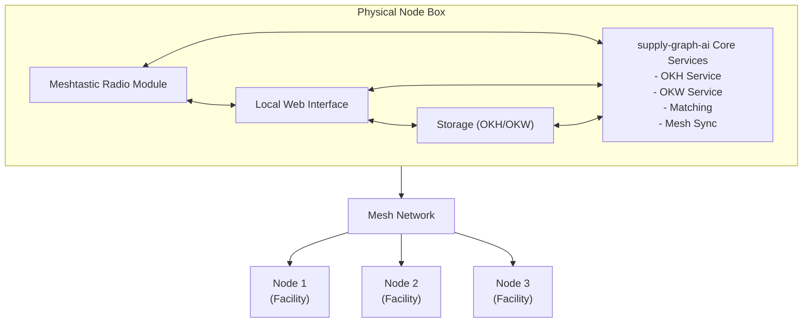
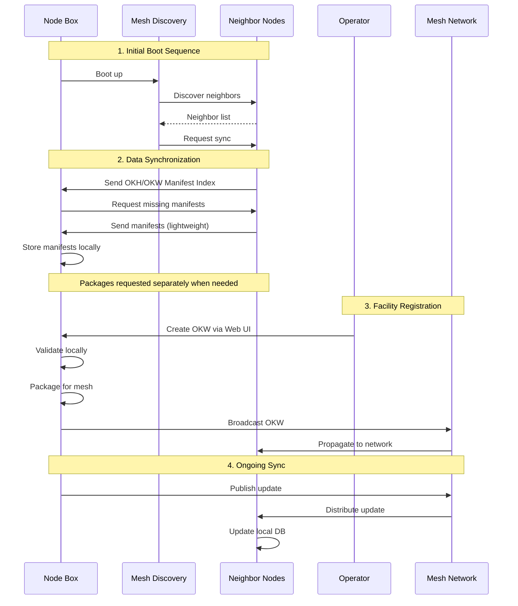
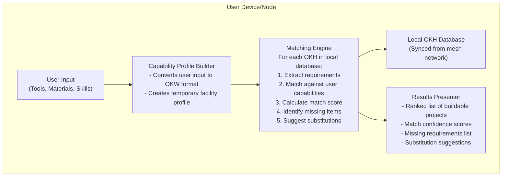
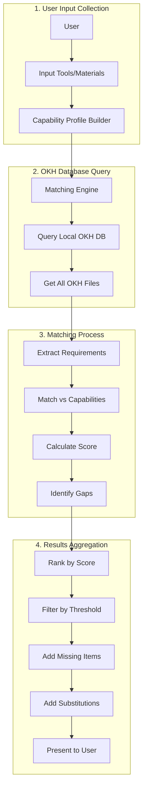
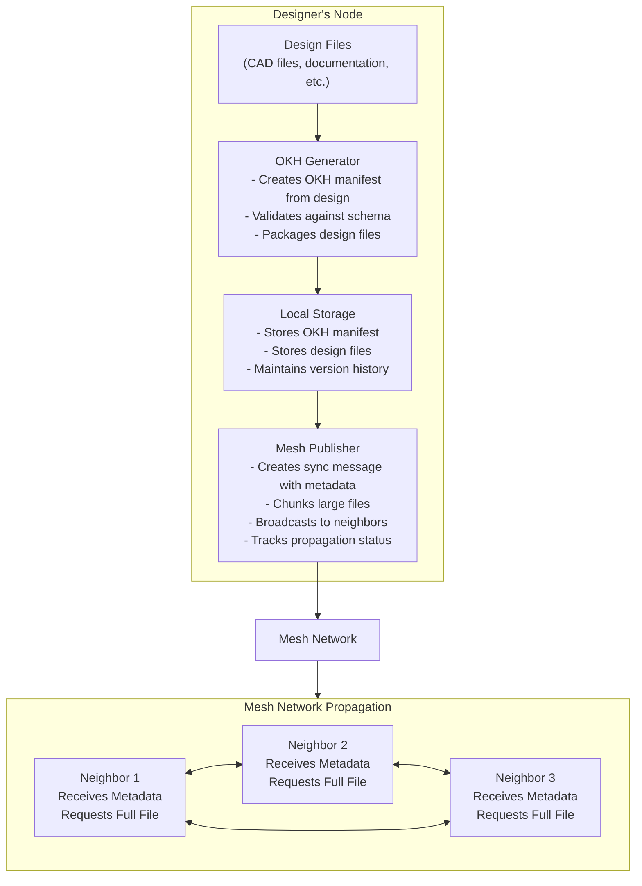
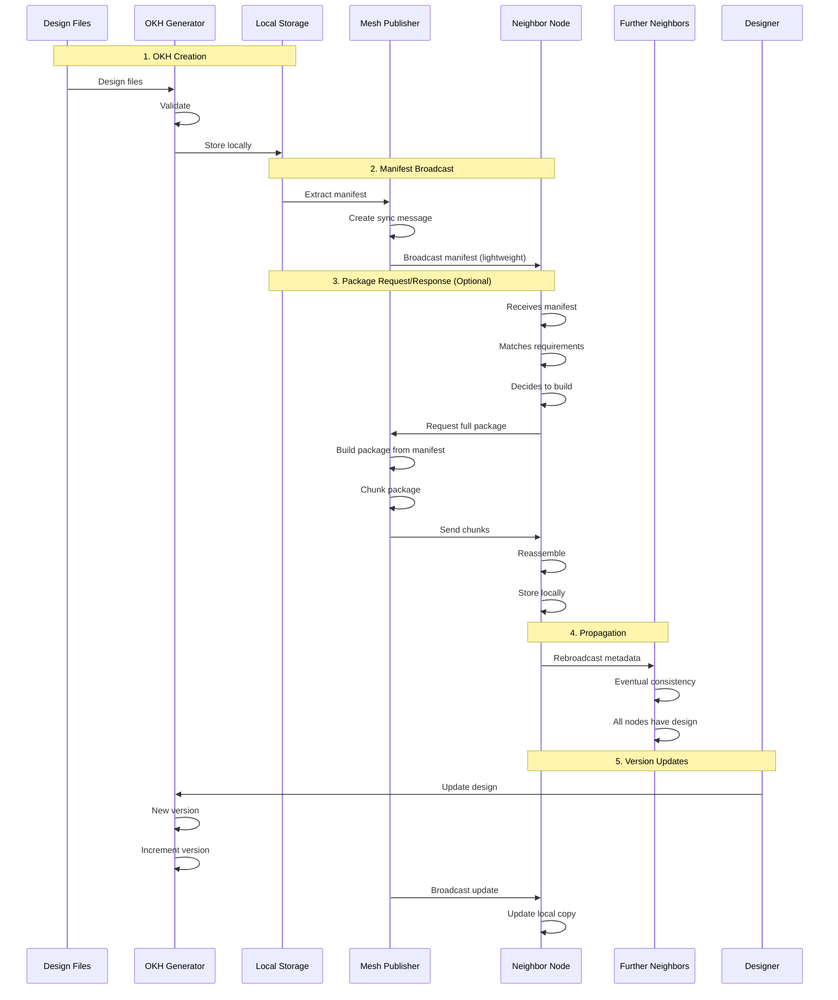
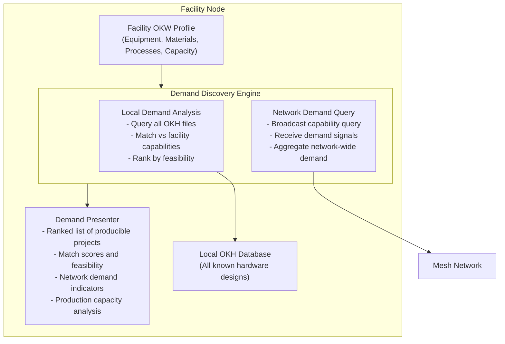

```mermaid
flowchart TD
    subgraph Local["1. Local Demand Analysis"]
        OKW["OKW Profile"] --> Extract["Extract Capabilities"]
        Extract --> Query["Query OKH DB"]
        Query --> EachOKH["Each OKH"]
        EachOKH --> ExtractReq["Extract Requirements"]
        ExtractReq --> Match["Match vs Capabilities"]
        Match --> Rank["Rank by Feasibility"]
        Rank --> Filter["Filter by Threshold"]
    end
    
    subgraph Network["2. Network Demand Query"]
        FN["Facility Node"] --> Broadcast["Broadcast Capability Query"]
        Broadcast --> MN["Mesh Network"]
        MN --> OtherNodes["Other Nodes"]
        OtherNodes --> Check["Check Local Requests"]
        Check --> Respond["Respond with Demand"]
        Respond --> Aggregate["Aggregate Responses"]
        Aggregate --> AddResults["Add to Results"]
    end
    
    subgraph Agg["3. Demand Aggregation"]
        LocalMatches["Local Matches"] --> Combine["Combine Results"]
        NetworkDemand["Network Demand"] --> Combine
        Combine --> RankCombined["Rank by Combined Score"]
        RankCombined --> Present["Present to Operator"]
    end
    
    subgraph Monitor["4. Ongoing Monitoring"]
        FN2["Facility Node"] --> Subscribe["Subscribe to Demand Updates"]
        Subscribe --> MN2["Mesh Network"]
        NewOKH["New OKH Published"] --> AutoMatch["Auto-Match"]
        AutoMatch --> Notify["Notify if Match Found"]
        DemandReq["Demand Request"] --> CheckCap["Check Capabilities"]
        CheckCap --> Respond2["Respond if Can Produce"]
    end
    
    Local --> Agg
    Network --> Agg
```

# Offline Mesh Network Use Cases

## Overview

This document explores use cases for supply-graph-ai in offline and mesh network environments, where traditional internet connectivity is unavailable or unreliable. These scenarios are particularly relevant for:

- Developing countries with limited infrastructure
- Conflict zones with disrupted communications
- Natural disaster areas with damaged infrastructure
- Remote locations without reliable internet access
- Community networks operating independently

All use cases assume the availability of mesh networking protocols (e.g., Meshtastic) and local data storage, but no persistent internet connection.

## Core Architecture Principles

### Manifest vs Package Distinction

A critical architectural consideration is the distinction between **OKH manifests** and **OKH packages**:

- **OKH Manifest**: A lightweight JSON file (typically < 100KB) that describes hardware requirements, links to files, and contains metadata. The manifest is the "recipe" but doesn't include the actual files.

- **OKH Package**: A complete file structure containing the manifest plus all referenced files (CAD files, STL files, PCB designs, documentation, images, etc.). Packages can be hundreds of megabytes or even gigabytes.

**Implications for Mesh Networks**:
- **Manifests** can be easily shared across the mesh network - they're small enough for frequent synchronization
- **Packages** require careful bandwidth management - they should only be transferred when explicitly requested
- Nodes typically maintain a local database of **manifests** for matching and discovery
- **Packages** are built on-demand or cached locally when needed for actual production

This distinction enables efficient network operations: nodes can discover and match against thousands of manifests while only downloading complete packages when they're ready to build.

### Mesh Network Layer
- **Protocol**: Meshtastic or similar LoRa-based mesh networking
- **Range**: Typically 1-10km line-of-sight, extended through mesh relays
- **Bandwidth**: Low bandwidth (hundreds of bytes to kilobytes per message)
- **Topology**: Ad-hoc, self-organizing network of nodes
- **Data Transfer**: Store-and-forward messaging with eventual consistency

### Local Data Storage
- **Node Storage**: Each node maintains a local database of OKH manifests (lightweight) and optionally cached packages
- **Replication**: Manifest data propagates through the mesh via gossip protocols
- **Conflict Resolution**: Version-based or timestamp-based conflict resolution
- **Storage Limits**: Nodes may have limited storage capacity - prioritize manifests over packages

### Synchronization Strategy
- **Manifest Sync**: Manifests synced frequently via lightweight gossip protocol
- **Package Sync**: Packages only transferred on explicit request, with bandwidth-aware chunking
- **Incremental Updates**: Only changes/deltas are transmitted for manifests
- **Priority Queuing**: Critical data (new OKH manifests, facility updates) prioritized
- **Compression**: Data compressed before transmission
- **Chunking**: Large packages split into smaller chunks for transmission

---

## Use Case 1: "Node in a Box" - Facility Onboarding

### User Journey

1. **Facility Operator** receives a physical "node in a box" package
2. **Unboxing**: Package contains:
    - Single-board computer (Raspberry Pi or similar)
    - Meshtastic radio module
    - Pre-configured storage (SD card or SSD)
    - Power supply (battery + solar panel option)
    - Quick start guide
3. **Initial Setup**: 
    - Power on the device
    - Connect to local WiFi (if available) or use direct mesh connection
    - Device auto-discovers nearby mesh nodes
    - Begins syncing OKH/OKW data from network
4. **Facility Registration**:
    - Operator creates OKW profile describing their facility capabilities
    - Profile is validated locally
    - Profile propagates to network via mesh
5. **Ongoing Operation**:
    - Node continuously syncs with mesh network
    - Receives new OKH files as they're published
    - Facility capabilities updated as equipment changes
    - Node serves as local access point for facility operators

### System Architecture



### Data Flow



### Key Components

**Mesh Sync Service**
- Discovers nearby nodes
- Manages data synchronization
- Handles conflict resolution
- Prioritizes critical updates

**Local Storage Manager**
- Manages OKH/OKW manifest storage (primary)
- Manages package storage (on-demand, cached)
- Maintains index/metadata for fast queries
- Handles storage capacity limits (prioritizes manifests)
- Implements data retention policies

**Facility Onboarding Wizard**
- Guides operator through OKW creation
- Validates facility data
- Provides templates for common facility types
- Generates initial OKW manifest

---

## Use Case 2: "What Can I Build?" - Capability Matching

### User Journey

1. **Maker/Engineer** wants to know what they can build with available resources
2. **Inventory Input**: User inputs their available:
    - Tools and equipment
    - Materials on hand
    - Skills and capabilities
3. **Local Query**: System queries all OKH manifests in local database
4. **Matching Process**: 
    - Extracts requirements from each OKH
    - Matches against user's capabilities
    - Ranks results by match quality
5. **Results Display**: 
    - Shows buildable projects
    - Highlights missing requirements
    - Suggests substitutions where possible
6. **Offline Access**: All matching happens locally, no network required

### System Architecture



### Data Flow



### Key Components

**Capability Profile Builder**
- Converts informal user input to structured OKW format
- Handles partial/incomplete information
- Provides suggestions for common tools/materials
- Creates temporary facility profile for matching

**Local Matching Service**
- Optimized for local execution (no network calls)
- Batch processes all OKH manifests
- Caches match results for performance
- Handles large manifest databases
- Works with lightweight manifests, not full packages

**Results Ranking Engine**
- Scores matches based on:
  - Percentage of requirements met
  - Critical vs optional requirements
  - Substitution availability
  - User skill level compatibility
- Filters results by confidence threshold

---

## Use Case 3: "Publish My Design" - Design Synchronization

### User Journey

1. **Designer/Engineer** creates a new hardware design
2. **OKH Creation**: 
    - Uses supply-graph-ai to generate OKH manifest
    - Validates manifest locally
    - Optionally includes design files
3. **Local Publishing**: 
    - OKH manifest stored in local node database
    - Marked as "new" or "updated"
    - Package files remain local until requested
4. **Mesh Propagation**:
    - Node broadcasts OKH manifest (lightweight) to neighbors
    - Neighbors receive manifest and can match against it immediately
    - Neighbors can request full package only if they want to build it
    - Manifest propagates through entire mesh network efficiently
5. **Version Management**:
    - Updates to design create new versions
    - Version history maintained across network
    - Nodes can request specific versions

### System Architecture



### Data Flow



### Key Components

**OKH Generator Service**
- Creates OKH manifests from design files
- Validates against OKH schema
- Handles file references and packaging
- Generates unique IDs and versions

**Mesh Publisher Service**
- Manages mesh network communication
- Broadcasts lightweight manifests for discovery
- Handles package requests and chunking for large packages
- Handles retry logic for failed transmissions
- Tracks propagation status across network
- Differentiates between manifest sync (frequent) and package transfer (on-demand)

**Version Manager**
- Maintains version history
- Handles version conflicts
- Supports version-specific queries
- Manages storage of multiple versions

**Sync Protocol Handler**
- Implements mesh sync protocol
- Handles metadata exchange
- Manages file chunk requests/responses
- Implements eventual consistency guarantees

---

## Use Case 4: "What's In Demand?" - Demand Discovery

### User Journey

1. **Facility Operator** wants to know what they could produce
2. **Capability Declaration**: 
    - Facility has existing OKW profile (from Use Case 1)
    - Profile describes available equipment, materials, processes
3. **Demand Query**:
    - System queries all OKH files in local database
    - Matches facility capabilities against OKH requirements
    - Identifies projects that facility could produce
4. **Demand Analysis**:
    - Ranks projects by match quality
    - Shows which projects are most feasible
    - Highlights any missing capabilities
    - Estimates production feasibility
5. **Network-Wide Demand**:
    - Optionally queries mesh network for demand signals
    - Receives requests from other nodes
    - Sees what others are looking for

### System Architecture



### Data Flow



### Key Components

**Demand Discovery Engine**
- Matches facility capabilities against OKH requirements
- Performs reverse matching (capability → requirement)
- Calculates production feasibility scores
- Handles capacity and resource constraints

**Network Demand Aggregator**
- Queries mesh network for demand signals
- Aggregates responses from multiple nodes
- Handles partial network connectivity
- Maintains demand cache for offline analysis

**Feasibility Analyzer**
- Calculates production feasibility based on:
  - Match quality (capability vs requirement)
  - Resource availability
  - Capacity constraints
  - Material availability
  - Skill requirements
- Provides production estimates

**Demand Signal Protocol**
- Defines format for demand queries/responses
- Handles capability-based matching requests
- Supports subscription to demand updates
- Manages demand signal propagation

---

## Supply and Demand Signaling Architecture

### Problem Statement

Efficiently matching supply (facility capabilities) with demand (hardware requirements) in a distributed, offline mesh network presents several challenges:

1. **Discovery**: How do facilities discover what's in demand?
2. **Matching**: How do requesters find facilities that can fulfill their needs?
3. **State Management**: How do we track supply/demand state across a distributed network?
4. **Bandwidth Efficiency**: How do we minimize network traffic while maintaining useful information?
5. **Consistency**: How do we handle network partitions and eventual consistency?

### Design Principles

Based on distributed systems best practices, we adopt the following principles:

**1. Local-First Matching**
- Primary matching happens locally using cached manifests
- Network queries are supplementary, not required
- System remains functional during network partitions

**2. Event-Driven Architecture**
- Supply/demand changes are treated as events
- Events propagate through the network via gossip protocol
- Nodes maintain local event logs for reconstruction

**3. Bloom Filters for Efficient Queries**
- Use Bloom filters to represent capability sets
- Enables efficient "can you do X?" queries without full data transfer
- Reduces false positives through careful tuning

**4. Merklized Data Structures**
- Use Merkle trees for efficient state synchronization
- Nodes can quickly identify what they're missing
- Enables incremental sync of supply/demand state

**5. Time-To-Live (TTL) for Demand Signals**
- Demand signals expire after a set time
- Prevents stale demand from cluttering the network
- Facilities can set their own TTL preferences

### Supply/Demand Signal Types

**1. Capability Announcements (Supply)**
- **Format**: OKW profile with facility capabilities
- **Propagation**: Gossip protocol, periodic refresh
- **TTL**: Long-lived (until facility updates capabilities)
- **Size**: Small (just the OKW manifest)

**2. Demand Queries (Pull Model)**
- **Format**: Capability requirements (can be partial OKH or capability set)
- **Propagation**: Broadcast to neighbors, forwarded through network
- **TTL**: Short (hours to days)
- **Response**: Facilities respond if they can fulfill

**3. Demand Announcements (Push Model)**
- **Format**: OKH manifest ID + quantity needed + deadline
- **Propagation**: Gossip protocol, expires after deadline
- **TTL**: Based on deadline
- **Use Case**: Urgent or high-priority requests

**4. Match Confirmations**
- **Format**: Facility ID + OKH ID + match details
- **Propagation**: Point-to-point or limited broadcast
- **TTL**: Until confirmed or expired
- **Use Case**: Facility confirms they can produce requested item

### Signal Propagation Strategies

**Gossip Protocol for State Synchronization**
```
Each node maintains:
- Local supply state (own capabilities)
- Local demand cache (recent demand signals)
- Neighbor state summaries (Bloom filters)

Periodic gossip:
1. Exchange Bloom filters with neighbors
2. Identify missing or updated signals
3. Request full signals for mismatches
4. Propagate new signals to neighbors
```

**Epidemic Routing for Urgent Demand**
```
For high-priority demand:
1. Broadcast to all immediate neighbors
2. Each neighbor rebroadcasts with probability P
3. Signal includes hop count and TTL
4. Prevents network flooding while ensuring coverage
```

**Directed Queries for Specific Matching**
```
For targeted queries:
1. Use capability Bloom filter to identify likely matches
2. Route query toward nodes with matching capabilities
3. Use DHT-like routing if network supports it
4. Fall back to broadcast if routing fails
```

### State Management

**Local Event Log**
- Each node maintains an append-only log of supply/demand events
- Enables reconstruction of state after failures
- Supports audit and debugging
- Can be pruned after events expire

**Conflict Resolution**
- **Supply Conflicts**: Latest capability update wins
- **Demand Conflicts**: Multiple demand signals for same item are aggregated
- **Match Conflicts**: First confirmation wins, others notified of conflict

**Consistency Model**
- **Eventual Consistency**: Network converges to consistent state over time
- **Causal Consistency**: Events are ordered within causal chains
- **Read-Your-Writes**: Local changes immediately visible locally

### Bandwidth Optimization Techniques

**1. Bloom Filter Summaries**
- Facilities maintain Bloom filters of their capabilities
- Queries can check Bloom filter before requesting full OKW
- Reduces unnecessary data transfer

**2. Delta Compression**
- Only transmit changes to supply/demand state
- Use version vectors to track what neighbors have seen
- Minimize redundant data transmission

**3. Interest-Based Filtering**
- Nodes can subscribe to specific capability types
- Reduces irrelevant signal propagation
- Similar to content-based pub/sub systems

**4. Aggregation**
- Aggregate similar demand signals
- Combine multiple small requests into summaries
- Reduces message count while preserving information

### Implementation Considerations

**Signal Format**
```json
{
  "type": "demand_query" | "demand_announcement" | "capability_announcement" | "match_confirmation",
  "id": "uuid",
  "timestamp": "iso8601",
  "ttl": 3600,
  "source_node": "node_id",
  "payload": {
    // Type-specific data
  },
  "signature": "crypto_signature"
}
```

**Bloom Filter Parameters**
- Size: 1024-4096 bits (balance between false positive rate and size)
- Hash functions: 3-5 (optimal for most use cases)
- False positive rate: 1-5% (acceptable for capability queries)

**Gossip Protocol Parameters**
- Gossip interval: 30-300 seconds (balance freshness vs bandwidth)
- Fanout: 2-4 neighbors per gossip round
- State summary size: < 1KB per neighbor

### Known Challenges and Mitigations

**Challenge: Network Partitions**
- **Problem**: Supply/demand signals may not propagate across partitions
- **Mitigation**: Local matching still works; signals sync when partitions reconnect

**Challenge: Stale Demand**
- **Problem**: Expired demand signals may persist in network
- **Mitigation**: TTL enforcement, periodic cleanup, explicit cancellation signals

**Challenge: Signal Flooding**
- **Problem**: High demand can overwhelm network
- **Mitigation**: Rate limiting, aggregation, priority queuing, epidemic routing with low probability

**Challenge: Privacy Concerns**
- **Problem**: Facilities may not want to broadcast all capabilities
- **Mitigation**: Selective announcement, encrypted signals, capability masking

**Challenge: False Positives in Matching**
- **Problem**: Bloom filter false positives lead to unnecessary queries
- **Mitigation**: Multi-stage filtering, tunable false positive rates, full verification before commitment

### Research and Best Practices References

This architecture draws from several well-established distributed systems patterns. Below, we explain each concept, provide links to primary source material, and describe how it applies to supply-graph-ai's offline mesh network use cases.

---

## Distributed Systems Patterns: Detailed Explanations

### 1. Gossip Protocols

**What is it?**

Gossip protocols (also called epidemic protocols) are a class of distributed algorithms where nodes periodically exchange information with a small, randomly selected subset of neighbors. Like human gossip, information spreads through the network gradually, eventually reaching all nodes. The name comes from the way information spreads: each node "gossips" with a few neighbors, who then gossip with their neighbors, and so on.

**How it works:**

1. Each node maintains local state (e.g., list of OKH manifests, facility capabilities)
2. Periodically (every 30-300 seconds), each node selects 2-4 random neighbors
3. Nodes exchange summaries of their state (e.g., Bloom filters, version vectors)
4. Missing or updated information is identified and requested
5. Information propagates through the network with eventual consistency

**Key Properties:**
- **Decentralized**: No central coordinator needed
- **Fault-tolerant**: Works even when nodes fail or network partitions
- **Scalable**: Bandwidth usage grows logarithmically with network size
- **Eventual consistency**: All nodes eventually see the same information

**Primary Sources:**
- **Original Paper**: Demers, A., et al. (1987). "Epidemic algorithms for replicated database maintenance." *ACM PODC*. [Link](https://dl.acm.org/doi/10.1145/41840.41841)
- **Cassandra Implementation**: Lakshman, A., & Malik, P. (2010). "Cassandra: a decentralized structured storage system." *ACM SIGOPS Operating Systems Review*. [Link](https://dl.acm.org/doi/10.1145/1773912.1773922)

**Application to supply-graph-ai:**

In our offline mesh network, gossip protocols enable:
- **Manifest Synchronization**: OKH manifests spread through the network automatically
- **Capability Discovery**: Facility capabilities (OKW profiles) propagate to all nodes
- **Demand Signal Distribution**: Demand queries and announcements spread efficiently
- **Network Resilience**: System continues working even when nodes disconnect

**Example in our system:**
```
Node A has a new OKH manifest
  ↓ (gossips with Node B and C)
Node B and C receive manifest summary
  ↓ (B gossips with D, C gossips with E)
Nodes D and E receive manifest
  ↓ (continues...)
Eventually all nodes in network have the manifest
```

**Why it's important for offline networks:**
- No internet connection means no central server - gossip provides decentralized sync
- Network partitions are common - gossip handles them gracefully
- Low bandwidth is critical - gossip uses minimal bandwidth per node
- Node failures are expected - gossip continues working with remaining nodes

---

### 2. Bloom Filters

**What is it?**

A Bloom filter is a space-efficient probabilistic data structure that can tell you whether an element is **possibly** in a set or **definitely not** in a set. It's like a membership test that can have false positives (says "maybe" when the answer is "no") but never false negatives (never says "definitely not" when the answer is "yes").

**How it works:**

1. Start with a bit array of size `m` (all bits set to 0)
2. Use `k` different hash functions
3. To add an element: hash it with all `k` functions, set those bit positions to 1
4. To check membership: hash the element with all `k` functions, check if all bits are 1
   - If all bits are 1 → "possibly in set" (could be false positive)
   - If any bit is 0 → "definitely not in set" (no false negatives)

**Key Properties:**
- **Space efficient**: Much smaller than storing full set
- **Fast**: O(k) time for add/check operations
- **One-way**: Can't retrieve original elements, only test membership
- **Tunable**: Can adjust false positive rate by changing size and hash count

**Primary Sources:**
- **Original Paper**: Bloom, B. H. (1970). "Space/time trade-offs in hash coding with allowable errors." *Communications of the ACM*. [Link](https://dl.acm.org/doi/10.1145/362686.362692)
- **Survey**: Broder, A., & Mitzenmacher, M. (2004). "Network applications of bloom filters: A survey." *Internet Mathematics*. [Link](https://www.eecs.harvard.edu/~michaelm/postscripts/im2005b.pdf)
- **Practical Guide**: Mitzenmacher, M., & Upfal, E. (2017). *Probability and Computing: Randomization and Probabilistic Techniques in Algorithms and Data Analysis*. Cambridge University Press.

**Application to supply-graph-ai:**

In our offline mesh network, Bloom filters enable:
- **Efficient Capability Queries**: "Do you have capability X?" without sending full capability list
- **State Summarization**: Compact representation of what manifests/capabilities a node has
- **Bandwidth Reduction**: Exchange Bloom filters instead of full data sets
- **Quick Filtering**: Rapidly identify nodes that might have matching capabilities

**Example in our system:**
```
Facility Node creates Bloom filter of capabilities:
  - "3D printing" → hash → set bits
  - "CNC machining" → hash → set bits
  - "Laser cutting" → hash → set bits

Query Node sends: "Can you do 3D printing?"
  → Hash "3D printing" → check bits → "possibly yes"
  → Request full OKW profile to verify

Query Node sends: "Can you do injection molding?"
  → Hash "injection molding" → check bits → "definitely no"
  → Skip this node, no need to request full profile
```

**Why it's important for offline networks:**
- **Bandwidth is precious**: Bloom filters are tiny (1-4KB) vs full capability lists (100KB+)
- **Quick filtering**: Identify likely matches before expensive full queries
- **Scalable**: Can represent thousands of capabilities in a small filter
- **Privacy-friendly**: Can't reverse-engineer full capabilities from filter

**Trade-offs:**
- False positives mean some unnecessary queries, but this is acceptable
- Can't remove elements (but can rebuild filter when capabilities change)
- Need to tune parameters (size, hash count) for acceptable false positive rate

---

### 3. Event Sourcing

**What is it?**

Event sourcing is a pattern where the state of an application is determined by a sequence of events, rather than storing the current state directly. Instead of updating a record in place, you append a new event to an immutable log. The current state is reconstructed by replaying all events from the beginning.

**How it works:**

1. **Event Log**: Append-only log of all events (e.g., "OKH manifest created", "facility capability updated")
2. **Event Store**: Events are stored permanently and immutably
3. **State Reconstruction**: Current state = initial state + all events applied in order
4. **Snapshots**: Optional optimization - periodically save current state to avoid replaying all events

**Key Properties:**
- **Complete History**: Every change is recorded
- **Audit Trail**: Can see exactly what happened and when
- **Time Travel**: Can reconstruct state at any point in time
- **Event Replay**: Can rebuild state after failures

**Primary Sources:**
- **Original Concept**: Fowler, M. (2005). "Event Sourcing." *martinfowler.com*. [Link](https://martinfowler.com/eaaDev/EventSourcing.html)
- **Pattern Language**: Hohpe, G., & Woolf, B. (2003). *Enterprise Integration Patterns*. Addison-Wesley. (Event Message pattern)
- **Practical Guide**: Young, G. (2016). *Versioning in an Event Sourced System*. [Link](https://leanpub.com/esversioning)
- **Implementation**: EventStore documentation. [Link](https://www.eventstore.com/event-sourcing)

**Application to supply-graph-ai:**

In our offline mesh network, event sourcing enables:
- **Supply/Demand History**: Complete log of all capability changes and demand signals
- **State Recovery**: Rebuild local state after node failures or data corruption
- **Conflict Resolution**: See full history of changes to resolve conflicts
- **Audit and Debugging**: Understand how network state evolved over time

**Example in our system:**
```
Event Log:
  Event 1: "Facility A added capability: 3D printing" (timestamp: T1)
  Event 2: "OKH manifest X published" (timestamp: T2)
  Event 3: "Demand query for 3D printing" (timestamp: T3)
  Event 4: "Facility A matched with OKH X" (timestamp: T4)
  Event 5: "Facility A updated capability: added CNC" (timestamp: T5)

Current State = Replay all events:
  - Facility A has: 3D printing, CNC
  - OKH manifest X exists
  - Demand query for 3D printing was made
  - Facility A matched with OKH X
```

**Why it's important for offline networks:**
- **Resilience**: Can recover from failures by replaying events
- **Consistency**: Events provide single source of truth
- **Debugging**: Can trace how network state developed
- **Synchronization**: New nodes can catch up by replaying events

**Trade-offs:**
- Storage overhead: Need to store all events (but can compress/archive old events)
- Replay cost: Reconstructing state can be slow (mitigated with snapshots)
- Event versioning: Need to handle schema changes in events over time

---

### 4. Epidemic Routing

**What is it?**

Epidemic routing is a message propagation algorithm inspired by how diseases spread. Messages are "contagious" - when a node receives a message, it spreads it to other nodes with some probability. This is particularly useful in delay-tolerant networks (DTNs) where nodes may not always be connected.

**How it works:**

1. **Message Injection**: Source node creates message and marks it as "infected"
2. **Epidemic Spread**: When two nodes meet:
   - They exchange lists of message IDs they have
   - Each node requests messages it doesn't have
   - Messages spread like a disease through the network
3. **Anti-Entropy**: Nodes periodically exchange to ensure all messages propagate
4. **Vaccination**: Messages can be "vaccinated" (marked as delivered) to stop spreading

**Key Properties:**
- **High Delivery Rate**: Messages eventually reach destination if path exists
- **No Routing Table**: Doesn't need to know network topology
- **Delay Tolerant**: Works in intermittently connected networks
- **Bandwidth Efficient**: Can tune probability to control spread

**Primary Sources:**
- **Original Paper**: Vahdat, A., & Becker, D. (2000). "Epidemic routing for partially connected ad hoc networks." *Technical Report CS-2000-06, Duke University*. [Link](https://issg.cs.duke.edu/epidemic/epidemic.pdf)
- **Survey**: Zhang, Z. (2006). "Routing in intermittently connected mobile ad hoc networks and delay tolerant networks: overview and challenges." *IEEE Communications Surveys & Tutorials*. [Link](https://ieeexplore.ieee.org/document/1683776)
- **DTN Architecture**: Fall, K. (2003). "A delay-tolerant network architecture for challenged internets." *ACM SIGCOMM*. [Link](https://dl.acm.org/doi/10.1145/863955.863960)

**Application to supply-graph-ai:**

In our offline mesh network, epidemic routing enables:
- **Urgent Demand Propagation**: High-priority demand signals spread quickly
- **Network Resilience**: Messages reach destination even with intermittent connectivity
- **No Central Coordination**: Works without knowing full network topology
- **Bandwidth Control**: Can tune spread probability to manage network load

**Example in our system:**
```
Urgent demand: "Need 100 units of X by Friday"

Node A (source) creates demand message
  ↓ (meets Node B)
Node B receives message, probability P=0.8 to forward
  ↓ (B forwards, meets Node C)
Node C receives message, probability P=0.8 to forward
  ↓ (continues spreading...)
Eventually reaches Facility Node Z that can fulfill
  ↓ (Z responds, message marked as "delivered")
Spreading stops for this message
```

**Why it's important for offline networks:**
- **Intermittent Connectivity**: Nodes may not always be connected - epidemic routing handles this
- **No Infrastructure**: Works without routers or central servers
- **Urgent Messages**: Can prioritize urgent demand signals
- **Self-Organizing**: Network organizes itself without manual configuration

**Trade-offs:**
- **Bandwidth Usage**: Can flood network if not controlled (mitigated with probability tuning)
- **Delivery Delay**: Messages may take time to propagate (acceptable for non-real-time use)
- **Duplicate Messages**: Nodes may receive same message multiple times (handled with deduplication)

---

### 5. Distributed Hash Tables (DHTs)

**What is it?**

A Distributed Hash Table (DHT) is a distributed system that provides a lookup service similar to a hash table. Key-value pairs are distributed across nodes in the network, and any node can efficiently retrieve the value associated with a given key. DHTs enable efficient resource discovery in large, decentralized networks.

**How it works:**

1. **Key Space**: All possible keys map to a circular key space (e.g., 0 to 2^160)
2. **Node Assignment**: Each node is assigned a position in the key space (based on node ID)
3. **Key Assignment**: Each key is assigned to the node whose ID is closest to the key
4. **Routing**: To find a key, nodes route requests through the network using a routing table
5. **Lookup**: Requests hop from node to node, getting closer to the target key each hop

**Key Properties:**
- **Decentralized**: No central server needed
- **Scalable**: Lookup time is O(log n) where n is number of nodes
- **Fault Tolerant**: System continues working when nodes fail
- **Load Balanced**: Keys distributed evenly across nodes

**Primary Sources:**
- **Chord DHT**: Stoica, I., et al. (2001). "Chord: A scalable peer-to-peer lookup service for internet applications." *ACM SIGCOMM*. [Link](https://pdos.csail.mit.edu/papers/chord:sigcomm01/chord_sigcomm.pdf)
- **Kademlia DHT**: Maymounkov, P., & Mazières, D. (2002). "Kademlia: A peer-to-peer information system based on the XOR metric." *IPTPS*. [Link](https://pdos.csail.mit.edu/~petar/papers/maymounkov-kademlia-lncs.pdf)
- **Survey**: Lua, E. K., et al. (2005). "A survey and comparison of peer-to-peer overlay network schemes." *IEEE Communications Surveys & Tutorials*. [Link](https://ieeexplore.ieee.org/document/1423865)

**Application to supply-graph-ai:**

In our offline mesh network, DHTs could enable:
- **Capability Lookup**: "Find all facilities with capability X" - hash capability to key, lookup nodes
- **Manifest Discovery**: "Find OKH manifest with ID Y" - hash ID to key, lookup location
- **Efficient Routing**: Route queries toward nodes likely to have matching capabilities
- **Load Distribution**: Distribute supply/demand data across network nodes

**Example in our system:**
```
Query: "Find facilities with 3D printing capability"

1. Hash "3D printing" → key = 0x7A3F...
2. Route query through DHT toward key 0x7A3F...
3. Each hop gets closer to target key
4. Reach node responsible for key 0x7A3F...
5. That node returns list of facilities with 3D printing
```

**Why it's important for offline networks:**
- **Efficient Discovery**: Find resources without broadcasting to all nodes
- **Scalability**: Works well even with hundreds of nodes
- **Decentralized**: No need for central directory
- **Fault Tolerance**: Continues working when nodes fail

**Trade-offs:**
- **Complexity**: More complex to implement than simple broadcast
- **Network Overhead**: Requires maintaining routing tables
- **Churn Sensitivity**: Frequent node joins/leaves can impact performance
- **May be overkill**: For small networks (< 50 nodes), simple broadcast may be sufficient

**Note**: DHTs may be overkill for small mesh networks. Consider simpler approaches first, and add DHT support if network grows large.

---

### 6. Content-Based Publish/Subscribe (Pub/Sub)

**What is it?**

Publish/Subscribe is a messaging pattern where senders (publishers) don't send messages directly to receivers (subscribers). Instead, publishers categorize messages into topics or channels, and subscribers express interest in certain topics. A message broker or event bus routes messages to interested subscribers.

**Content-Based Pub/Sub** extends this by allowing subscribers to express interest based on message content (e.g., "notify me of all OKH manifests that require 3D printing"), not just topic names.

**How it works:**

1. **Subscription**: Subscribers register interest using predicates (e.g., "capability = '3D printing'")
2. **Publication**: Publishers send messages with attributes (e.g., OKH manifest with required capabilities)
3. **Matching**: System matches message attributes against subscription predicates
4. **Routing**: Messages are routed only to matching subscribers
5. **Delivery**: Subscribers receive only messages they're interested in

**Key Properties:**
- **Decoupling**: Publishers and subscribers don't know about each other
- **Selective Delivery**: Subscribers receive only relevant messages
- **Scalability**: Can handle many publishers and subscribers
- **Flexibility**: Subscriptions can be complex predicates

**Primary Sources:**
- **Siena System**: Carzaniga, A., et al. (2001). "Design and evaluation of a wide-area event notification service." *ACM TOCS*. [Link](https://dl.acm.org/doi/10.1145/502159.502160)
- **Hermes Middleware**: Pietzuch, P. R., & Bacon, J. M. (2002). "Hermes: A distributed event-based middleware architecture." *DEBS*. [Link](https://www.cl.cam.ac.uk/techreports/UCAM-CL-TR-498.pdf)
- **Survey**: Eugster, P. T., et al. (2003). "The many faces of publish/subscribe." *ACM Computing Surveys*. [Link](https://dl.acm.org/doi/10.1145/857076.857078)

**Application to supply-graph-ai:**

In our offline mesh network, content-based pub/sub enables:
- **Interest-Based Filtering**: Facilities subscribe to demand signals matching their capabilities
- **Selective Propagation**: Only relevant messages propagate to interested nodes
- **Bandwidth Efficiency**: Reduce network traffic by filtering at subscription level
- **Dynamic Subscriptions**: Facilities can change subscriptions as capabilities change

**Example in our system:**
```
Facility A subscribes: "Notify me of demand for 3D printing OR CNC machining"

Demand signals published:
  - "Need 100 units, requires 3D printing" → Matches → Delivered to Facility A
  - "Need 50 units, requires injection molding" → Doesn't match → Not delivered
  - "Need 200 units, requires CNC machining" → Matches → Delivered to Facility A

Result: Facility A only receives relevant demand signals, saving bandwidth
```

**Why it's important for offline networks:**
- **Bandwidth Conservation**: Only relevant messages propagate, saving precious bandwidth
- **Reduced Noise**: Facilities don't receive irrelevant demand signals
- **Scalability**: System scales better when messages are filtered early
- **Flexibility**: Subscriptions can be complex (e.g., "3D printing AND material = PLA")

**Trade-offs:**
- **Matching Overhead**: Need to match messages against subscriptions (but this is usually fast)
- **Subscription Management**: Need to maintain and propagate subscriptions
- **Complexity**: More complex than simple broadcast (but worth it for bandwidth savings)

---

### 7. Merklized Data Structures (Merkle Trees)

**What is it?**

A Merkle tree (also called a hash tree) is a tree data structure where each leaf node contains a hash of a data block, and each non-leaf node contains a hash of its children's hashes. The root of the tree (called the Merkle root) is a single hash that represents the entire data structure. Merklized data structures enable efficient verification of data integrity and efficient synchronization of large datasets.

**How it works:**

1. **Data Blocks**: Start with your data divided into blocks (e.g., list of OKH manifests, set of facility capabilities)
2. **Leaf Nodes**: Hash each data block to create leaf nodes
3. **Parent Nodes**: Hash pairs of child nodes together to create parent nodes
4. **Root Hash**: Continue hashing up the tree until you reach a single root hash
5. **Verification**: To verify a specific block, you only need the block, its "proof path" (sibling hashes up to root), and the root hash
6. **Synchronization**: Two nodes can compare root hashes to quickly determine if their data differs, then exchange only the differing subtrees

**Visual Example:**
```
                    Root Hash (H1234)
                   /                \
          H12                      H34
         /    \                   /    \
      H1      H2               H3      H4
     /        \               /        \
  Hash(Data1) Hash(Data2) Hash(Data3) Hash(Data4)
```

**Key Properties:**
- **Efficient Verification**: Verify any data block with O(log n) hashes instead of hashing entire dataset
- **Incremental Sync**: Only transfer differing parts of the tree, not entire dataset
- **Tamper Detection**: Any change to data changes the root hash, immediately detectable
- **Parallelizable**: Can compute hashes in parallel for better performance

**Primary Sources:**
- **Original Concept**: Merkle, R. C. (1988). "A digital signature based on a conventional encryption function." *CRYPTO '87*. [Link](https://link.springer.com/chapter/10.1007/3-540-48184-2_32)
- **Git Implementation**: Git uses Merkle trees for version control. See: [Git Objects](https://git-scm.com/book/en/v2/Git-Internals-Git-Objects)
- **Bitcoin Usage**: Nakamoto, S. (2008). "Bitcoin: A Peer-to-Peer Electronic Cash System." Uses Merkle trees for transaction verification. [Link](https://bitcoin.org/bitcoin.pdf)
- **IPFS Implementation**: Benet, J. (2014). "IPFS - Content Addressed, Versioned, P2P File System." Uses Merkle DAGs. [Link](https://ipfs.io/ipfs/QmR7GSQM93Cx5eAg6a6yRzNde1FQv7uL6X1o4k7zrJa3LX/ipfs.draft3.pdf)
- **Survey**: Crosby, S. A., & Wallach, D. S. (2009). "Efficient data structures for tamper-evident logging." *USENIX Security*. [Link](https://www.usenix.org/legacy/event/sec09/tech/full_papers/crosby.pdf)

**Application to supply-graph-ai:**

In our offline mesh network, Merklized data structures enable:
- **Efficient State Synchronization**: Nodes can quickly identify what data they're missing by comparing Merkle roots
- **Incremental Updates**: Only transfer the parts of the dataset that differ between nodes
- **Data Integrity**: Verify that received manifests and capabilities haven't been tampered with
- **Bandwidth Efficiency**: Avoid transferring entire datasets when only small parts have changed

**Example in our system:**
```
Node A has 1000 OKH manifests, Node B has 950 (missing 50)

Without Merkle Trees:
  - Node B requests: "Send me all your manifests"
  - Node A sends: 1000 manifests (large transfer)
  - Node B compares all 1000 to find the 50 missing ones

With Merkle Trees:
  1. Node A and B exchange Merkle roots
  2. Roots differ → data differs
  3. Exchange intermediate hashes to find differing subtrees
  4. Identify that Node B is missing manifests in subtree X
  5. Node A sends only the 50 missing manifests from subtree X
  6. Much smaller transfer, faster sync
```

**Detailed Synchronization Example:**
```
Node A's Merkle Tree:
                    Root: H1234
                   /            \
            H12                  H34
           /    \               /    \
        H1      H2           H3      H4
    (Manifests (Manifests (Manifests (Manifests
     1-250)    251-500)   501-750)  751-1000)

Node B's Merkle Tree:
                    Root: H1234' (different!)
                   /            \
            H12                  H34'
           /    \               /    \
        H1      H2           H3'     H4'
    (Manifests (Manifests (Manifests (Manifests
     1-250)    251-500)   501-750)  751-950) ← Missing 50!

Synchronization Process:
1. Compare roots: H1234 ≠ H1234' → data differs
2. Compare children: H12 = H12' (same), H34 ≠ H34' (differs)
3. Focus on right subtree, compare: H3 = H3' (same), H4 ≠ H4' (differs)
4. Node B requests only manifests from H4 subtree
5. Node A sends only the 50 missing manifests
6. Node B rebuilds H4', then H34', then H1234'
7. Sync complete with minimal data transfer
```

**Why it's important for offline networks:**
- **Bandwidth Efficiency**: Critical in low-bandwidth mesh networks - only transfer what's needed
- **Fast Synchronization**: Quickly identify what's missing without comparing entire datasets
- **Data Integrity**: Verify data hasn't been corrupted or tampered with during transmission
- **Scalability**: Works efficiently even with thousands of manifests/capabilities
- **Resilience**: Can verify and repair corrupted data by requesting specific subtrees

**Trade-offs:**
- **Computational Overhead**: Need to compute and maintain Merkle tree (but this is usually fast with modern hardware)
- **Storage Overhead**: Need to store tree structure and hashes (minimal compared to data size)
- **Complexity**: More complex than simple hash comparison (but worth it for bandwidth savings)
- **Tree Rebalancing**: If data changes frequently, may need to rebuild tree (but can optimize with incremental updates)

**Variations and Optimizations:**

**Merkle DAG (Directed Acyclic Graph)**
- Used in IPFS and Git
- Allows data blocks to be shared/referenced multiple times
- More efficient for versioned data where blocks are reused

**Merkle Patricia Tree**
- Used in Ethereum
- Combines Merkle tree with Patricia (radix) tree
- More efficient for key-value stores

**Incremental Merkle Trees**
- Optimized for frequent updates
- Only recompute changed branches
- Useful when data changes frequently

---

### 8. BitTorrent Protocol for Package Distribution

**What is it?**

BitTorrent is a peer-to-peer (P2P) file-sharing protocol designed for efficient distribution of large files across a network. Instead of downloading a file from a single source, BitTorrent breaks files into small pieces and allows multiple peers to download and upload pieces simultaneously. This creates a self-scaling distribution system where more downloaders actually improve the system's performance.

**How it works:**

1. **Torrent File Creation**: 
   - Original file is split into fixed-size pieces (typically 256KB - 4MB)
   - A `.torrent` file is created containing:
     - File metadata (name, size, piece size)
     - Piece hashes (SHA-1 hash of each piece)
     - Tracker URL (or DHT/bootstrap nodes for trackerless torrents)
     - Info hash (hash of the entire torrent metadata)

2. **Initial Seeding**:
   - First node (seeder) has complete file and creates torrent
   - Seeder announces availability to tracker/DHT
   - Torrent file is distributed (via manifest or other means)

3. **Peer Discovery**:
   - **Tracker-based**: Peers contact tracker to get list of other peers
   - **Trackerless (DHT)**: Peers use Distributed Hash Table to find other peers
   - **Peer Exchange (PEX)**: Peers exchange peer lists directly

4. **Piece Download**:
   - Peer connects to multiple other peers simultaneously
   - Requests different pieces from different peers
   - Downloads pieces in parallel (not sequentially)
   - Verifies each piece using its hash before accepting

5. **Piece Upload (Seeding)**:
   - As peer downloads pieces, it immediately starts uploading them to others
   - Uses "tit-for-tat" algorithm: peers that upload to you get priority
   - Creates positive feedback loop: more peers = faster distribution

6. **Completion**:
   - Once all pieces are downloaded and verified, file is complete
   - Peer becomes a seeder, continues uploading to help others

**Key Properties:**
- **Self-Scaling**: More downloaders improve distribution speed
- **Resilient**: Works even if original seeder goes offline
- **Efficient**: Multiple parallel connections maximize bandwidth usage
- **Verifiable**: Each piece is hashed, ensuring data integrity
- **Fair**: Tit-for-tat encourages sharing

**Primary Sources:**
- **Original Protocol**: Cohen, B. (2003). "Incentives Build Robustness in BitTorrent." *Workshop on Economics of Peer-to-Peer Systems*. [Link](https://www.bittorrent.org/bittorrent-econ.pdf)
- **Protocol Specification**: BitTorrent Protocol Specification v1.0. [Link](https://www.bittorrent.org/beps/bep_0003.html)
- **DHT Extension**: Maymounkov, P., & Mazières, D. (2002). "Kademlia: A peer-to-peer information system based on the XOR metric." (Used in trackerless BitTorrent) [Link](https://pdos.csail.mit.edu/~petar/papers/maymounkov-kademlia-lncs.pdf)
- **Performance Analysis**: Pouwelse, J., et al. (2005). "The BitTorrent P2P file-sharing system: Measurements and analysis." *IPTPS*. [Link](https://www.cs.vu.nl/~johan/papers/iptps05.pdf)

**Application to supply-graph-ai:**

In our offline mesh network, BitTorrent could enable:
- **Efficient Package Distribution**: Distribute large OKH packages (100MB-1GB+) efficiently
- **Resilient Transfer**: Packages continue downloading even if original source disconnects
- **Bandwidth Optimization**: Multiple nodes can share the load of distributing packages
- **Incremental Download**: Nodes can start using packages before fully downloaded (if structure allows)
- **Automatic Seeding**: Nodes automatically help distribute packages they've downloaded

**Example in our system:**
```
Scenario: Designer publishes new OKH package (500MB)

1. Designer creates package and generates .torrent file
2. Designer seeds initial package
3. Torrent metadata (small .torrent file) distributed via manifest sync
4. Facility Node A wants package:
   - Downloads .torrent file (few KB)
   - Connects to tracker/DHT, finds Designer and other peers
   - Downloads pieces in parallel from multiple sources
   - Starts seeding pieces as it downloads them
5. Facility Node B also wants package:
   - Can download from Designer AND Node A simultaneously
   - Faster than if only Designer was seeding
6. More nodes join → distribution gets faster
7. Designer goes offline → package still available from other seeders
```

**Detailed Download Process:**
```
Package: 500MB, split into 2000 pieces (256KB each)

Node A starts download:
  - Connects to Designer (seeder) and Node B (partial seeder)
  - Downloads piece 1 from Designer
  - Downloads piece 100 from Node B
  - Downloads piece 500 from Designer
  - Downloads piece 750 from Node B
  - (Downloads multiple pieces in parallel)

Node A after downloading 10%:
  - Has pieces: 1, 100, 500, 750, 1200, etc.
  - Starts seeding these pieces to Node C
  - Node C can download from Designer, Node B, AND Node A

Result: Network bandwidth is fully utilized, distribution is fast
```

**Advantages for Offline Mesh Networks:**

1. **Bandwidth Efficiency**
   - Multiple nodes share upload burden
   - No single bottleneck
   - Maximizes use of available network capacity

2. **Resilience**
   - Original seeder can go offline
   - Package remains available from other seeders
   - Critical for offline networks where nodes may disconnect

3. **Scalability**
   - More demand = faster distribution (counter-intuitive but true)
   - Self-organizing: no central coordination needed
   - Works well with 10s to 1000s of nodes

4. **Incremental Availability**
   - Nodes can start using package before fully downloaded
   - Useful if package structure allows partial access
   - Can prioritize critical files within package

5. **Fairness**
   - Tit-for-tat encourages sharing
   - Nodes that contribute get better download speeds
   - Prevents free-riding

**Challenges and Considerations:**

1. **Tracker Infrastructure**
   - **Problem**: Traditional BitTorrent requires tracker or DHT
   - **Solution for Mesh**: 
     - Use DHT (Kademlia) for trackerless operation
     - Or use gossip protocol to distribute peer lists
     - Or embed peer discovery in mesh protocol itself

2. **Connection Management**
   - **Problem**: BitTorrent assumes TCP/IP connections
   - **Solution for Mesh**: 
     - Adapt to mesh protocol's connection model
     - May need to use mesh protocol's store-and-forward
     - Could use overlay network on top of mesh

3. **Piece Size Optimization**
   - **Problem**: Optimal piece size depends on network characteristics
   - **Solution**: 
     - Smaller pieces (128KB) for low-bandwidth mesh
     - Larger pieces (1MB) for higher-bandwidth connections
     - Adaptive piece size based on network conditions

4. **Metadata Distribution**
   - **Problem**: Need to distribute .torrent files
   - **Solution**: 
     - Embed torrent metadata in OKH manifest
     - Or distribute via gossip protocol
     - Or include in manifest sync process

5. **Storage Requirements**
   - **Problem**: Nodes need to store pieces while downloading
   - **Solution**: 
     - Acceptable trade-off for package distribution
     - Can delete packages after use if storage is limited
     - Implement LRU eviction for cached packages

6. **Network Topology**
   - **Problem**: Mesh networks may have limited connectivity
   - **Solution**: 
     - BitTorrent works well with intermittent connectivity
     - Store-and-forward can buffer pieces
     - Epidemic routing can help distribute pieces

**Hybrid Approach: BitTorrent + Mesh Network**

For optimal results, combine BitTorrent with mesh network characteristics:

```
1. Package Distribution Layer (BitTorrent):
   - Handles efficient piece-based distribution
   - Manages peer connections and piece requests
   - Ensures data integrity via piece hashes

2. Mesh Network Layer (Meshtastic/Similar):
   - Provides underlying connectivity
   - Handles store-and-forward for intermittent connections
   - Manages multi-hop routing

3. Integration Points:
   - Torrent metadata distributed via manifest sync
   - Peer discovery via mesh network gossip
   - Piece requests/responses use mesh protocol
   - BitTorrent protocol runs as overlay on mesh
```

**Implementation Considerations:**

**Torrent Metadata in OKH Manifest:**
```json
{
  "okhv": "OKH-LOSHv1.0",
  "id": "...",
  "title": "...",
  // ... other manifest fields ...
  "package": {
    "torrent_info_hash": "abc123...",
    "torrent_piece_count": 2000,
    "torrent_piece_size": 262144,
    "torrent_size_bytes": 524288000,
    "torrent_trackers": [], // Empty for trackerless
    "torrent_dht_nodes": ["node1:port", "node2:port"]
  }
}
```

**Adapted Protocol for Mesh:**
- Use mesh protocol for peer discovery (instead of tracker/DHT)
- Use mesh protocol for piece transfer (instead of direct TCP)
- Maintain BitTorrent's piece-based structure and verification
- Keep tit-for-tat incentives for fairness

**Trade-offs:**

**Advantages:**
- ✅ Highly efficient for large file distribution
- ✅ Self-scaling and resilient
- ✅ Proven technology with mature implementations
- ✅ Handles network churn well
- ✅ Fair distribution of bandwidth

**Disadvantages:**
- ❌ Requires adaptation for mesh network protocols
- ❌ Additional complexity in implementation
- ❌ Storage overhead for pieces during download
- ❌ May be overkill for small packages (< 10MB)
- ❌ Requires multiple seeders for optimal performance

**Recommendation:**

BitTorrent is **highly recommended** for package distribution in offline mesh networks, with the following considerations:

1. **Use for Large Packages**: Implement BitTorrent for packages > 10MB
2. **Adapt for Mesh**: Create mesh-adapted version that uses mesh protocol for transport
3. **Hybrid Approach**: Use simple direct transfer for small packages, BitTorrent for large ones
4. **Metadata Integration**: Embed torrent metadata in OKH manifests
5. **Progressive Implementation**: Start with simple adaptation, add optimizations later

**Alternative: Simplified BitTorrent-like Protocol**

For mesh networks, consider a simplified version:
- Keep piece-based distribution and hashing
- Simplify peer discovery (use mesh gossip)
- Simplify piece exchange (use mesh store-and-forward)
- Remove complex tit-for-tat (may not be needed in cooperative mesh)
- Focus on resilience and efficiency over fairness mechanisms

This would provide most benefits of BitTorrent with less complexity, better suited for resource-constrained mesh nodes.

---

## Pattern Selection for supply-graph-ai

Based on the characteristics of our offline mesh network use cases, we recommend the following pattern priorities:

**Essential Patterns:**
1. **Gossip Protocols** - Core mechanism for manifest and capability synchronization
2. **Bloom Filters** - Critical for bandwidth-efficient capability queries
3. **Event Sourcing** - Important for state recovery and audit trails
4. **Merklized Data Structures** - Essential for efficient state synchronization and data integrity

**Highly Recommended:**
5. **Content-Based Pub/Sub** - Significant bandwidth savings for demand signals
6. **Epidemic Routing** - Useful for urgent demand propagation
7. **BitTorrent Protocol** - Essential for efficient large package distribution (>10MB)

**Optional (for larger networks):**
8. **DHTs** - Consider if network grows beyond 50-100 nodes

The combination of these patterns provides a robust, efficient, and resilient foundation for supply/demand matching in offline mesh networks.

---

## Cross-Cutting Concerns

### Data Synchronization Strategy

**Gossip Protocol**
- Nodes periodically exchange data summaries
- Missing data identified through comparison
- Incremental updates transmitted
- Eventual consistency across network

**Conflict Resolution**
- Version-based: Latest version wins
- Timestamp-based: Most recent update wins
- Manual resolution for critical conflicts
- Conflict markers for user review

**Storage Management**
- LRU eviction for non-critical data
- Priority retention for frequently accessed OKH/OKW
- Compression for archived data
- Selective sync based on node capacity

### Network Topology Handling

**Node Discovery**
- Automatic neighbor discovery via mesh protocol
- Maintains neighbor list
- Handles node failures gracefully
- Reconnects when nodes return

**Message Routing**
- Store-and-forward for multi-hop routing
- Priority queuing for critical messages
- Retry logic for failed transmissions
- Message deduplication

**Network Partitioning**
- Handles network splits gracefully
- Maintains local operations during partitions
- Merges data when partitions reconnect
- Detects and resolves inconsistencies

### Performance Optimization

**Local Caching**
- Cache frequently accessed OKH/OKW files
- Cache match results
- Cache network topology information
- Intelligent cache invalidation

**Batch Processing**
- Batch OKH queries for efficiency
- Batch mesh message transmission
- Batch database updates
- Optimize for low-power operation

**Data Compression**
- Compress OKH/OKW files before transmission
- Use efficient serialization formats
- Minimize metadata overhead
- Compress design files when possible

### Security and Privacy

**Data Integrity**
- Cryptographic hashes for file verification
- Digital signatures for critical updates
- Tamper detection
- Secure mesh communication

**Access Control**
- Optional encryption for sensitive data
- Access control lists for facility data
- Privacy-preserving queries
- User authentication for node access

---

## Implementation Considerations

### Technology Stack

**Mesh Networking**
- Meshtastic or similar LoRa-based protocol
- Store-and-forward message handling
- Multi-hop routing support
- Low-power operation

**Local Storage**
- SQLite or similar embedded database
- File system for OKH/OKW files
- Index for fast queries
- Efficient serialization (MessagePack, CBOR)

**Application Layer**
- supply-graph-ai core services (unchanged)
- Mesh sync service (new)
- Local-first data access patterns
- Offline-capable UI

### Deployment Model

**Node Hardware**
- Single-board computer (Raspberry Pi, etc.)
- Meshtastic radio module
- Local storage (SD card or SSD)
- Power supply (battery + solar option)

**Software Distribution**
- Pre-configured OS image
- Containerized application
- Auto-update via mesh (optional)
- Minimal configuration required

### Scalability Considerations

**Network Size**
- Handles networks of 10s to 100s of nodes
- Efficient routing for large networks
- Hierarchical organization for very large networks
- Network segmentation strategies

**Data Volume**
- Handles 1000s of OKH files per node
- Efficient storage and retrieval
- Selective replication strategies
- Data pruning and archival

**Query Performance**
- Optimized local queries
- Indexed searches
- Cached results
- Background processing

---

## Future Enhancements

### Advanced Features

**Predictive Caching**
- Pre-fetch likely-needed OKH files
- Cache based on user patterns
- Intelligent prefetching from neighbors

**Collaborative Filtering**
- Recommend designs based on similar facilities
- Network-wide popularity metrics
- Community ratings and reviews

**Distributed Matching**
- Offload matching to network
- Collaborative supply tree generation
- Network-wide optimization

**Offline LLM Integration**
- Local LLM models for enhanced matching
- Offline content generation
- Reduced dependency on cloud services

### Integration Opportunities

**External Systems**
- Integration with existing facility management systems
- Export to standard formats (CSV, JSON)
- API for third-party tools
- Webhook support for events

**Data Sources**
- Import from existing OKH repositories
- Integration with design tools
- Import from manufacturing databases
- Sync with cloud when available

---

## Conclusion

These use cases demonstrate how supply-graph-ai can operate effectively in offline and mesh network environments, enabling distributed hardware manufacturing capabilities without traditional internet infrastructure. The architecture prioritizes:

1. **Local-First Operations**: All core functionality works offline
2. **Eventual Consistency**: Network sync happens asynchronously
3. **Resilience**: Handles network partitions and node failures
4. **Efficiency**: Optimized for low bandwidth and storage constraints
5. **Usability**: Simple setup and operation for non-technical users

The system enables communities to build and share open hardware knowledge even in challenging connectivity environments, supporting the goal of accessible manufacturing capabilities worldwide.

