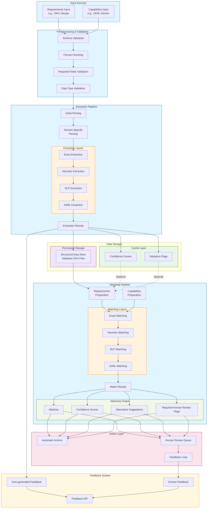

# System Diagram

```mermaid
flowchart TD
    subgraph inputs[Input Sources]
        I1[Requirements Input\ne.g., OKH, Recipe]
        I2[Capabilities Input\ne.g., OKW, Kitchen]
    end

    subgraph preproc[Pre-processing & Validation]
        V1[Schema Validation]
        V2[Format Checking]
        V3[Required Fields Validation]
        V4[Data Type Validation]
    end

    subgraph extraction[Extraction Pipeline]
        EP1[Initial Parsing]
        EP2[Domain-Specific\nParsing]
        
        subgraph ext_layers[Extraction Layers]
            EL1[Exact Extraction]
            EL2[Heuristic Extraction]
            EL3[NLP Extraction]
            EL4[AI/ML Extraction]
        end
        
        ER1[Extraction Results]
    end

    subgraph storage[Data Storage]
        subgraph permanent[Permanent Storage]
            PS1[Structured Data Store\nValidated OKH Files]
        end
        
        subgraph cache[Cache Layer]
            C1[Confidence Scores]
            C2[Validation Flags]
        end
    end

    subgraph feedback[Feedback System]
        F1[Auto-generated Feedback]
        F2[Human Feedback]
        F3[Feedback API]
    end

    subgraph matching[Matching Pipeline]
        MP1[Requirements\nPreparation]
        MP2[Capabilities\nPreparation]
        
        subgraph match_layers[Matching Layers]
            ML1[Exact Matching]
            ML2[Heuristic Matching]
            ML3[NLP Matching]
            ML4[AI/ML Matching]
        end
        
        MR1[Match Results]
        subgraph match_output[Matching Output]
            MO1[Matches]
            MO2[Confidence Scores]
            MO3[Alternative Suggestions]
            MO4[Required Human Review Flags]
        end
    end

    subgraph actions[Action Layer]
        A1[Automatic Actions]
        A2[Human Review Queue]
        A3[Feedback Loop]
    end

    %% Input to Extraction flow
    I1 & I2 --> V1
    V1 --> V2
    V2 --> V3
    V3 --> V4
    V4 --> EP1
    EP1 --> EP2
    EP2 --> EL1
    EL1 --> EL2
    EL2 --> EL3
    EL3 --> EL4
    EL4 --> ER1

    %% Extraction Results to Storage and Feedback
    ER1 --> PS1
    ER1 --> C1
    ER1 --> C2
    ER1 --> F1

    %% Storage to Matching flow
    PS1 --> MP1
    C1 & C2 -.->|Optional| MP1
    
    %% Matching flow
    MP1 & MP2 --> ML1
    ML1 --> ML2
    ML2 --> ML3
    ML3 --> ML4
    ML4 --> MR1
    MR1 --> MO1 & MO2 & MO3 & MO4
    
    %% Actions and Feedback flow
    MO1 & MO2 & MO3 & MO4 --> A1 & A2
    A2 --> A3
    A3 --> F2
    F1 & F2 --> F3

    classDef pipeline fill:#e1f5fe,stroke:#01579b
    classDef layer fill:#fff3e0,stroke:#ef6c00
    classDef storage fill:#f3e5f5,stroke:#4a148c
    classDef cache fill:#e8f5e9,stroke:#1b5e20
    classDef feedback fill:#fff8e1,stroke:#ff6f00
    classDef output fill:#f1f8e9,stroke:#33691e
    classDef action fill:#fce4ec,stroke:#880e4f
    
    class inputs,preproc,extraction,matching pipeline
    class ext_layers,match_layers layer
    class permanent storage
    class cache cache
    class feedback feedback
    class match_output output
    class actions action
```