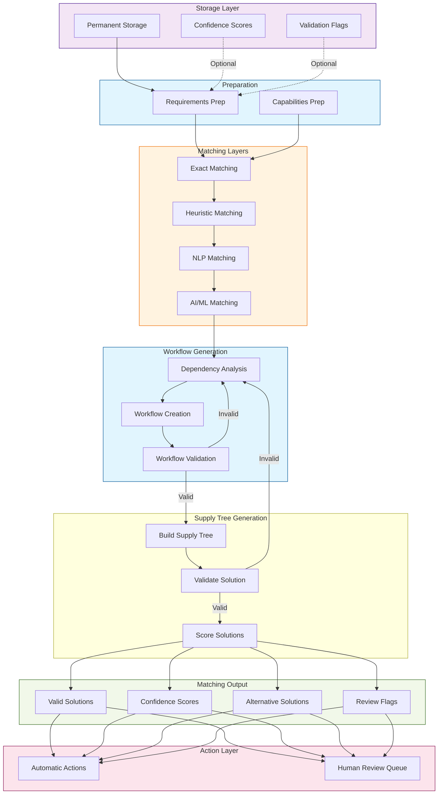

```mermaid
flowchart TD
    subgraph storage[Storage Layer]
        PS[Permanent Storage]
        CS[Confidence Scores]
        VF[Validation Flags]
    end

    subgraph prep[Preparation]
        MP1[Requirements Prep]
        MP2[Capabilities Prep]
    end

    subgraph matching_layers[Matching Layers]
        M1[Exact Matching]
        M2[Heuristic Matching]
        M3[NLP Matching]
        M4[AI/ML Matching]
    end

    subgraph workflow[Workflow Generation]
        WF1[Dependency Analysis]
        WF2[Workflow Creation]
        WF3[Workflow Validation]
    end

    subgraph tree_gen[Supply Tree Generation]
        T1[Build Supply Tree]
        T2[Validate Solution]
        T3[Score Solutions]
    end

    subgraph output[Matching Output]
        O1[Valid Solutions]
        O2[Confidence Scores]
        O3[Alternative Solutions]
        O4[Review Flags]
    end

    subgraph actions[Action Layer]
        A1[Automatic Actions]
        A2[Human Review Queue]
    end

    %% Data flows
    PS --> MP1
    CS & VF -.->|Optional| MP1
    
    MP1 & MP2 --> M1
    M1 --> M2
    M2 --> M3
    M3 --> M4
    
    M4 --> WF1
    WF1 --> WF2
    WF2 --> WF3
    
    WF3 --> |Valid|T1
    WF3 --> |Invalid|WF1
    
    T1 --> T2
    T2 --> |Valid|T3
    T2 --> |Invalid|WF1
    
    T3 --> O1 & O2 & O3 & O4
    
    O1 & O2 & O3 & O4 --> A1 & A2

    classDef storage fill:#f3e5f5,stroke:#4a148c
    classDef pipeline fill:#e1f5fe,stroke:#01579b
    classDef layer fill:#fff3e0,stroke:#ef6c00
    classDef output fill:#f1f8e9,stroke:#33691e
    classDef action fill:#fce4ec,stroke:#880e4f

    class storage storage
    class prep,matching_layers,workflow pipeline
    class matching_layers layer
    class output output
    class actions action

```