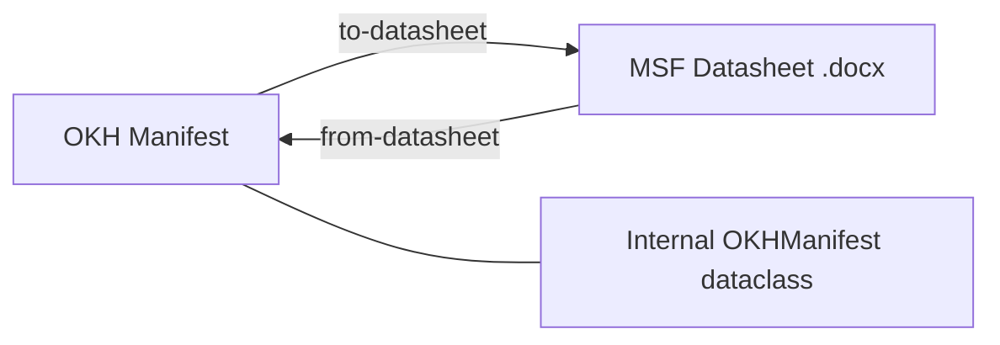

# Format Conversion

OHM supports bi-directional conversion between the internal OKH (OpenKnowHow) data model and external document formats used in the broader open hardware ecosystem.

## Supported Formats

| Format | Direction | Description |
|--------|-----------|-------------|
| **MSF Datasheet** (.docx) | OKH ↔ docx | 3D-printed product technical specification datasheet |

## Architecture

The conversion system is built around a simple principle: **the OKH canonical data model is always the source of truth**.



All conversions pass through the `OKHManifest` dataclass, ensuring data consistency and validation regardless of the external format.

## Access Methods

The conversion utility is available through three interfaces:

- **CLI**: `ohm convert to-datasheet` / `ohm convert from-datasheet`
- **API**: `POST /v1/api/convert/to-datasheet` / `POST /v1/api/convert/from-datasheet`
- **Python**: `DatasheetConverter` class in `src.core.services.datasheet_converter`

## Quick Start

### CLI

```bash
# Convert OKH manifest → MSF datasheet
ohm convert to-datasheet my-project.okh.json -o output.docx

# Convert MSF datasheet → OKH manifest
ohm convert from-datasheet filled-datasheet.docx -o my-project.okh.json
```

### API

```bash
# OKH → datasheet (returns .docx file download)
curl -X POST http://localhost:8001/v1/api/convert/to-datasheet \
  -H "Content-Type: application/json" \
  -d @my-project.okh.json \
  --output datasheet.docx

# Datasheet → OKH (upload .docx, get JSON back)
curl -X POST http://localhost:8001/v1/api/convert/from-datasheet \
  -F "datasheet_file=@filled-datasheet.docx"
```

### Python

```python
from src.core.services.datasheet_converter import DatasheetConverter
from src.core.models.okh import OKHManifest

converter = DatasheetConverter()

# OKH → datasheet
manifest = OKHManifest.from_dict(my_data)
converter.okh_to_datasheet(manifest, "output.docx")

# Datasheet → OKH
manifest = converter.datasheet_to_okh("filled-datasheet.docx")
print(manifest.title)
```

## Pages

- [MSF Datasheet Format](msf-datasheet.md) — Detailed format description and field mapping
