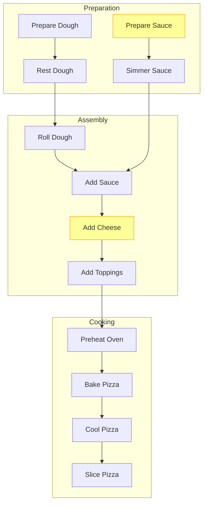

# Open Matching Engine (OME) MVP: Concrete Milestones and Deliverables

## Architectural Principles

While the MVP focuses on the cooking domain for simplicity, it's critical that we build a domain-agnostic core architecture that can be extended to manufacturing and other domains without significant refactoring. This section outlines the architectural principles that will guide MVP development.

## MVP Core Deliverables

1. **Command Line Interface**
    -   Implemented with argparse
    -   Basic commands for processing, validation, and visualization
    -   Support for input/output file specifications

2. **Supply Tree Generator**
    -   Create Supply Tree objects from requirements and capabilities
    -   Support for the cooking domain as proof-of-concept
    -   Basic dependency resolution

3. **Validation System**
    -   Schema validation for input files
    -   Supply Tree structure validation
    -   Solution feasibility validation

4. **Visualization Component**
    -   Text-based representation for CLI
    -   Export to graphical formats (DOT/Mermaid)

## Detailed Milestones

### Milestone 1: Data Models and Core Classes (2-3 weeks)
- **Deliverables:**
    -   Simplified Recipe schema (OKH equivalent)
    -   Simplified Kitchen schema (OKW equivalent)
    -   Supply Tree core implementation
    -   Basic Workflow and WorkflowNode classes
    -   Unit tests for core classes

```python
# Example code structure
class Recipe:  # Simplified OKH
    ingredients: List[Ingredient]
    tools: List[Tool]
    process_steps: List[ProcessStep]
    
class Kitchen:  # Simplified OKW
    available_ingredients: List[Ingredient]
    available_tools: List[Tool]
    capabilities: List[Capability]

class SupplyTree:
    workflows: Dict[UUID, Workflow]
    connections: List[WorkflowConnection]
    validate(): bool
    to_dict(): Dict
```

### Milestone 2: Basic Extractors and Parsers (2-3 weeks)
- **Deliverables:**
    -   JSON/YAML parser for recipe files
    -   JSON/YAML parser for kitchen files
    -   Requirements extractor
    -   Capabilities extractor
    -   Command line argument parsing

```python
# Example CLI entry point
import argparse

def main():
    parser = argparse.ArgumentParser(description='Open Matching Engine')
    parser.add_argument('--recipe', type=str, help='Path to recipe file')
    parser.add_argument('--kitchen', type=str, help='Path to kitchen file')
    parser.add_argument('--output', type=str, help='Output path for results')
    parser.add_argument('--visualize', action='store_true', help='Generate visualization')
    
    args = parser.parse_args()
    # Process commands
```

### Milestone 3: Basic Matchers and Supply Tree Generation (3-4 weeks)
- **Deliverables:**
    -   Exact matching for ingredients and tools
    -   Heuristic matching for cooking processes
    -   Supply Tree generator implementation
    -   Basic substitution handling
    -   Matching confidence scoring

```python
# Example matching interface
class Matcher:
    def match_requirements(self, requirements, capabilities) -> List[Match]:
        # Implementation
        
    def generate_supply_tree(self, recipe, kitchen) -> SupplyTree:
        # Extract requirements and capabilities
        # Find matches
        # Build workflows
        # Assemble into SupplyTree
        # Return result
```

### Milestone 4: Validation and Visualization (2-3 weeks)
- **Deliverables:**
    -   Supply Tree structure validator
    -   Solution feasibility validator
    -   Text-based visualization for CLI
    -   Export to DOT format for Graphviz
    -   Export to Mermaid markdown

```python
# Example visualization code
class Visualizer:
    def to_text(self, supply_tree) -> str:
        # Generate text-based representation
        
    def to_dot(self, supply_tree) -> str:
        # Generate DOT language for Graphviz
        
    def to_mermaid(self, supply_tree) -> str:
        # Generate Mermaid markdown
```

### Milestone 5: Integration and End-to-End Testing (2-3 weeks)
- **Deliverables:**
    -   Integrated pipeline from input to visualization
    -   Example recipe and kitchen datasets
    -   End-to-end test cases
    -   Performance benchmarking
    -   Bug fixes and optimizations

```python
# Example integration test
def test_end_to_end():
    recipe = load_recipe("test_data/pizza_recipe.json")
    kitchen = load_kitchen("test_data/basic_kitchen.json")
    
    matcher = Matcher()
    supply_tree = matcher.generate_supply_tree(recipe, kitchen)
    
    assert supply_tree.validate()
    
    visualizer = Visualizer()
    visualization = visualizer.to_mermaid(supply_tree)
    
    with open("test_output/pizza_supply_tree.md", "w") as f:
        f.write(visualization)
```

### Milestone 6: Documentation and Release Preparation (1-2 weeks)
- **Deliverables:**
    -   User documentation
    -   Installation instructions
    -   Example usage guides
    -   Code documentation
    -   Release package

## Sample MVP Usage

```bash
# Example command line usage
$ python -m ome --recipe recipes/pizza.json --kitchen kitchens/home.json --output results/pizza_match.json --visualize

Processing recipe: Pizza Margherita
Matching against kitchen: Home Kitchen
Exact matches found: 5/7 ingredients, 3/4 tools
Heuristic matches found: 2/7 ingredients, 1/4 tools
All process steps can be completed
Overall match confidence: 87%

Supply Tree generated with 3 workflows and 12 nodes
Validation successful: True

Results saved to: results/pizza_match.json
Visualization saved to: results/pizza_match.md
```

## Example Supply Tree Visualization Output



## Domain-Agnostic Architecture

### Core Abstract Base Classes

The MVP will implement these abstract base classes that will serve as the foundation for all domains:

```python
# Core abstract base classes
class BaseRequirement(ABC):
    """Abstract base class for all requirement types across domains"""
    @abstractmethod
    def validate(self) -> bool:
        pass
    
    @abstractmethod
    def to_dict(self) -> Dict:
        pass

class BaseCapability(ABC):
    """Abstract base class for all capability types across domains"""
    @abstractmethod
    def validate(self) -> bool:
        pass
    
    @abstractmethod
    def to_dict(self) -> Dict:
        pass
    
class BaseExtractor(ABC):
    """Abstract base class for domain-specific extractors"""
    @abstractmethod
    def extract_requirements(self, input_data: Dict) -> List[BaseRequirement]:
        pass
    
    @abstractmethod
    def extract_capabilities(self, input_data: Dict) -> List[BaseCapability]:
        pass

class BaseMatcher(ABC):
    """Abstract base class for matchers across domains"""
    @abstractmethod
    def match(self, requirements: List[BaseRequirement], 
              capabilities: List[BaseCapability]) -> List[Match]:
        pass
    
    @abstractmethod
    def generate_supply_tree(self, requirements: List[BaseRequirement],
                            capabilities: List[BaseCapability]) -> SupplyTree:
        pass
```

### Domain-Specific Implementations

For the cooking domain MVP, we'll extend these base classes:

```python
class RecipeRequirement(BaseRequirement):
    """Cooking domain implementation of requirements"""
    # Cooking-specific implementation

class KitchenCapability(BaseCapability):
    """Cooking domain implementation of capabilities"""
    # Cooking-specific implementation

class RecipeExtractor(BaseExtractor):
    """Extractor for recipe requirements"""
    # Cooking-specific implementation

class CookingMatcher(BaseMatcher):
    """Matcher for cooking domain"""
    # Cooking-specific implementation
```

### Pipeline Architecture

The OME pipeline will be designed with pluggable components:

```python
class Pipeline:
    """Main OME pipeline with domain-agnostic orchestration"""
    
    def __init__(self, domain: str):
        """Initialize pipeline with appropriate domain handlers"""
        self.domain = domain
        
        # Domain registry - will be expanded beyond cooking in future
        self.domain_registry = {
            "cooking": {
                "extractor": RecipeExtractor(),
                "matcher": CookingMatcher(),
                "validator": CookingValidator(),
                "visualizer": CookingVisualizer()
            },
            # Future domains will be added here
            "manufacturing": None  # Placeholder for future implementation
        }
        
        # Initialize components based on domain
        self.extractor = self.domain_registry[domain]["extractor"]
        self.matcher = self.domain_registry[domain]["matcher"]
        self.validator = self.domain_registry[domain]["validator"]
        self.visualizer = self.domain_registry[domain]["visualizer"]
    
    def process(self, requirements_file: str, capabilities_file: str) -> Result:
        """Process requirements against capabilities"""
        # Domain-agnostic pipeline flow
        raw_req_data = self._load_data(requirements_file)
        raw_cap_data = self._load_data(capabilities_file)
        
        requirements = self.extractor.extract_requirements(raw_req_data)
        capabilities = self.extractor.extract_capabilities(raw_cap_data)
        
        matches = self.matcher.match(requirements, capabilities)
        supply_tree = self.matcher.generate_supply_tree(requirements, capabilities)
        
        is_valid = self.validator.validate_supply_tree(supply_tree)
        
        return Result(
            supply_tree=supply_tree,
            matches=matches,
            is_valid=is_valid
        )
```

### Domain Registration System

To allow for easy extension to new domains:

```python
class DomainRegistry:
    """Registry for domain-specific components"""
    
    def __init__(self):
        self.domains = {}
    
    def register_domain(self, domain_name: str, components: Dict):
        """Register a new domain with its components"""
        self.domains[domain_name] = components
    
    def get_domain_components(self, domain_name: str) -> Dict:
        """Get components for a specific domain"""
        if domain_name not in self.domains:
            raise ValueError(f"Domain {domain_name} not registered")
        return self.domains[domain_name]
```

This architecture ensures that:

1. The core system is truly domain-agnostic
2. New domains can be added without modifying core code
3. Components can be replaced independently
4. The cooking domain MVP builds directly toward the manufacturing domain implementation


## Success Criteria

1. Successfully generate Supply Trees from sample recipes and kitchens
2. Validate solution feasibility with 90%+ accuracy
3. Provide clear visualization of the matching solution
4. Process medium-complexity recipes quickly
5. Command line interface with all basic operations
6. Demonstrate domain-agnostic architecture with proper abstractions
7. Prove extensibility by showing how manufacturing domain would be implemented

## Extension to Manufacturing Domain

To ensure our MVP architecture is truly extensible, we'll include a documentation section and minimal code examples showing how the manufacturing domain would extend our base classes:

```python
# Manufacturing domain extensions (for documentation purposes in MVP)
class ManufacturingRequirement(BaseRequirement):
    """Manufacturing domain implementation of requirements"""
    # OKH implementation
    wikipedia_url: str  # Link to process description
    equipment_required: List[str]
    materials_required: List[str]
    quality_standards: List[str]
    
class ManufacturingCapability(BaseCapability):
    """Manufacturing domain implementation of capabilities"""
    # OKW implementation
    equipment: List[Equipment]
    processes: List[Process]
    certifications: List[str]
    
class ManufacturingExtractor(BaseExtractor):
    """Extractor for OKH manufacturing requirements"""
    # Manufacturing-specific implementation that processes OKH format
    
class ManufacturingMatcher(BaseMatcher):
    """Matcher for manufacturing domain"""
    # Manufacturing-specific implementation that handles 
    # complex material and process requirements
```

This documentation will serve as a blueprint for how the MVP architecture directly extends to the manufacturing domain, ensuring that our development approach builds toward the ultimate goal of the project.
