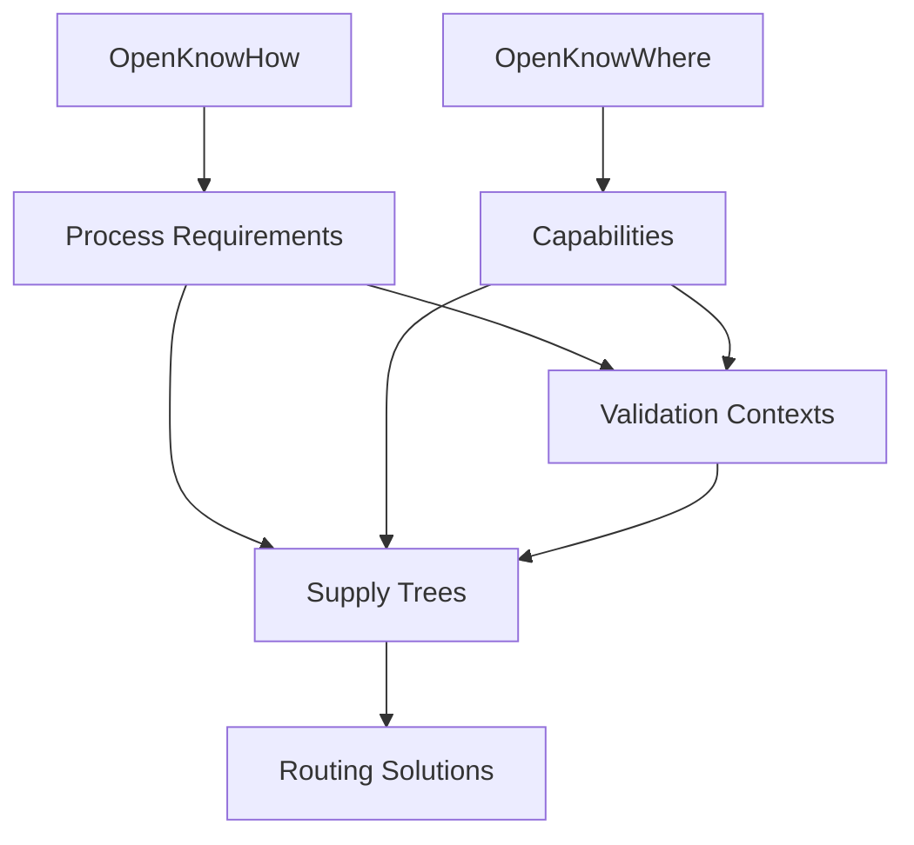

# Data Models

## Overview

The Open Matching Engine uses several interconnected data models to represent requirements, capabilities, and manufacturing solutions. These models form the foundation of our matching system and enable complex validation across different contexts.

## Core Models

### 1. [Supply Trees](supply-tree.md)
The central data structure representing complete manufacturing solutions.
- Multiple connected DAGs representing workflows
- Context-aware validation
- Process requirements and capabilities
- Workflow dependencies and connections

### 2. [OpenKnowHow (OKH)](okh-docs.md)
Standard format for documenting open hardware designs.
```python
@dataclass
class OKHManifest:
    """Primary OKH manifest structure"""
    title: str
    description: str
    intended_use: str
    manufacturing_files: List[Document]
    documentation_language: str
    making_instructions: List[Document]
    tool_list: List[str]
    manufacturing_processes: List[str]
    materials: List[Material]
```

### 3. [OpenKnowWhere (OKW)](okw-docs.md)
Standard format for documenting manufacturing capabilities.
```python
@dataclass
class OKWFacility:
    """Manufacturing facility specification"""
    name: str
    location: Location
    equipment: List[Equipment]
    processes: List[Process]
    certifications: List[str]
    typical_batch_size: str
    materials_worked: List[str]
```

### 4. [Process Requirements](process.md)
Specifications for manufacturing processes with context-specific validation.
```python
@dataclass
class ProcessRequirement:
    """Manufacturing process requirements"""
    specification: Union[ExactProcessSpec, ProcessConstraints]
    validation_contexts: Dict[str, ValidationContext]
    failure_responses: Dict[str, ValidationFailureResponse]
```

### 5. [Validation Contexts](validation-contexts.md)
Context-specific validation rules and acceptance criteria.
```python
@dataclass
class ValidationContext:
    """Context-specific validation rules"""
    domain: str
    standards: List[str]
    acceptance_criteria: Dict[str, Any]
    validation_procedures: Dict[str, Callable]
```

## Component-Specific Models

### OME.extraction Models
Models for handling unstructured input and producing normalized data:
```python
@dataclass
class ExtractionResult:
    """Output from extraction pipeline"""
    structured_data: Dict[str, Any]  # Validated OKH/OKW data
    metadata: ExtractionMetadata
    validation_results: ValidationResults
    confidence_scores: Dict[str, float]
```

### OME.analysis Models
Models for requirement and capability analysis:
```python
@dataclass
class AnalysisResult:
    """Output from analysis pipeline"""
    requirements: List[ProcessRequirement]
    capabilities: List[Capability]
    constraints: List[Constraint]
    context_mappings: Dict[str, ContextMap]
```

### OME.matching Models
Models for matching solutions and scoring:
```python
@dataclass
class MatchingSolution:
    """Complete matching solution"""
    supply_tree: SupplyTree
    confidence_score: float
    validation_results: Dict[str, ValidationResult]
    alternative_paths: List[AlternativePath]
```

### OME.routing Models
Models for material and workflow routing:
```python
@dataclass
class RoutingSolution:
    """Optimized routing solution"""
    paths: List[RoutePath]
    resource_allocations: Dict[UUID, ResourceAllocation]
    timing: Dict[UUID, TimingConstraint]
    optimization_metrics: Dict[str, float]
```

## Model Relationships



## Storage Models

### Permanent Storage
Models for long-term data persistence:
```python
@dataclass
class StorageRecord:
    """Permanent storage record"""
    id: UUID
    data_type: str
    content: Dict[str, Any]
    metadata: StorageMetadata
    version: str
```

### Cache Models
Models for temporary data caching:
```python
@dataclass
class CacheEntry:
    """Cache storage entry"""
    key: str
    data: Any
    timestamp: datetime
    ttl: int
    metadata: Dict[str, Any]
```

## Example Usage

### Creating a Supply Tree from OKH/OKW
```python
# Load and validate OKH/OKW data
okh_data = OKHManifest.from_file("design.okh")
okw_data = OKWFacility.from_file("facility.okw")

# Create process requirements
requirements = ProcessRequirement(
    specification=okh_data.to_process_spec(),
    validation_contexts={
        "manufacturing": manufacturing_context,
        "quality": quality_context
    }
)

# Generate supply tree
supply_tree = SupplyTree.generate(
    requirements=requirements,
    capabilities=okw_data.capabilities,
    context="manufacturing"
)
```

## Validation and Extension

### Adding New Contexts
```python
# Define new validation context
medical_context = ValidationContext(
    domain="medical_devices",
    standards=["ISO_13485", "ASTM_F899"],
    acceptance_criteria={...},
    validation_procedures={...}
)

# Add to existing requirements
requirements.add_validation_context("medical", medical_context)
```

### Custom Data Models
```python
@dataclass
class CustomProcessRequirement(ProcessRequirement):
    """Domain-specific process requirements"""
    additional_field: str
    custom_validation: Callable
```

## Best Practices

1. **Model Independence**
   - Keep models loosely coupled
   - Use interfaces for interaction
   - Maintain clear boundaries

2. **Validation**
   - Validate early and often
   - Use strong typing
   - Include comprehensive metadata

3. **Extension**
   - Follow existing patterns
   - Maintain backward compatibility
   - Document changes clearly

4. **Performance**
   - Consider serialization impact
   - Plan for large datasets
   - Implement efficient storage

## Next Steps

- Review detailed model specifications
- Understand validation contexts
- Explore example implementations
- Consider extension points