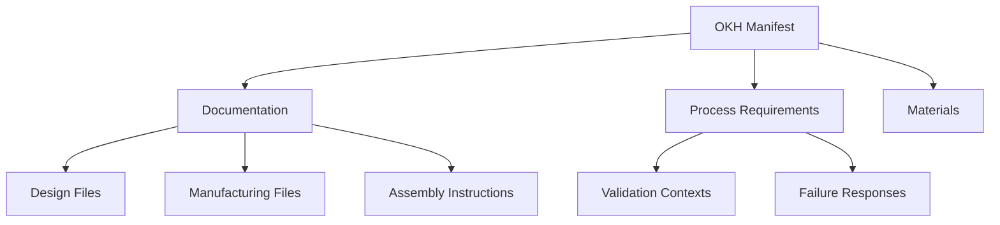

# OpenKnowHow (OKH) Model

## Overview

The OpenKnowHow data model represents the complete technical documentation needed to build a piece of open source hardware. It includes all information from design files and manufacturing requirements to assembly instructions and quality validation criteria.

## Core Classes

### 1. OKHManifest
The primary container class representing a complete OKH specification.

```python
@dataclass
class OKHManifest:
    """Primary OKH manifest structure"""
    title: str
    repo: str  # URL to repository
    version: str
    license: License
    licensor: str
    documentation_language: str
    function: str
```

#### Key Properties
- `title` - Working title of the hardware
- `repo` - Reference to repository containing technical documentation
- `version` - Version of the module (semantic versioning recommended)
- `license` - License information for hardware/documentation/software
- `licensor` - Original creator or licensor
- `documentation_language` - IETF BCP 47 language tag
- `function` - Functional description and purpose

### 2. DocumentRef
Reference to documentation files or resources.

```python
@dataclass
class DocumentRef:
    """Reference to a documentation file or resource"""
    title: str
    path: str  # Can be relative path or URL
    type: DocumentationType
    metadata: Dict = field(default_factory=dict)
```

### 3. License 
License information for different aspects of the module.

```python
@dataclass 
class License:
    """License information for different aspects of the module"""
    hardware: Optional[str] = None  # SPDX identifier
    documentation: Optional[str] = None  # SPDX identifier
    software: Optional[str] = None  # SPDX identifier
```

### 4. MaterialSpec
Specification for materials used in the module.

```python
@dataclass
class MaterialSpec:
    """Specification for a material used in the module"""
    material_id: str  # e.g. "PLA", "1.0715"
    name: str
    quantity: Optional[float] = None
    unit: Optional[str] = None
    notes: Optional[str] = None
```

### 5. ProcessRequirement
Manufacturing process requirements with context-specific validation.

```python
@dataclass
class ProcessRequirement:
    """Manufacturing process requirements"""
    specification: Union[ExactProcessSpec, ProcessConstraints]
    validation_contexts: Dict[str, ValidationContext]
    failure_responses: Dict[str, ValidationFailureResponse]
```

## Data Flow



## Validation and Extension

### Adding New Validation Contexts
```python
# Define new validation context
medical_context = ValidationContext(
    domain="medical_devices",
    standards=["ISO_13485", "ASTM_F899"],
    acceptance_criteria={...},
    validation_procedures={...}
)

# Add to existing requirements
requirements.add_validation_context("medical", medical_context)
```

### Custom Process Requirements
```python
@dataclass
class CustomProcessRequirement(ProcessRequirement):
    """Domain-specific process requirements"""
    additional_field: str
    custom_validation: Callable
```

## Best Practices

### 1. Documentation References
- Use relative paths when possible
- Include complete metadata
- Maintain file hierarchy information
- Support multiple formats

### 2. Process Requirements
- Be explicit about physical actions
- Define clear success criteria
- Include measurement methods
- Specify required tools/equipment

### 3. Material Specifications
- Use standard identifiers
- Include complete properties
- Specify alternatives where appropriate
- Document constraints

### 4. Validation
- Use measurable criteria
- Define clear methods
- Include acceptance ranges
- Document procedures

## Future Considerations

### 1. Enhanced Validation
- Machine vision integration
- Sensor data processing
- Automated testing
- Real-time monitoring

### 2. Process Optimization
- Parameter optimization
- Alternative method suggestions
- Resource optimization
- Quality improvement

### 3. Knowledge Base
- Process libraries
- Common validation methods
- Standard procedures
- Best practices

## Example Usage

```python
# Create a basic manifest
license = License(
    hardware="CERN-OHL-S-2.0",
    documentation="CC-BY-4.0",
    software="GPL-3.0-or-later"
)

manifest = OKHManifest(
    title="Example Hardware Project",
    repo="https://github.com/example/project",
    version="1.0.0",
    license=license,
    licensor="John Doe",
    documentation_language="en",
    function="This project demonstrates the OKH manifest structure"
)

# Add documentation references
manifest.manufacturing_files.append(
    DocumentRef(
        title="Assembly Guide",
        path="/docs/assembly.md",
        type=DocumentationType.MANUFACTURING_FILES
    )
)

# Add process requirements
manifest.process_requirements.append(
    ProcessRequirement(
        specification=ExactProcessSpec(
            process="milling",
            parameters={"tolerance": "0.1mm"}
        ),
        validation_contexts={
            "manufacturing": manufacturing_context
        }
    )
)

# Validate the manifest
manifest.validate()
```