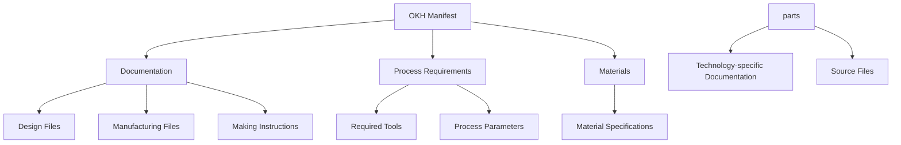
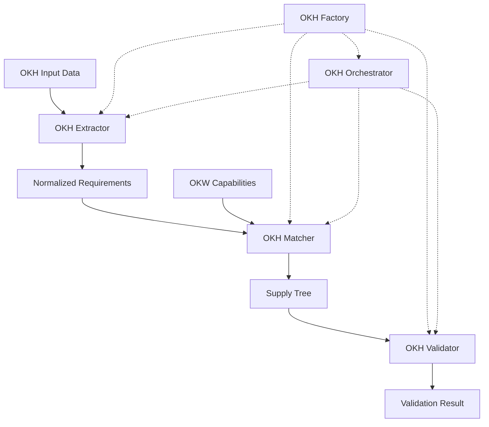

# OpenKnowHow (OKH) Model

## Overview

The OpenKnowHow data model represents the complete technical documentation needed to build a piece of open source hardware. It includes all information from design files and manufacturing requirements to assembly instructions and quality validation criteria.

The OKH ecosystem consists of several components working together:

- **OKH Model** (`okh.py`) - Core data structures representing OKH manifests
- **OKH Extractor** (`okh_extractor.py`) - Extracts structured requirements from OKH data
- **OKH Matcher** (`okh_matcher.py`) - Matches OKH requirements with capabilities
- **OKH Validator** (`okh_validator.py`) - Validates OKH manifests and matches
- **OKH Orchestrator** (`okh_orchestrator.py`) - Coordinates the extraction, matching, and validation
- **OKH Factory** (`okh_factory.py`) - Creates and manages OKH components

## Core Classes

### 1. OKHManifest
The primary container class representing a complete OKH specification.

```python
@dataclass
class OKHManifest:
    """Primary OKH manifest structure"""
    # Required fields
    title: str
    repo: str  # URL to repository
    version: str
    license: License
    licensor: Union[str, Person, List[Union[str, Person]]]
    documentation_language: Union[str, List[str]]
    function: str
    
    # Unique identifier
    id: UUID = field(default_factory=uuid4)
    
    # Optional fields - metadata
    okhv: str = "OKH-LOSHv1.0"  # OKH specification version
    data_source: Optional[str] = None
    description: Optional[str] = None
    intended_use: Optional[str] = None
    
    # Documentation fields
    keywords: List[str] = field(default_factory=list)
    project_link: Optional[str] = None
    health_safety_notice: Optional[str] = None
    contact: Optional[Person] = None
    contributors: List[Person] = field(default_factory=list)
    image: Optional[str] = None
    
    # Technical documentation references
    manufacturing_files: List[DocumentRef] = field(default_factory=list)
    documentation_home: Optional[str] = None
    design_files: List[DocumentRef] = field(default_factory=list)
    making_instructions: List[DocumentRef] = field(default_factory=list)
    tool_list: List[str] = field(default_factory=list)
    
    # Manufacturing specifications
    manufacturing_processes: List[str] = field(default_factory=list)
    materials: List[MaterialSpec] = field(default_factory=list)
    manufacturing_specs: Optional[ManufacturingSpec] = None
    
    # Parts and components
    parts: List[PartSpec] = field(default_factory=list)
    tsdc: List[str] = field(default_factory=list)  # Technology-specific Documentation Criteria
```

#### Key Properties
- `title` - Working title of the hardware
- `repo` - Reference to repository containing technical documentation
- `version` - Version of the module (semantic versioning recommended)
- `license` - License information for hardware/documentation/software
- `licensor` - Original creator or licensor
- `documentation_language` - IETF BCP 47 language tag
- `function` - Functional description and purpose
- `id` - Unique identifier for the manifest (UUID)

#### Key Methods

- `validate()` - Validates that all required fields are present and properly formatted
- `to_dict()` - Converts the manifest to a dictionary format
- `from_dict()` - Creates an OKHManifest instance from a dictionary
- `extract_requirements()` - Extracts process requirements for matching

### 2. License
License information for different aspects of the module.

```python
@dataclass 
class License:
    """License information for different aspects of the module"""
    hardware: Optional[str] = None  # SPDX identifier
    documentation: Optional[str] = None  # SPDX identifier
    software: Optional[str] = None  # SPDX identifier
    
    def validate(self) -> bool:
        """Validates that at least one license is specified"""
        return any([self.hardware, self.documentation, self.software])
```

### 3. Person
Represents a person associated with the OKH module.

```python
@dataclass
class Person:
    """Represents a person associated with the OKH module"""
    name: str
    email: Optional[str] = None
    affiliation: Optional[str] = None
    social: List[Dict[str, str]] = field(default_factory=list)
```

### 4. DocumentRef
Reference to documentation files or resources.

```python
@dataclass
class DocumentRef:
    """Reference to a documentation file or resource"""
    title: str
    path: str  # Can be relative path or URL
    type: DocumentationType
    metadata: Dict = field(default_factory=dict)
    
    def validate(self) -> bool:
        """Validate the document reference"""
        # Check if path exists (if it's a relative path)
        if not (self.path.startswith('http://') or self.path.startswith('https://')):
            return os.path.exists(self.path)
        return True
```

### 5. MaterialSpec
Specification for materials used in the module.

```python
@dataclass
class MaterialSpec:
    """Specification for a material used in the module"""
    material_id: str  # e.g. "PLA", "1.0715"
    name: str
    quantity: Optional[float] = None
    unit: Optional[str] = None
    notes: Optional[str] = None
```

### 6. ProcessRequirement
Manufacturing process requirements with specified parameters and validation criteria.

```python
@dataclass
class ProcessRequirement:
    """Manufacturing process requirements"""
    process_name: str
    parameters: Dict = field(default_factory=dict)
    validation_criteria: Dict = field(default_factory=dict)
    required_tools: List[str] = field(default_factory=list)
    notes: str = ""
    
    def can_be_satisfied_by(self, capability) -> bool:
        """Check if this process requirement can be satisfied by a capability"""
        # Check if capability supports this process
        return self.process_name in capability.processes
```

### 7. ManufacturingSpec
Manufacturing specifications for the hardware.

```python
@dataclass
class ManufacturingSpec:
    """Manufacturing specifications"""
    joining_processes: List[str] = field(default_factory=list)
    outer_dimensions: Optional[Dict] = None
    process_requirements: List[ProcessRequirement] = field(default_factory=list)
    quality_standards: List[str] = field(default_factory=list)
    notes: str = ""
```

### 8. PartSpec
Specification for a part of the OKH module.

```python
@dataclass
class PartSpec:
    """Specification for a part of the OKH module"""
    name: str
    id: UUID = field(default_factory=uuid4)
    source: Union[str, List[str]] = field(default_factory=list)  # Path to source files
    export: Union[str, List[str]] = field(default_factory=list)  # Path to export files
    auxiliary: Union[str, List[str]] = field(default_factory=list)  # Path to auxiliary files
    image: Optional[str] = None  # Path to image
    tsdc: List[str] = field(default_factory=list)  # Technology-specific Documentation Criteria
    material: Optional[str] = None  # Material reference
    outer_dimensions: Optional[Dict] = None  # Dimensions in mm
    
    # Manufacturing-specific fields for different TSDCs
    manufacturing_params: Dict = field(default_factory=dict)
    
    def has_tsdc(self, tsdc_code: str) -> bool:
        """Check if part has a specific TSDC"""
        return tsdc_code in self.tsdc
```

## Data Flow



## OKH Manifest Operations

### Validation
The OKH manifest provides validation to ensure completeness and correctness:

```python
def validate(self) -> bool:
    """
    Validate that all required fields are present and properly formatted.
    Returns True if valid, raises ValidationError if invalid.
    """
    required_fields = [
        self.title,
        self.repo,
        self.version,
        self.license,
        self.licensor,
        self.documentation_language,
        self.function
    ]
    
    if not all(required_fields):
        missing = [
            field for field, value in zip(
                ["title", "repo", "version", "license", "licensor", 
                 "documentation_language", "function"],
                required_fields
            ) if not value
        ]
        raise ValueError(f"Missing required fields: {', '.join(missing)}")
        
    # Validate license
    if not self.license.validate():
        raise ValueError("License validation failed")
        
    # Validate document references
    for doc in self.manufacturing_files + self.design_files + self.making_instructions:
        if not doc.validate():
            raise ValueError(f"Invalid document reference: {doc.title}")
            
    return True
```

### Requirement Extraction
The manifest can extract process requirements for matching:

```python
def extract_requirements(self) -> List[ProcessRequirement]:
    """Extract process requirements for matching"""
    requirements = []
    
    # Add requirements from manufacturing specs
    if self.manufacturing_specs:
        requirements.extend(self.manufacturing_specs.process_requirements)
    
    # Extract implicit requirements from manufacturing processes
    for process in self.manufacturing_processes:
        req = ProcessRequirement(
            process_name=process,
            parameters={},
            validation_criteria={},
            required_tools=[]
        )
        requirements.append(req)
    
    # Extract requirements from parts
    for part in self.parts:
        for tsdc in part.tsdc:
            # Create process requirement based on TSDC
            params = part.manufacturing_params.copy()
            params['material'] = part.material
            
            req = ProcessRequirement(
                process_name=tsdc,
                parameters=params,
                validation_criteria={},
                required_tools=[]
            )
            requirements.append(req)
    
    return requirements
```

### Serialization
The manifest supports serialization to and from dictionary formats:

```python
def to_dict(self) -> Dict:
    """Convert the manifest to a dictionary format"""
    # Implementation to convert all fields to a dictionary
    
@classmethod
def from_dict(cls, data: Dict) -> 'OKHManifest':
    """Create an OKHManifest instance from a dictionary"""
    # Implementation to reconstruct from dictionary
    
@classmethod
def from_toml(cls, filepath: str) -> 'OKHManifest':
    """Load an OKHManifest from a TOML file"""
    # Implementation to load from TOML
```

## Best Practices

### 1. Documentation References
- Use relative paths when possible
- Include complete metadata
- Maintain file hierarchy information
- Support multiple formats

### 2. Process Requirements
- Be explicit about physical actions
- Define clear success criteria
- Include measurement methods
- Specify required tools/equipment

### 3. Material Specifications
- Use standard identifiers
- Include complete properties
- Specify alternatives where appropriate
- Document constraints

### 4. Validation
- Validate manifests before use
- Check required fields
- Verify document references
- Validate license specifications

## OKH Framework Components

### OKH Factory
The OKH Factory provides a convenient way to create and manage OKH components:

```python
from src.core.domains.manufacturing.okh_factory import OKHFactory

# Create components
extractor = OKHFactory.create_extractor()
matcher = OKHFactory.create_matcher()
validator = OKHFactory.create_validator()
orchestrator = OKHFactory.create_orchestrator()

# Create OKH manifest from different sources
manifest_from_dict = OKHFactory.create_from_dict(data_dict)
manifest_from_toml = OKHFactory.create_from_toml("hardware_project.toml")

# Convert to normalized requirements
normalized_requirements = OKHFactory.convert_to_normalized_requirements(manifest)
```

### OKH Extractor
The OKH Extractor parses OKH data and creates normalized requirements:

```python
from src.core.domains.manufacturing.okh_extractor import OKHExtractor

extractor = OKHExtractor()

# Extract requirements from OKH content
result = extractor.extract_requirements(okh_content)
normalized_requirements = result.data

# Extract detailed data
parsed_data = extractor._initial_parse_requirements(okh_content)
detailed_requirements = extractor._detailed_extract_requirements(parsed_data)
validated_requirements = extractor._validate_and_refine_requirements(detailed_requirements)
```

### OKH Matcher
The OKH Matcher generates Supply Trees from OKH requirements and OKW capabilities:

```python
from src.core.domains.manufacturing.okh_matcher import OKHMatcher

matcher = OKHMatcher()

# Match requirements to capabilities
match_result = matcher.match(requirements, capabilities)

# Generate a supply tree
supply_tree = matcher.generate_supply_tree(okh_manifest, capabilities)
```

### OKH Validator
The OKH Validator ensures the correctness of OKH manifests and supply trees:

```python
from src.core.domains.manufacturing.okh_validator import OKHValidator

validator = OKHValidator()

# Validate OKH manifest
manifest_results = validator.validate_okh_manifest(okh_manifest)
if manifest_results["valid"]:
    print(f"Manifest is valid with completeness score: {manifest_results['completeness_score']}")

# Validate supply tree
tree_results = validator.validate_supply_tree(supply_tree, okh_manifest)
if tree_results["valid"]:
    print(f"Supply tree is valid with confidence: {tree_results['confidence']}")
```

### OKH Orchestrator
The OKH Orchestrator coordinates the entire matching process:

```python
from src.core.domains.manufacturing.okh_orchestrator import OKHOrchestrator

orchestrator = OKHOrchestrator()
orchestrator.initialize()

# Execute the matching process
result = orchestrator.match(normalized_requirements_list, normalized_capabilities_list)

# Check results
if result["status"] == "success":
    print(f"Generated {len(result['supply_trees'])} supply trees")
    print(f"Overall confidence: {result['confidence']}")
```

## Complete Example Usage

```python
# Create a basic manifest
license = License(
    hardware="CERN-OHL-S-2.0",
    documentation="CC-BY-4.0",
    software="GPL-3.0-or-later"
)

manifest = OKHManifest(
    title="Example Hardware Project",
    repo="https://github.com/example/project",
    version="1.0.0",
    license=license,
    licensor="John Doe",
    documentation_language="en",
    function="This project demonstrates the OKH manifest structure"
)

# Add documentation references
manifest.manufacturing_files.append(
    DocumentRef(
        title="Assembly Guide",
        path="/docs/assembly.md",
        type=DocumentationType.MANUFACTURING_FILES
    )
)

# Add material specifications
manifest.materials.append(
    MaterialSpec(
        material_id="PLA",
        name="Polylactic Acid Filament",
        quantity=250.0,
        unit="g"
    )
)

# Add process requirements
process_req = ProcessRequirement(
    process_name="3D printing",
    parameters={
        "layer_height": "0.2mm",
        "infill": "20%",
        "temperature": "210C"
    },
    required_tools=["3D printer", "filament"]
)

# Add to manufacturing specs
manifest.manufacturing_specs = ManufacturingSpec(
    process_requirements=[process_req],
    quality_standards=["Amateur-grade"]
)

# Add parts
manifest.parts.append(
    PartSpec(
        name="Main Body",
        source=["models/body.stl"],
        tsdc=["3DP"],  # 3D printing
        material="PLA",
        manufacturing_params={
            "infill": "30%",
            "support": "required"
        }
    )
)

# Use the OKH framework components
factory = OKHFactory()
validator = factory.create_validator()
matcher = factory.create_matcher()

# Validate the manifest
validation_result = validator.validate_okh_manifest(manifest)
if validation_result["valid"]:
    # Match with capabilities
    capabilities = [...] # List of capabilities
    supply_tree = matcher.generate_supply_tree(manifest, capabilities)
    
    # Validate supply tree
    tree_validation = validator.validate_supply_tree(supply_tree, manifest)
    print(f"Supply tree confidence: {tree_validation['confidence']}")
```

## TSDC (Technology-Specific Documentation Criteria)

TSDCs are standardized codes that indicate specific technologies used in a part:

- **3DP**: 3D Printing
- **PCB**: Printed Circuit Board
- **CNC**: Computer Numerical Control machining
- **CAST**: Casting process
- **LASER**: Laser cutting/engraving
- **SHEET**: Sheet metal fabrication

When a part has a TSDC tag, it should include appropriate manufacturing parameters specific to that technology. For example:

```python
# Part with 3D printing TSDC
part = PartSpec(
    name="Housing",
    tsdc=["3DP"],
    manufacturing_params={
        "printing-process": "FDM",
        "material": "PLA",
        "layer-height": "0.2mm",
        "infill": "20%"
    }
)

# Part with PCB TSDC
pcb_part = PartSpec(
    name="Controller Board",
    tsdc=["PCB"],
    manufacturing_params={
        "board-thickness-mm": 1.6,
        "copper-thickness-mm": 0.035,
        "component-sides": 2
    }
)
```

The OKH validator will check for appropriate parameters based on the TSDC tags.

## Framework Architecture

The OKH framework follows a modular architecture that separates concerns and enables flexible processing:



### Component Relationships

1. **OKH Factory** acts as a central creation point for all other components, enabling dependency injection and simplifying component creation.

2. **OKH Extractor** transforms raw OKH data into structured, normalized requirements that can be processed by the matching system.

3. **OKH Matcher** takes normalized requirements and available capabilities to generate Supply Trees representing valid manufacturing solutions.

4. **OKH Validator** ensures the correctness of both input (OKH manifests) and output (Supply Trees) through various validation rules.

5. **OKH Orchestrator** coordinates the entire process, managing the flow of data between components and handling errors and edge cases.

### Extension Points

The framework is designed to be extended in several ways:

1. **Custom Extractors** can be created to parse different input formats or apply domain-specific extraction rules.

2. **Additional Matchers** can be implemented to use different matching strategies, such as exact, heuristic, NLP, or ML-based approaches.

3. **Domain-Specific Validators** can enforce specialized validation rules for particular industries or applications.

4. **Alternative Orchestration Flows** can be implemented to support different use cases or optimization strategies.

### Optimizing the Framework

For best results with the OKH framework:

1. **Use the Factory Pattern** - Create components through the OKHFactory to ensure proper configuration and dependency injection.

2. **Validate Early and Often** - Use the OKHValidator at multiple stages to catch issues before they propagate.

3. **Handle Uncertainty** - Utilize confidence scores and validation metrics to handle ambiguous or incomplete data appropriately.

4. **Extend Through Inheritance** - Create domain-specific implementations by extending the base classes rather than modifying them.