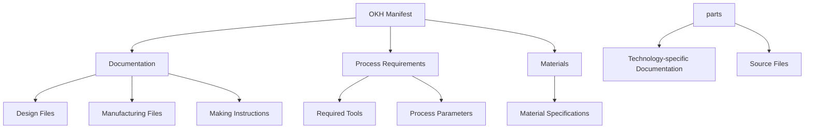
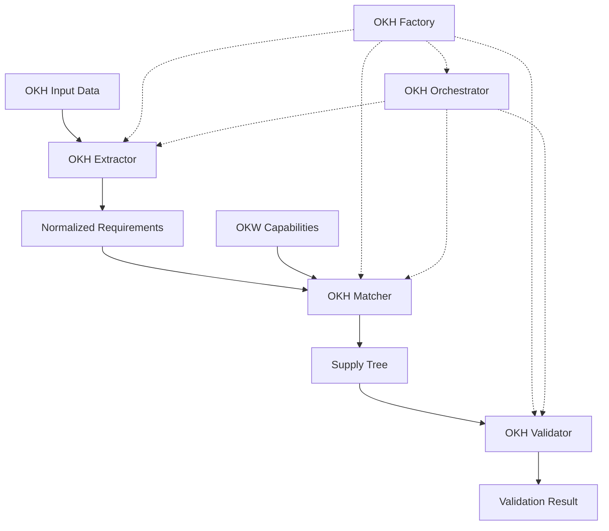

# OpenKnowHow (OKH) Model

## Overview

The OpenKnowHow data model represents the complete technical documentation needed to build a piece of open source hardware. It includes all information from design files and manufacturing requirements to assembly instructions and quality validation criteria.

The OKH ecosystem consists of several components working together:

- **OKH Model** (`okh.py`) - Core data structures representing OKH manifests
- **OKH Extractor** (`okh_extractor.py`) - Extracts structured requirements from OKH data
- **OKH Matcher** (`okh_matcher.py`) - Matches OKH requirements with capabilities
- **Validator framework** (`validation/okh_validator.py`, `validation/compatibility.py`) - Validates OKH manifests and supply trees using the new rule-based framework
- **OKH Orchestrator** (`okh_orchestrator.py`) - Coordinates the extraction, matching, and validation
- **OKH Factory** (`okh_factory.py`) - Creates and manages OKH components

## Core Classes

### 1. OKHManifest
The primary container class representing a complete OKH specification.

```python
@dataclass
class OKHManifest:
    """Primary OKH manifest structure"""
    # Required fields
    title: str
    version: str
    license: License
    licensor: Union[str, Person, List[Union[str, Person]]]
    documentation_language: Union[str, List[str]]
    function: str
    
    # Unique identifier
    id: UUID = field(default_factory=uuid4)
    
    # Optional fields - metadata
    okhv: str = "OKH-LOSHv1.0"  # OKH specification version
    data_source: Optional[str] = None
    description: Optional[str] = None
    intended_use: Optional[str] = None
    
    # Documentation fields
    keywords: List[str] = field(default_factory=list)
    project_link: Optional[str] = None
    health_safety_notice: Optional[str] = None
    contact: Optional[Person] = None
    contributors: List[Person] = field(default_factory=list)
    image: Optional[str] = None
    
    # Technical documentation references
    manufacturing_files: List[DocumentRef] = field(default_factory=list)
    documentation_home: Optional[str] = None
    design_files: List[DocumentRef] = field(default_factory=list)
    making_instructions: List[DocumentRef] = field(default_factory=list)
    tool_list: List[str] = field(default_factory=list)
    
    # Manufacturing specifications
    manufacturing_processes: List[str] = field(default_factory=list)
    materials: List[MaterialSpec] = field(default_factory=list)
    manufacturing_specs: Optional[ManufacturingSpec] = None
    
    # Parts and components
    parts: List[PartSpec] = field(default_factory=list)
    components: List[Component] = field(default_factory=list)  # Sub-assemblies and purchased parts
    tsdc: List[str] = field(default_factory=list)  # Technology-specific Documentation Criteria

    # Repair documentation
    repair_guides: List[RepairGuide] = field(default_factory=list)
    disassembly_guides: List[DocumentRef] = field(default_factory=list)
```

#### Key Properties
- `title` - Working title of the hardware
- `version` - Version of the module (semantic versioning recommended)
- `license` - License information for hardware/documentation/software
- `licensor` - Original creator or licensor
- `documentation_language` - IETF BCP 47 language tag
- `function` - Functional description and purpose
- `id` - Unique identifier for the manifest (UUID)
- `repo` - Reference to repository containing technical documentation *(optional)*

#### Key Methods

- `validate()` - Validates that all required fields are present and properly formatted
- `to_dict()` - Converts the manifest to a dictionary format
- `from_dict()` - Creates an OKHManifest instance from a dictionary
- `from_toml(filepath)` - Loads a manifest from a TOML file
- `to_toml(filepath)` - Saves the manifest to a TOML file
- `extract_requirements()` - Extracts process requirements for matching
- `has_tsdc(tsdc_code)` - Returns True if the manifest uses a given TSDC code
- `get_package_name()` - Returns the canonical `org/project` package identifier
- `get_package_path(base_dir)` - Returns the full versioned package path

### 2. License
License information for different aspects of the module.

```python
@dataclass 
class License:
    """License information for different aspects of the module"""
    hardware: Optional[str] = None  # SPDX identifier
    documentation: Optional[str] = None  # SPDX identifier
    software: Optional[str] = None  # SPDX identifier
    
    def validate(self) -> bool:
        """Validates that at least one license is specified"""
        return any([self.hardware, self.documentation, self.software])
```

### 3. Person
Represents a person associated with the OKH module.

```python
@dataclass
class Person:
    """Represents a person associated with the OKH module"""
    name: str
    email: Optional[str] = None
    affiliation: Optional[str] = None
    social: List[Dict[str, str]] = field(default_factory=list)
```

### 4. DocumentRef
Reference to documentation files or resources.

```python
@dataclass
class DocumentRef:
    """Reference to a documentation file or resource"""
    title: str
    path: str  # Can be relative path or URL
    type: DocumentationType
    metadata: Dict = field(default_factory=dict)
```

`DocumentationType` enum values:

| Value | Constant | Typical source |
|---|---|---|
| `"design-files"` | `DESIGN_FILES` | CAD, PCB source files |
| `"manufacturing-files"` | `MANUFACTURING_FILES` | Toolpaths, gerbers |
| `"making-instructions"` | `MAKING_INSTRUCTIONS` | Assembly guides |
| `"operating-instructions"` | `OPERATING_INSTRUCTIONS` | End-user manuals |
| `"technical-specifications"` | `TECHNICAL_SPECIFICATIONS` | Datasheets, specs |
| `"schematics"` | `SCHEMATICS` | Electrical schematics |
| `"risk-assessment"` | `RISK_ASSESSMENT` | Safety/FMEA docs |
| `"publications"` | `PUBLICATIONS` | Papers, articles |
| `"repair-guide"` | `REPAIR_GUIDE` | Step-by-step repair procedures (e.g. iFixit) |
| `"disassembly-guide"` | `DISASSEMBLY_GUIDE` | Teardown/disassembly references |
| `"parts-catalog"` | `PARTS_CATALOG` | Exploded-diagram parts references (POS.NO / PART.NO tables) |
| `"service-manual"` | `SERVICE_MANUAL` | Professional technician service docs (calibration, compliance, replacement parts) |
| `"troubleshooting-guide"` | `TROUBLESHOOTING_GUIDE` | Flowchart/decision-tree symptom-to-cause guides |
| `"operations-manual"` | `OPERATIONS_MANUAL` | Operator-facing docs covering operation, basic maintenance, and owner-serviceable parts |

### 5. MaterialSpec
Specification for materials used in the module.

```python
@dataclass
class MaterialSpec:
    """Specification for a material used in the module"""
    material_id: str  # e.g. "PLA", "1.0715"
    name: str
    quantity: Optional[float] = None
    unit: Optional[str] = None
    notes: Optional[str] = None
```

### 6. ProcessRequirement
Manufacturing process requirements with specified parameters and validation criteria.

```python
@dataclass
class ProcessRequirement:
    """Manufacturing process requirements"""
    process_name: str
    parameters: Dict = field(default_factory=dict)
    validation_criteria: Dict = field(default_factory=dict)
    required_tools: List[str] = field(default_factory=list)
    notes: str = ""
    
    def can_be_satisfied_by(self, capability) -> bool:
        """Check if this process requirement can be satisfied by a capability"""
        # Check if capability supports this process
        return self.process_name in capability.processes
```

### 7. ManufacturingSpec
Manufacturing specifications for the hardware.

```python
@dataclass
class ManufacturingSpec:
    """Manufacturing specifications"""
    joining_processes: List[str] = field(default_factory=list)
    outer_dimensions: Optional[Dict] = None
    process_requirements: List[ProcessRequirement] = field(default_factory=list)
    quality_standards: List[str] = field(default_factory=list)
    notes: str = ""
```

### 8. Component
A named sub-assembly or purchased part within an OKH assembly. Added to `OKHManifest` to
support the `components` field (#173). Extended with repair fields in the repair epic.

```python
@dataclass
class Component:
    """A named component within an OKH assembly — sub-assembly or purchased part."""
    name: str
    quantity: int = 1
    replaceable: bool = False
    salvageable: bool = False
    consumable: bool = False
    okh_ref: Optional[str] = None       # Reference to another OKH manifest
    product_url: Optional[str] = None   # Purchasing URL
    part_number: Optional[str] = None   # Manufacturer/supplier part number
    notes: Optional[str] = None
    failure_modes: List[str] = field(default_factory=list)
    diagnostic_codes: List[str] = field(default_factory=list)
    repair_notes: Optional[str] = None
```

#### Key Properties
- `name` — Component name (e.g., "M3 hex nut", "Arduino Nano")
- `quantity` — Number of units required (default: 1)
- `replaceable` — Whether the component can be replaced with an equivalent
- `salvageable` — Whether the component can be salvaged from another build
- `consumable` — Whether the component is a periodic-replacement consumable (filter, catalyst, seal). Consumables are expected to be replaced on a schedule regardless of failure state, which affects their salvage value.
- `okh_ref` — Optional reference to a sibling OKH manifest (sub-assembly linkage)
- `product_url` — Purchasing link for sourcing
- `part_number` — Manufacturer or supplier part number (e.g., `"P/N 10036"`, `"MOTOR 120 DC"`)
- `notes` — Free-text notes for procurement or assembly context
- `failure_modes` — List of known failure modes (e.g., `["contact oxidation", "stuck closed"]`)
- `diagnostic_codes` — Machine-readable alarm or error codes that identify this component's failures (e.g., `["FLWERR", "!WATER"]` for a Fresenius flow pump; `["F1", "F3"]` for an appliance control board)
- `repair_notes` — Component-level repair guidance (replacement specs, sourcing notes)

The `components` list on `OKHManifest` is serialized and deserialized by `to_dict()` /
`from_dict()`. It is also surfaced in the API response (`OKHResponse.components`) and
counted in validate metadata (`component_count` and `consumable_count`).

### 9. RepairGuide
A structured reference to a repair guide for an OKH assembly or component. Designed to be
populated from sources like iFixit, manufacturer service manuals, or community documentation.

```python
@dataclass
class RepairGuide:
    title: str
    path: str                                  # URL or local path to the guide
    source: Optional[str] = None               # "ifixit", "manufacturer", "community"
    author: Optional[str] = None               # Guide author (iFixit community guides, etc.)
    skill_level: Optional[str] = None          # "easy", "moderate", "difficult", "expert"
    estimated_time_minutes: Optional[int] = None
    tools_required: List[str] = field(default_factory=list)
    safety_prerequisites: List[str] = field(default_factory=list)
    applies_to_components: List[str] = field(default_factory=list)
    applies_to_models: List[str] = field(default_factory=list)
    metadata: Dict = field(default_factory=dict)
```

#### Key Properties
- `title` — Guide title (e.g., "Power Switch Replacement")
- `path` — URL to the guide (iFixit, manufacturer portal) or local file path
- `source` — Origin of the guide: `"ifixit"`, `"manufacturer"`, or `"community"`
- `author` — Guide author; particularly important for community-written guides (iFixit, wiki). Manufacturer manuals typically omit this.
- `skill_level` — Difficulty rating: `"easy"`, `"moderate"`, `"difficult"`, or `"expert"` (use `"expert"` for guides that require formal certification or professional training)
- `estimated_time_minutes` — Approximate repair time
- `tools_required` — List of tools and test equipment needed (mirrors iFixit's tools field; for service manuals, include model numbers where specified)
- `safety_prerequisites` — Hard safety gates that must be satisfied before beginning any work. These are distinct from general repair notes and should be prominently enforced. Examples: `"Never troubleshoot with a patient connected to the machine"`, `"Use Universal Precautions when handling contaminated filters"`.
- `applies_to_components` — Component names from the manifest's `components` list that this guide covers
- `applies_to_models` — Product model variants this guide applies to. Use when a single document covers multiple models (e.g., `["Bactron I", "Bactron II", "Bactron IV"]` or `["PlumeSafe Whisper 602", "PlumeSafe 1202"]`).
- `metadata` — Arbitrary additional data (step count, image URLs, revision, publication number, etc.)

`repair_guides` is a top-level list on `OKHManifest`, serialized by `to_dict()` /
`from_dict()`, and surfaced in `OKHResponse.repair_guides`. The validate endpoint also
returns `repair_guide_count` in its metadata block.

The `disassembly_guides` field on `OKHManifest` uses `DocumentRef` with type
`DocumentationType.DISASSEMBLY_GUIDE` for structured teardown/disassembly references.

### 9. PartSpec
Specification for a part of the OKH module.

```python
@dataclass
class PartSpec:
    """Specification for a part of the OKH module"""
    name: str
    id: UUID = field(default_factory=uuid4)
    source: Union[str, List[str]] = field(default_factory=list)  # Path to source files
    export: Union[str, List[str]] = field(default_factory=list)  # Path to export files
    auxiliary: Union[str, List[str]] = field(default_factory=list)  # Path to auxiliary files
    image: Optional[str] = None  # Path to image
    tsdc: List[str] = field(default_factory=list)  # Technology-specific Documentation Criteria
    material: Optional[str] = None  # Material reference
    outer_dimensions: Optional[Dict] = None  # Dimensions in mm
    
    # Manufacturing-specific fields for different TSDCs
    manufacturing_params: Dict = field(default_factory=dict)
    
    def has_tsdc(self, tsdc_code: str) -> bool:
        """Check if part has a specific TSDC"""
        return tsdc_code in self.tsdc
```

## Data Flow


```mermaid
graph TD
    manifest[OKH Manifest] --> docs[Documentation]
    manifest --> processes[Process Requirements]
    manifest --> materials[Materials]
    
    docs --> design[Design Files]
    docs --> manuf[Manufacturing Files]
    docs --> assembly[Making Instructions]
    
    processes --> tools[Required Tools]
    processes --> params[Process Parameters]
    
    materials --> specs[Material Specifications]
    
    parts --> tsdc[Technology-specific Documentation]
    parts --> source[Source Files]
```

## OKH Manifest Operations

### Validation
The OKH manifest provides validation to ensure completeness and correctness:

```python
def validate(self) -> bool:
    """
    Validate that all required fields are present and properly formatted.
    Returns True if valid, raises ValidationError if invalid.
    """
    required_fields = [
        self.title,
        self.repo,
        self.version,
        self.license,
        self.licensor,
        self.documentation_language,
        self.function
    ]
    
    if not all(required_fields):
        missing = [
            field for field, value in zip(
                ["title", "repo", "version", "license", "licensor", 
                 "documentation_language", "function"],
                required_fields
            ) if not value
        ]
        raise ValueError(f"Missing required fields: {', '.join(missing)}")
        
    # Validate license
    if not self.license.validate():
        raise ValueError("License validation failed")
        
    # Validate document references
    for doc in self.manufacturing_files + self.design_files + self.making_instructions:
        if not doc.validate():
            raise ValueError(f"Invalid document reference: {doc.title}")
            
    return True
```

### Requirement Extraction
The manifest can extract process requirements for matching:

```python
def extract_requirements(self) -> List[ProcessRequirement]:
    """Extract process requirements for matching"""
    requirements = []
    
    # Add requirements from manufacturing specs
    if self.manufacturing_specs:
        requirements.extend(self.manufacturing_specs.process_requirements)
    
    # Extract implicit requirements from manufacturing processes
    for process in self.manufacturing_processes:
        req = ProcessRequirement(
            process_name=process,
            parameters={},
            validation_criteria={},
            required_tools=[]
        )
        requirements.append(req)
    
    # Extract requirements from parts
    for part in self.parts:
        for tsdc in part.tsdc:
            # Create process requirement based on TSDC
            params = part.manufacturing_params.copy()
            params['material'] = part.material
            
            req = ProcessRequirement(
                process_name=tsdc,
                parameters=params,
                validation_criteria={},
                required_tools=[]
            )
            requirements.append(req)
    
    return requirements
```

### Serialization
The manifest supports serialization to and from dictionary formats:

```python
def to_dict(self) -> Dict:
    """Convert the manifest to a dictionary format"""
    # Implementation to convert all fields to a dictionary
    
@classmethod
def from_dict(cls, data: Dict) -> 'OKHManifest':
    """Create an OKHManifest instance from a dictionary"""
    # Implementation to reconstruct from dictionary
    # CRITICAL: Preserves the original ID from data if provided
    if 'id' in data and data['id']:
        instance.id = UUID(data['id'])
    
@classmethod
def from_toml(cls, filepath: str) -> 'OKHManifest':
    """Load an OKHManifest from a TOML file"""
    # Implementation to load from TOML
```

**Important**: The `from_dict()` method **must preserve the original ID** from the input data. This is critical for maintaining data integrity when loading manifests from storage. Without this, list and get operations will return different IDs, causing the system to fail.

## API Integration and Critical Implementation Notes

### **Critical Bug Prevention**

#### **ID Preservation in Serialization**
The most critical aspect of OKH manifest serialization is **preserving unique identifiers**. The `from_dict()` method must include this logic:

```python
@classmethod
def from_dict(cls, data: Dict) -> 'OKHManifest':
    """Create an OKHManifest instance from a dictionary"""
    # ... create instance with basic fields ...
    
    # CRITICAL: Preserve the original ID from data
    if 'id' in data and data['id']:
        instance.id = UUID(data['id'])
    
    return instance
```

**Why this matters**: Without ID preservation, list operations return manifests with different IDs than what's stored, making get operations fail. This bug can break the entire OKH retrieval system.

#### **Response Model Conversion**
When using OKH manifests in API endpoints, always convert to the appropriate response model:

```python
# In API routes - ALWAYS convert OKHManifest to OKHResponse
manifest_dict = result.to_dict()
return OKHResponse(**manifest_dict)
```

**Why this matters**: FastAPI's response validation is strict about type matching. Returning `OKHManifest` objects directly when the endpoint expects `OKHResponse` objects causes validation errors.

#### **Field Type Alignment**
Ensure response models match the data structures being returned:

- `OKHManifest.repo` is optional → `OKHResponse.repo` must also be optional
- All field types must match exactly between models
- Default values must be consistent


## OKH Framework Components

### OKH Factory
The OKH Factory provides a convenient way to create and manage OKH components:

```python
from src.core.domains.manufacturing.okh_factory import OKHFactory

# Create components
extractor = OKHFactory.create_extractor()
matcher = OKHFactory.create_matcher()
validator = OKHFactory.create_validator()
orchestrator = OKHFactory.create_orchestrator()

# Create OKH manifest from different sources
manifest_from_dict = OKHFactory.create_from_dict(data_dict)
manifest_from_toml = OKHFactory.create_from_toml("hardware_project.toml")

# Convert to normalized requirements
normalized_requirements = OKHFactory.convert_to_normalized_requirements(manifest)
```

### OKH Extractor
The OKH Extractor parses OKH data and creates normalized requirements:

```python
from src.core.domains.manufacturing.okh_extractor import OKHExtractor

extractor = OKHExtractor()

# Extract requirements from OKH content
result = extractor.extract_requirements(okh_content)
normalized_requirements = result.data

# Extract detailed data
parsed_data = extractor._initial_parse_requirements(okh_content)
detailed_requirements = extractor._detailed_extract_requirements(parsed_data)
validated_requirements = extractor._validate_and_refine_requirements(detailed_requirements)
```

### OKH Matcher
The OKH Matcher generates Supply Trees from OKH requirements and OKW capabilities:

```python
from src.core.domains.manufacturing.okh_matcher import OKHMatcher

matcher = OKHMatcher()

# Match requirements to capabilities
match_result = matcher.match(requirements, capabilities)

# Generate a supply tree
supply_tree = matcher.generate_supply_tree(okh_manifest, capabilities)
```

### OKH Validator

OKH validation uses a two-layer architecture:

**`ManufacturingOKHValidator`** — async, rule-based manifest validator (new framework).  
**`ManufacturingOKHValidatorCompat`** — sync compatibility wrapper used by the factory,
orchestrator, and service registry. Delegates to `ManufacturingOKHValidator` internally.  
**`ManufacturingSupplyTreeValidator`** — validates supply trees and checks process-requirement
coverage against the manifest's declared capabilities.

```python
from src.core.domains.manufacturing.validation.compatibility import (
    ManufacturingOKHValidatorCompat,
)

validator = ManufacturingOKHValidatorCompat()

# Validate OKH manifest (legacy-style dict result)
manifest_results = validator.validate_okh_manifest(okh_manifest)
if manifest_results["valid"]:
    print(f"Manifest is valid with completeness score: {manifest_results['completeness_score']}")

# Validate supply tree
tree_results = validator.validate_supply_tree(supply_tree, okh_manifest)
if tree_results["valid"]:
    print(f"Supply tree valid, confidence: {tree_results['confidence']}")
```

For the higher-level `validate_okh_manifest()` / `validate_okw_facility()` entry points
(used by the service layer and API), see `src/core/validation/model_validator.py` which
returns a `ModelValidationResult` with `valid`, `errors`, `warnings`, `suggestions`, and
`details` fields. Use `.to_api_format()` to convert to the external API format (which uses
`is_valid` instead of `valid`).

### OKH Orchestrator
The OKH Orchestrator coordinates the entire matching process:

```python
from src.core.domains.manufacturing.okh_orchestrator import OKHOrchestrator

orchestrator = OKHOrchestrator()
orchestrator.initialize()

# Execute the matching process
result = orchestrator.match(normalized_requirements_list, normalized_capabilities_list)

# Check results
if result["status"] == "success":
    print(f"Generated {len(result['supply_trees'])} supply trees")
    print(f"Overall confidence: {result['confidence']}")
```

## Complete Example Usage

```python
# Create a basic manifest
license = License(
    hardware="CERN-OHL-S-2.0",
    documentation="CC-BY-4.0",
    software="GPL-3.0-or-later"
)

manifest = OKHManifest(
    title="Example Hardware Project",
    repo="https://github.com/example/project",
    version="1.0.0",
    license=license,
    licensor="John Doe",
    documentation_language="en",
    function="This project demonstrates the OKH manifest structure"
)

# Add documentation references
manifest.manufacturing_files.append(
    DocumentRef(
        title="Assembly Guide",
        path="/docs/assembly.md",
        type=DocumentationType.MANUFACTURING_FILES
    )
)

# Add material specifications
manifest.materials.append(
    MaterialSpec(
        material_id="PLA",
        name="Polylactic Acid Filament",
        quantity=250.0,
        unit="g"
    )
)

# Add process requirements
process_req = ProcessRequirement(
    process_name="3D printing",
    parameters={
        "layer_height": "0.2mm",
        "infill": "20%",
        "temperature": "210C"
    },
    required_tools=["3D printer", "filament"]
)

# Add to manufacturing specs
manifest.manufacturing_specs = ManufacturingSpec(
    process_requirements=[process_req],
    quality_standards=["Amateur-grade"]
)

# Add parts
manifest.parts.append(
    PartSpec(
        name="Main Body",
        source=["models/body.stl"],
        tsdc=["3DP"],  # 3D printing
        material="PLA",
        manufacturing_params={
            "infill": "30%",
            "support": "required"
        }
    )
)

# Use the OKH framework components
factory = OKHFactory()
validator = factory.create_validator()  # Returns ManufacturingOKHValidatorCompat
matcher = factory.create_matcher()

# Validate the manifest (service-level validation)
from src.core.validation.model_validator import validate_okh_manifest
result = validate_okh_manifest(manifest.to_dict(), quality_level="professional")
if result.valid:
    # Match with capabilities
    capabilities = [...] # List of capabilities
    supply_tree = matcher.generate_supply_tree(manifest, capabilities)
    
    # Validate supply tree
    tree_validation = validator.validate_supply_tree(supply_tree, manifest)
    print(f"Supply tree confidence: {tree_validation['confidence']}")

# Packaging helpers (in src/core/models/package.py)
from src.core.models.package import get_package_name, get_package_path
print(get_package_name(manifest))       # e.g. "community/my-project"
print(get_package_path(manifest))       # e.g. "packages/community/my-project/1.0.0"
```

## TSDC (Technology-Specific Documentation Criteria)

TSDCs are standardized codes that indicate specific technologies used in a part:

- **3DP**: 3D Printing
- **PCB**: Printed Circuit Board
- **CNC**: Computer Numerical Control machining
- **CAST**: Casting process
- **LASER**: Laser cutting/engraving
- **SHEET**: Sheet metal fabrication

When a part has a TSDC tag, it should include appropriate manufacturing parameters specific to that technology. For example:

```python
# Part with 3D printing TSDC
part = PartSpec(
    name="Housing",
    tsdc=["3DP"],
    manufacturing_params={
        "printing-process": "FDM",
        "material": "PLA",
        "layer-height": "0.2mm",
        "infill": "20%"
    }
)

# Part with PCB TSDC
pcb_part = PartSpec(
    name="Controller Board",
    tsdc=["PCB"],
    manufacturing_params={
        "board-thickness-mm": 1.6,
        "copper-thickness-mm": 0.035,
        "component-sides": 2
    }
)
```

The OKH validator will check for appropriate parameters based on the TSDC tags.

## Framework Architecture

The OKH framework follows a modular architecture that separates concerns and enables flexible processing:


```mermaid
graph TD
    input[OKH Input Data] --> extractor[OKH Extractor]
    extractor --> requirements[Normalized Requirements]
    requirements --> matcher[OKH Matcher]
    capabilities[OKW Capabilities] --> matcher
    matcher --> supply_tree[Supply Tree]
    supply_tree --> validator[OKH Validator]
    validator --> result[Validation Result]
    
    factory[OKH Factory] -.-> extractor
    factory -.-> matcher
    factory -.-> validator
    factory -.-> orchestrator
    
    orchestrator[OKH Orchestrator] -.-> extractor
    orchestrator -.-> matcher
    orchestrator -.-> validator
```

### Component Relationships

1. **OKH Factory** acts as a central creation point for all other components, enabling dependency injection and simplifying component creation.

2. **OKH Extractor** transforms raw OKH data into structured, normalized requirements that can be processed by the matching system.

3. **OKH Matcher** takes normalized requirements and available capabilities to generate Supply Trees representing valid manufacturing solutions.

4. **OKH Validator** ensures the correctness of both input (OKH manifests) and output (Supply Trees) through various validation rules.

5. **OKH Orchestrator** coordinates the entire process, managing the flow of data between components and handling errors and edge cases.

### Extension Points

The framework is designed to be extended in several ways:

1. **Custom Extractors** can be created to parse different input formats or apply domain-specific extraction rules.

2. **Additional Matchers** can be implemented to use different matching strategies, such as exact, heuristic, NLP, or ML-based approaches.

3. **Domain-Specific Validators** can enforce specialized validation rules for particular industries or applications.

4. **Alternative Orchestration Flows** can be implemented to support different use cases or optimization strategies.

### Optimizing the Framework

For best results with the OKH framework:

1. **Use the Factory Pattern** - Create components through the OKHFactory to ensure proper configuration and dependency injection.

2. **Validate Early and Often** - Use the OKHValidator at multiple stages to catch issues before they propagate.

3. **Handle Uncertainty** - Utilize confidence scores and validation metrics to handle ambiguous or incomplete data appropriately.

4. **Extend Through Inheritance** - Create domain-specific implementations by extending the base classes rather than modifying them.

---

## Repair Document Extraction Pipeline

`RepairDocExtractor` (`src/core/generation/repair_doc_extractor.py`) extracts structured
OKH repair fields from uploaded documents such as service manuals, parts catalogs,
troubleshooting guides, and iFixit-style repair guides.

### Two-pass architecture

**Pass 1 — programmatic (always runs, fully offline):**
- Classifies document type by filename keywords and content scoring.
- Extracts components from parts-table patterns (`POS.NO / PART.NO / DESCRIPTION`).
- Picks up explicit part-number callouts (`P/N`, `Part No.`, `PART#`).
- Marks consumable components (filters, catalysts, seals, fuses, …).
- Extracts diagnostic codes from fault-code sections (`FLWERR`, `!WATER`, `F1`, …).
- Collects tools from "Tools Required" sections (list items under the header).
- Collects safety prerequisites from `WARNING:` / `CAUTION:` blocks and "Never …" statements.
- Extracts guide author from `Written By:` / `Author:` attributions.
- Extracts applicable model variants from "Applies to: …" patterns.

**Pass 2 — LLM enrichment (optional):**
Enabled by setting `use_llm=true`. Requires a configured LLM provider.
- Validates programmatic components and removes false positives.
- Adds components mentioned in prose that regex cannot reach.
- Infers `skill_level` and `estimated_time_minutes` from document language.
- Maps orphaned diagnostic codes to specific component names.
- Fills `applies_to_models` when implied but not stated explicitly.

### API endpoint

```
POST /v1/api/okh/extract-repair-docs
Content-Type: multipart/form-data
```

| Field | Type | Required | Description |
|---|---|---|---|
| `files` | `UploadFile[]` | yes | One or more repair documents (PDF or text) |
| `manifest_id` | `string` | no | Merge extracted fields into this manifest |
| `use_llm` | `bool` | no (default `false`) | Enable LLM enrichment pass |

Response (`OKHRepairExtractResponse`):

```json
{
  "success": true,
  "message": "Extracted repair fields from 2 file(s)",
  "components": [ { "name": "...", "part_number": "...", "consumable": false, ... } ],
  "repair_guides": [ { "title": "...", "tools_required": [...], "safety_prerequisites": [...] } ],
  "documentation_type": "service-manual",
  "source_files": ["fresenius-2008h-troubleshooting.pdf"],
  "llm_enhanced": false,
  "notes": [],
  "manifest_id": null
}
```

### CLI command

```bash
# Programmatic extraction only (offline)
ohm okh extract-repair-docs fresenius-service-manual.pdf

# Multiple documents
ohm okh extract-repair-docs manual.pdf parts.pdf

# With LLM enrichment pass
ohm okh extract-repair-docs manual.pdf --use-llm

# Merge into an existing manifest
ohm okh extract-repair-docs guide.pdf --manifest-id <uuid>

# Save the JSON patch to a file
ohm okh extract-repair-docs guide.pdf --output patch.json
```

### Supported document formats

| Format | Extension | Notes |
|---|---|---|
| PDF | `.pdf` | Parsed via `pypdf`; tables are linearised but column order is preserved |
| Plain text | `.txt`, `.md`, `.rst` | Read directly |

### Recognised document types

| `DocumentationType` value | Typical filenames | Key signals |
|---|---|---|
| `troubleshooting-guide` | `*troubleshoot*`, `*fault*` | Error/fault code tables, symptom→action tables |
| `parts-catalog` | `*parts*`, `*catalog*` | `POS.NO` / `PART.NO` / `DESCRIPTION` columns |
| `service-manual` | `*service*`, `*technical*` | Calibration, maintenance schedules, periodic inspection |
| `operations-manual` | `*operations*`, `*operator*`, `*user*` | Operating instructions |
| `disassembly-guide` | `*disassembly*`, `*teardown*` | Step-by-step removal/reassembly |