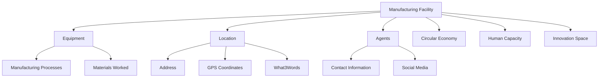

# OpenKnowWhere (OKW) Model

## Overview

The OpenKnowWhere data model represents manufacturing capabilities and facilities. It captures detailed information about manufacturing facilities, their equipment, processes, and capabilities to enable matching with hardware requirements specified in OKH.

## Core Classes

### 1. ManufacturingFacility
The primary class representing a manufacturing facility and its capabilities.

```python
@dataclass
class ManufacturingFacility:
    """Primary OKW Manufacturing Facility class"""
    name: str
    location: Location
    facility_status: FacilityStatus
    id: UUID = field(default_factory=uuid4)
    owner: Optional[Agent] = None
    contact: Optional[Agent] = None
    affiliations: List[Agent] = field(default_factory=list)
    opening_hours: Optional[str] = None
    description: Optional[str] = None
    date_founded: Optional[date] = None
    access_type: AccessType = AccessType.RESTRICTED
    wheelchair_accessibility: Optional[str] = None
    equipment: List[Equipment] = field(default_factory=list)
    manufacturing_processes: List[str] = field(default_factory=list)  # Wikipedia URLs
    typical_batch_size: Optional[BatchSize] = None
    floor_size: Optional[int] = None  # square meters
    storage_capacity: Optional[str] = None
    typical_materials: List[Material] = field(default_factory=list)
    certifications: List[str] = field(default_factory=list)
    backup_generator: bool = False
    uninterrupted_power_supply: bool = False
    road_access: bool = False
    loading_dock: bool = False
    maintenance_schedule: Optional[str] = None
    typical_products: List[str] = field(default_factory=list)
    partners_funders: List[Agent] = field(default_factory=list)
    
    # Sub-property collections
    circular_economy: CircularEconomy = field(default_factory=CircularEconomy)
    human_capacity: HumanCapacity = field(default_factory=HumanCapacity)
    innovation_space: InnovationSpace = field(default_factory=InnovationSpace)
```

#### Key Properties
- `name` - Name of the facility
- `location` - Physical location information
- `facility_status` - Current operational status
- `equipment` - List of available manufacturing equipment
- `manufacturing_processes` - List of supported processes (Wikipedia URLs)
- `typical_materials` - List of materials typically used or available
- `certifications` - Quality certifications and standards compliance

#### Key Methods
- `to_dict()` - Convert to dictionary representation
- `from_dict()` - Create a facility from a dictionary

### 2. Equipment
Detailed specification of manufacturing equipment.

```python
@dataclass
class Equipment:
    """Manufacturing equipment specification"""
    equipment_type: str  # Wikipedia URL reference
    manufacturing_process: str  # Wikipedia URL reference
    make: Optional[str] = None
    model: Optional[str] = None
    serial_number: Optional[str] = None
    location: Optional[Location] = None
    condition: Optional[str] = None
    notes: Optional[str] = None
    owner: Optional[Agent] = None
    quantity: Optional[int] = None
    throughput: Optional[str] = None
    power_rating: Optional[int] = None  # Watts
    materials_worked: List[Material] = field(default_factory=list)
    maintenance_schedule: Optional[str] = None
    usage_levels: Optional[str] = None
    tolerance_class: Optional[str] = None  # ISO 2768
    current_firmware: Optional[str] = None
    uninterrupted_power_supply: bool = False
    
    # Common specific properties
    axes: Optional[int] = None
    bed_size: Optional[int] = None  # mm
    build_volume: Optional[int] = None  # mm^3
    computer_controlled: bool = False
    extraction_system: bool = False
    laser_power: Optional[int] = None  # Watts
    nozzle_size: Optional[int] = None  # mm
    working_surface: Optional[int] = None  # mm
    x_travel: Optional[int] = None  # mm
    y_travel: Optional[int] = None  # mm
    z_travel: Optional[int] = None  # mm
    
    # Additional properties can be stored in this dict
    additional_properties: Dict[str, any] = field(default_factory=dict)
```

### 3. Location
Location information with multiple addressing options.

```python
@dataclass
class Address:
    """Location address information"""
    number: Optional[str] = None
    street: Optional[str] = None
    district: Optional[str] = None
    city: Optional[str] = None
    region: Optional[str] = None
    country: Optional[str] = None
    postcode: Optional[str] = None

@dataclass
class What3Words:
    """What3Words geolocation reference"""
    words: str
    language: str  # ISO 639-2 or ISO 639-3 language code

@dataclass
class Location:
    """Location information with multiple addressing options"""
    address: Optional[Address] = None
    gps_coordinates: Optional[str] = None  # Decimal degrees
    directions: Optional[str] = None
    what3words: Optional[What3Words] = None
    city: Optional[str] = None
    country: Optional[str] = None
```

### 4. Agent
Person or organization associated with a facility.

```python
@dataclass
class Contact:
    """Contact information"""
    landline: Optional[str] = None
    mobile: Optional[str] = None
    fax: Optional[str] = None
    email: Optional[str] = None
    whatsapp: Optional[str] = None

@dataclass
class SocialMedia:
    """Social media information"""
    facebook: Optional[str] = None
    twitter: Optional[str] = None
    instagram: Optional[str] = None
    other_urls: List[str] = field(default_factory=list)

@dataclass
class Agent:
    """Person or organization associated with a facility"""
    name: str
    location: Optional[Location] = None
    contact_person: Optional[str] = None
    bio: Optional[str] = None
    website: Optional[str] = None
    languages: List[str] = field(default_factory=list)  # ISO 639 codes
    mailing_list: Optional[str] = None
    images: List[str] = field(default_factory=list)
    contact: Optional[Contact] = field(default_factory=Contact)
    social_media: Optional[SocialMedia] = field(default_factory=SocialMedia)
```

### 5. Material
Material information with type, source and properties.

```python
@dataclass
class Material:
    """Material information"""
    material_type: str  # Wikipedia URL
    manufacturer: Optional[str] = None
    brand: Optional[str] = None
    supplier_location: Optional[Location] = None
```

### 6. Supporting Classes

Several additional classes provide specific information about facility capabilities:

```python
@dataclass
class CircularEconomy:
    """Circular economy related information"""
    applies_principles: bool = False
    description: Optional[str] = None
    by_products: List[str] = field(default_factory=list)

@dataclass
class HumanCapacity:
    """Human capacity information"""
    headcount: Optional[int] = None

@dataclass
class InnovationSpace:
    """Innovation space information"""
    staff: Optional[int] = None
    learning_resources: List[str] = field(default_factory=list)
    services: List[str] = field(default_factory=list)
    footfall: Optional[int] = None
    residencies: bool = False

@dataclass
class RecordData:
    """Information about the data record itself"""
    date_created: datetime
    created_by: Agent
    last_updated: Optional[datetime] = None
    updated_by: Optional[Agent] = None
    date_verified: Optional[datetime] = None
    verified_by: Optional[Agent] = None
    data_collection_method: Optional[str] = None
```

## Enums and Constants

### FacilityStatus
```python
class FacilityStatus(Enum):
    """Status of manufacturing facility"""
    ACTIVE = "Active"
    PLANNED = "Planned" 
    TEMPORARY_CLOSURE = "Temporary Closure"
    CLOSED = "Closed"
```

### AccessType
```python
class AccessType(Enum):
    """How manufacturing equipment is accessed"""
    RESTRICTED = "Restricted"
    RESTRICTED_PUBLIC = "Restricted with public hours"
    SHARED = "Shared space"
    PUBLIC = "Public"
    MEMBERSHIP = "Membership"
```

### BatchSize
```python
class BatchSize(Enum):
    """Typical batch size ranges"""
    SMALL = "0 -- 50 units"
    MEDIUM = "50 -- 500 units"
    LARGE = "500 -- 5000 units"
    XLARGE = "5000 + units"
```

## Data Flow



## Serialization

ManufacturingFacility and related classes support serialization to and from dictionaries:

### to_dict() Method
The `to_dict()` method converts the facility to a dictionary:

```python
def to_dict(self) -> Dict:
    """Convert to dictionary representation"""
    result = {
        "id": str(self.id),
        "name": self.name,
        "location": self.location.to_dict(),
        "facility_status": self.facility_status.value
    }
    
    # Add optional fields if they exist
    if self.owner:
        result["owner"] = self.owner.to_dict()
    if self.equipment:
        result["equipment"] = [e.to_dict() for e in self.equipment]
    # ... and so on for other fields
    
    return result
```

### from_dict() Method
The `from_dict()` class method creates a facility from a dictionary:

```python
@classmethod
def from_dict(cls, data: Dict) -> 'ManufacturingFacility':
    """Create a ManufacturingFacility instance from a dictionary"""
    # Parse required fields
    name = data.get('name', '')
    location_data = data.get('location', {})
    # ... parse location data
    
    # Create and return facility object
    facility = cls(
        name=name,
        location=location,
        facility_status=FacilityStatus(data.get('facility_status', 'Active'))
    )
    
    # Set optional fields if they exist in the data
    # ...
    
    return facility
```

## Best Practices

### 1. Equipment Documentation
- Use standard Wikipedia URLs for processes
- Document all equipment capabilities
- Include material compatibility
- Specify maintenance requirements

### 2. Location Information
- Provide multiple addressing methods
- Include qualitative directions when helpful
- Use standardized coordinate formats
- Consider accessibility information

### 3. Capability Specification
- Be explicit about process capabilities
- Document typical batch sizes
- Include quality certifications
- Specify material handling capabilities

### 4. Contact Management
- Maintain current contact information
- Include multiple contact methods
- Document language capabilities
- Include social media presence

### 5. Accuracy and Completeness
- Keep facility data up-to-date
- Document equipment specifications thoroughly
- Include location information
- Specify all manufacturing capabilities

## Example Usage

```python
# Create address and location
address = Address(
    street="123 Maker Street",
    city="Makerville",
    region="Makershire",
    country="Makerland",
    postcode="MK1 2AB"
)

location = Location(
    address=address,
    gps_coordinates="51.5074° N, 0.1278° W"
)

# Create contact information
contact_info = Contact(
    email="info@makerspace.com",
    mobile="+1234567890"
)

social = SocialMedia(
    facebook="https://facebook.com/makerspace",
    twitter="@makerspace"
)

# Create owner agent
owner = Agent(
    name="Maker Space Inc",
    website="https://makerspace.com",
    contact=contact_info,
    social_media=social
)

# Create facility
facility = ManufacturingFacility(
    name="Community Maker Space",
    location=location,
    facility_status=FacilityStatus.ACTIVE,
    owner=owner,
    access_type=AccessType.MEMBERSHIP,
    description="A community makerspace focused on 3D printing and CNC machining"
)

# Add equipment
facility.equipment.append(
    Equipment(
        equipment_type="https://en.wikipedia.org/wiki/3D_printing",
        manufacturing_process="https://en.wikipedia.org/wiki/Fused_filament_fabrication",
        make="Prusa",
        model="i3 MK3S+",
        materials_worked=[
            Material(
                material_type="https://en.wikipedia.org/wiki/Polylactic_acid",
                brand="Prusament"
            ),
            Material(
                material_type="https://en.wikipedia.org/wiki/Polyethylene_terephthalate",
                brand="PETG Filament"
            )
        ],
        build_volume=250000,  # 250mm x 210mm x 210mm
        nozzle_size=4,  # 0.4mm
        computer_controlled=True
    )
)

# Add CNC machine
facility.equipment.append(
    Equipment(
        equipment_type="https://en.wikipedia.org/wiki/CNC_router",
        manufacturing_process="https://en.wikipedia.org/wiki/Machining",
        make="Shapeoko",
        model="Pro",
        materials_worked=[
            Material(material_type="https://en.wikipedia.org/wiki/Wood"),
            Material(material_type="https://en.wikipedia.org/wiki/Acrylic")
        ],
        working_surface=600,  # 600mm x 600mm
        axes=3,
        computer_controlled=True
    )
)

# Add manufacturing processes
facility.manufacturing_processes = [
    "https://en.wikipedia.org/wiki/3D_printing",
    "https://en.wikipedia.org/wiki/Machining",
    "https://en.wikipedia.org/wiki/Laser_cutting"
]

# Add circular economy information
facility.circular_economy = CircularEconomy(
    applies_principles=True,
    description="We recycle 3D printing failures and offer material drop-off",
    by_products=["PLA scraps", "Wood shavings"]
)

# Add innovation space details
facility.innovation_space = InnovationSpace(
    staff=2,
    learning_resources=["Intro to 3D Printing", "CNC Basics Course"],
    services=["Design consultation", "Prototype development"],
    footfall=25,  # Average daily visitors
    residencies=True
)

# Convert to dictionary for storage or transmission
facility_dict = facility.to_dict()

# Recreate from dictionary
restored_facility = ManufacturingFacility.from_dict(facility_dict)
```

## Connecting OKW to the Matching Engine

The OKW model is designed to work with the Open Hardware Manager by providing detailed capability information that can be matched against OKH requirements. Each facility can be converted to normalized capabilities:

```python
def convert_to_capabilities(facility: ManufacturingFacility) -> List[Capability]:
    """Convert facility to list of capabilities for matching"""
    capabilities = []
    
    # Add equipment capabilities
    for equipment in facility.equipment:
        capability = Capability(
            name=equipment.equipment_type,
            type=equipment.manufacturing_process,
            parameters={
                "make": equipment.make,
                "model": equipment.model,
                "materials": [m.material_type for m in equipment.materials_worked],
                "computer_controlled": equipment.computer_controlled
            },
            limitations={}
        )
        
        # Add equipment-specific limitations
        if equipment.working_surface:
            capability.limitations["max_size"] = equipment.working_surface
        
        capabilities.append(capability)
    
    # Add process capabilities
    for process in facility.manufacturing_processes:
        capability = Capability(
            name=process,
            type=process,
            parameters={
                "facility": facility.name,
                "certifications": facility.certifications
            },
            limitations={}
        )
        capabilities.append(capability)
    
    return capabilities
```

When used with the Open Hardware Manager, OKW facilities can be matched with OKH requirements to generate valid manufacturing solutions in the form of Supply Trees.