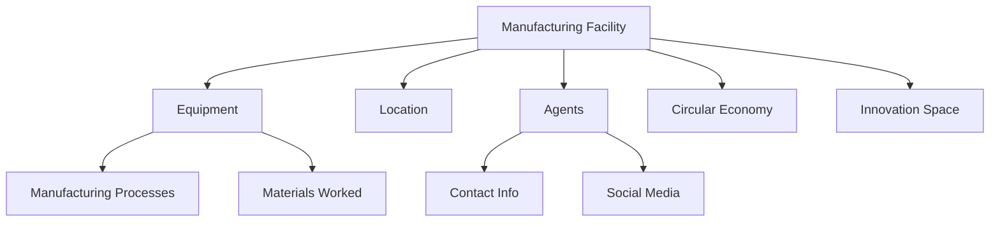

# OpenKnowWhere (OKW) Model

## Overview

The OpenKnowWhere data model represents manufacturing capabilities and facilities. It captures detailed information about manufacturing facilities, their equipment, processes, and capabilities to enable matching with hardware requirements specified in OKH.

## Core Classes

### 1. ManufacturingFacility
The primary class representing a manufacturing facility and its capabilities.

```python
@dataclass
class ManufacturingFacility:
    """Primary OKW Manufacturing Facility class"""
    name: str
    location: Location
    facility_status: FacilityStatus
    owner: Optional[Agent] = None
    contact: Optional[Agent] = None
    affiliations: List[Agent] = field(default_factory=list)
    equipment: List[Equipment] = field(default_factory=list)
    manufacturing_processes: List[str] = field(default_factory=list)
```

#### Key Properties
- `name` - Name of the facility
- `location` - Physical location information
- `facility_status` - Current operational status
- `equipment` - List of available manufacturing equipment
- `manufacturing_processes` - List of supported processes

### 2. Equipment
Detailed specification of manufacturing equipment.

```python
@dataclass
class Equipment:
    """Manufacturing equipment specification"""
    equipment_type: str  # Wikipedia URL reference
    manufacturing_process: str  # Wikipedia URL reference
    make: Optional[str] = None
    model: Optional[str] = None
    serial_number: Optional[str] = None
    condition: Optional[str] = None
    materials_worked: List[str] = field(default_factory=list)
```

### 3. Location
Location information with multiple addressing options.

```python
@dataclass
class Location:
    """Location information with multiple addressing options"""
    address: Optional[Dict[str, str]] = field(default_factory=dict)
    gps_coordinates: Optional[str] = None  # Decimal degrees
    directions: Optional[str] = None
    what3words: Optional[Dict[str, str]] = field(default_factory=dict)
    city: Optional[str] = None
    country: Optional[str] = None
```

### 4. Agent
Person or organization associated with a facility.

```python
@dataclass
class Agent:
    """Person or organization associated with a facility"""
    name: str
    location: Optional[Location] = None
    contact_person: Optional[str] = None
    bio: Optional[str] = None
    website: Optional[str] = None
    languages: List[str] = field(default_factory=list)
```

### 5. CircularEconomy
Circular economy related information.

```python
@dataclass
class CircularEconomy:
    """Circular economy related information"""
    applies_principles: bool = False
    description: Optional[str] = None
    by_products: List[str] = field(default_factory=list)
```

## Data Flow



## Enums and Constants

### FacilityStatus
```python
class FacilityStatus(Enum):
    """Status of manufacturing facility"""
    ACTIVE = "Active"
    PLANNED = "Planned" 
    TEMPORARY_CLOSURE = "Temporary Closure"
    CLOSED = "Closed"
```

### AccessType
```python
class AccessType(Enum):
    """How manufacturing equipment is accessed"""
    RESTRICTED = "Restricted"
    RESTRICTED_PUBLIC = "Restricted with public hours"
    SHARED = "Shared space"
    PUBLIC = "Public"
    MEMBERSHIP = "Membership"
```

### BatchSize
```python
class BatchSize(Enum):
    """Typical batch size ranges"""
    SMALL = "0 -- 50 units"
    MEDIUM = "50 -- 500 units"
    LARGE = "500 -- 5000 units"
    XLARGE = "5000 + units"
```

## Best Practices

### 1. Equipment Documentation
- Use standard Wikipedia URLs for processes
- Document all equipment capabilities
- Include material compatibility
- Specify maintenance requirements

### 2. Location Information
- Provide multiple addressing methods
- Include qualitative directions when helpful
- Use standardized coordinate formats
- Consider accessibility information

### 3. Capability Specification
- Be explicit about process capabilities
- Document typical batch sizes
- Include quality certifications
- Specify material handling capabilities

### 4. Contact Management
- Maintain current contact information
- Include multiple contact methods
- Document language capabilities
- Include social media presence

## Future Considerations

### 1. Enhanced Capability Matching
- AI-powered capability assessment
- Automated equipment classification
- Real-time availability tracking
- Dynamic capacity planning

### 2. Resource Management
- Integrated scheduling systems
- Resource availability tracking
- Capacity optimization
- Network load balancing

### 3. Quality Assurance
- Automated capability verification
- Quality certification tracking
- Process monitoring integration
- Performance analytics

## Example Usage

```python
# Create a basic manufacturing facility
location = Location(
    address={
        "street": "123 Maker Street",
        "city": "Makerville",
        "country": "Makerland"
    },
    gps_coordinates="51.5074° N, 0.1278° W"
)

owner = Agent(
    name="Maker Space Inc",
    contact=Contact(
        email="info@makerspace.com",
        mobile="+1234567890"
    )
)

facility = ManufacturingFacility(
    name="Community Maker Space",
    location=location,
    facility_status=FacilityStatus.ACTIVE,
    owner=owner,
    access_type=AccessType.MEMBERSHIP,
    description="A community makerspace focused on 3D printing and CNC machining"
)

# Add equipment
facility.equipment.append(
    Equipment(
        equipment_type="https://en.wikipedia.org/wiki/3D_printing",
        manufacturing_process="https://en.wikipedia.org/wiki/Fused_filament_fabrication",
        make="Prusa",
        model="i3 MK3S+",
        materials_worked=["PLA", "PETG", "ABS"]
    )
)

# Validate the facility data
facility.validate()
```