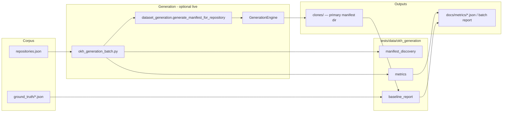

# Spec: OKH Generation Quality Harness & Materials Checks

## Status

Implemented (Phases 1–4) — package restored; Materials heuristics + unit tests;
batch hardened (progress / per-repo timeout / incremental report); core canary
refreshed into `clones/` with Materials baseline at
`docs/metrics/okh_generation_materials_baseline.json`. Phase 5 (pipeline fix) remains.

## Date

2026-07-10

## Context

`generate-from-url` converts unformatted open-hardware repos into OKH manifests via a
4-layer pipeline (direct → heuristic → NLP → LLM). Output quality for **Materials** is
unreliable: case/plural near-duplicates (`Cable` / `cables`) and prose or markdown BOM
table rows ingested as materials.

A systematic eval harness was designed (Issue 1.3.1) and wired into scripts under
`scripts/okh_generation_*.py`, but the supporting package `tests/data/okh_generation/`
was **never committed** to any branch. Scripts import modules that do not exist; checked-in
baselines report `compared_count: 0`.

This spec defines what to rebuild, how it runs, and which files change — before any
pipeline fix for Materials.

### Map anchors (`.repo-map.md`)

| Concern | Location |
|---------|----------|
| Batch / baseline / layer / chunked scripts | `scripts/okh_generation_*.py` |
| Programmatic generate-from-url | `src/core/generation/dataset_generation.py` |
| Orchestration + BOM→materials | `src/core/generation/engine.py` |
| Heuristic materials scrape | `src/core/generation/layers/heuristic.py` |
| LLM materials prompt | `src/core/generation/layers/llm.py` |
| Field normalize / exact `material_id` dedup | `src/core/generation/models.py` (`_normalize_materials`) |
| In-pipeline field confidence | `src/core/generation/quality.py` (`QualityAssessor`) |
| BOM collect / component dedup | `src/core/generation/bom_models.py` |
| MaterialSpec model | `src/core/models/okh.py` |
| Pytest marker | `pyproject.toml` → `okh_dataset` |
| Clones gitignore | `.gitignore` → `tests/data/okh_generation/clones/` |

Parallel pattern (also referenced in docs, currently absent locally): matching accuracy
under `tests/data/matching/` — same “dataset package + scripts + metrics JSON” shape.

---

## Goals

1. **Restore the import contract** so existing scripts run without inventing new CLIs.
2. **Measure generation quality** with deterministic heuristics (no LLM required for scoring).
3. **Add Materials-specific heuristics** that catch the two known failure classes.
4. **Support optional ground-truth comparison** for a small core set (**blocking fields only**
   for repo-001/002). Materials are scored via heuristics/fixtures, not GT allowlists, in v1.
5. **Keep clones / large manifests out of git**; commit code + small fixtures only.
   Primary on-disk location for generated manifests is `tests/data/okh_generation/clones/`
   (gitignored).

### Non-goals (this phase)

- Fixing Materials extraction/normalization in the generation pipeline (follow-on).
- Expanding ground truth to all 26 canary repos (roadmap deferred Phase B2).
- Replacing `QualityAssessor` or changing the 4-layer engine API.
- Live Azure blob as the source of truth for CI (use local fixtures / generated clones).

---

## How it works



### Three evaluation modes

| Mode | Trigger | Needs LLM? | Purpose |
|------|---------|------------|---------|
| **A. Unit / fixture** | `pytest -m okh_dataset` (or unit tests of metrics) | No | Lock heuristic behaviour on tiny synthetic manifests |
| **B. Offline score** | `okh_generation_baseline_report.py` / `layer_compare.py` | No | Score manifests already on disk vs ground truth / each other |
| **C. Live canary** | `okh_generation_batch.py` (+ optional chunked eval) | Optional | Regenerate canary set; attach `heuristic_quality` per repo |

Materials checks land in **mode A + B first** (fast feedback), then ride along in **mode C**
via the same `heuristic_manifest_quality` dict the batch script already records.

---

## Package layout (create)

```
tests/data/okh_generation/
  __init__.py
  README.md
  repositories.json          # canary corpus metadata (26 repos)
  metrics.py                 # heuristic_manifest_quality, heuristic_layer_comparison
  baseline_report.py         # load_repositories_dataset, build_baseline_report
  manifest_discovery.py      # path/slug helpers + canonical_repo_url
  ground_truth/
    repo-001.json            # minimal blocking-field GT (rover)
    repo-002.json            # minimal blocking-field GT (openflexure)
  fixtures/                  # tiny synthetic manifests for unit tests
    materials_near_dup.json
    materials_prose.json
    materials_clean.json
  clones/                    # gitignored generated manifests
```

`tests/data/` also needs `__init__.py` so `tests.data.okh_generation` is importable.

---

## Import contract (must satisfy existing scripts)

### `manifest_discovery.py`

| Symbol | Used by | Behaviour |
|--------|---------|-----------|
| `canonical_repo_url(url: str) -> str` | `matching_batch.py` | Normalize host/path (strip `.git`, trailing slash, lowercase host) for join keys |
| `title_slug_for_filename(title: str, fallback_id: str) -> str` | `okh_generation_batch.py` | Kebab-case slug from title; fallback to dataset id |
| `allocate_unique_slug(base: str, used: set[str]) -> str` | batch | Ensure unique stem within a run (`-2`, `-3`, …) |
| `find_generated_manifest_path(dir, layer, url, dataset_id=…) -> Path \| None` | batch, layer_compare | Resolve title-slug or legacy `<id>-<layer>.json` |

### `metrics.py`

| Symbol | Used by | Required keys / behaviour |
|--------|---------|---------------------------|
| `heuristic_manifest_quality(manifest: dict) -> dict` | batch | See schema below |
| `heuristic_layer_comparison(m3: dict, m4: dict) -> dict` | layer_compare | Per-field / summary deltas between 3L and 4L |

#### `heuristic_manifest_quality` schema (v1)

**Existing consumers require:**

| Key | Type | Consumer |
|-----|------|----------|
| `generation_confidence` | `float` 0–1 | batch stdout, chunked eval |
| `function_suspected_license_leak` | `bool` | batch stdout |
| `has_title` | `bool` | chunked presence proxy |
| `has_version` | `bool` | chunked presence proxy |
| `has_function` | `bool` | chunked presence proxy |
| `has_description` | `bool` | chunked presence proxy |

**Materials extensions (add now; chunked eval may ignore until wired):**

| Key | Type | Meaning |
|-----|------|---------|
| `materials_count` | `int` | `len(materials)` |
| `materials_near_dup_pairs` | `int` | Case/plural/whitespace near-duplicates among `name` / `material_id` |
| `materials_prose_like_count` | `int` | Entries that look like sentences, markdown tables, or paths |
| `materials_quality_score` | `float` 0–1 | `1 - penalties` (documented formula in module docstring) |

Near-dup rule (initial): normalize with `casefold()`, strip, collapse whitespace; treat
singular/plural via simple trailing-`s` stem equality; count unordered pairs with distinct
surface forms.

Prose-like rule (initial) — flag if any of:

- word count ≥ 8, or length > 90
- contains markdown table pipes `|` as structure
- looks like a sentence (ends with `.` and ≥ 5 words)
- contains `http://` / `https://` (supplier link rows)
- matches instructional openers (`make sure`, `in case you`, `you could`, `you will`)

Tune thresholds in unit tests against `fixtures/`; do not call an LLM.

### `baseline_report.py`

| Symbol | Used by | Behaviour |
|--------|---------|-----------|
| `load_repositories_dataset(path) -> dict` | batch, layer_compare | Load + light-validate `repositories.json` |
| `build_baseline_report(repo_root, *, layer, repositories_json, manifests_dir) -> dict` | baseline_report script | Emit schema matching `docs/metrics/okh_generation_baseline.json` |

#### Baseline report statuses

| Status | When |
|--------|------|
| `skipped_no_ground_truth` | `ground_truth_path` null/missing |
| `skipped_no_generated_manifest` | GT exists but no manifest on disk |
| `compared` | Both present; compute blocking metrics |

#### Blocking metrics (Phase B3 contract from existing JSON)

- `blocking_accuracy` — agreement on a fixed set of blocking fields vs GT
  (minimum: `title`, `version`, `function`; license shape if present in GT)
- `blocking_presence_completeness` — fraction of blocking fields non-empty in generated
- Aggregate: `avg_blocking_accuracy_compared`, `avg_blocking_presence_completeness_compared`,
  `compared_count`, `by_documentation_quality`, `by_domain`

Materials are **not** blocking fields in v1 baseline accuracy (too noisy until extraction
improves). Materials heuristics are reported under each repo row’s optional
`heuristic_quality` / summary bucket `materials_heuristics` once fixtures exist.

### `repositories.json`

Reconstruct from `docs/metrics/okh_generation_baseline.json` `repos[]` entries:

- `id`, `url`, `platform`, `platform_supported`
- `documentation_quality`, `domain`, `project_structure`
- `ground_truth_path` (only repo-001, repo-002 initially)
- Optional: `core_for_regression: true` for the subset batch `--core-only` should prefer
  (recommend: repos with GT + known Materials offenders: BHA centrifuge/stirrer/thermocycler,
  rover, openflexure, iris-case, efekta)

---

## Tests that must exist

### Unit (fast, always in CI)

| Test module | Asserts |
|-------------|---------|
| `tests/unit/test_okh_generation_metrics.py` | Presence flags; license-leak heuristic; near-dup / prose counters on fixtures |
| `tests/unit/test_okh_generation_manifest_discovery.py` | Slug uniqueness; legacy vs title-slug path resolution; URL canonicalization |
| `tests/unit/test_okh_generation_baseline_report.py` | Status matrix; empty compared_count; happy-path compared row shape |

Marker: plain unit tests (no network). Optionally also mark with `okh_dataset` where useful.

### Dataset regression (optional / manual or nightly)

| Test | Asserts |
|------|---------|
| Parametrized over `core_for_regression` manifests in `clones/` if present | `materials_near_dup_pairs == 0` and `materials_prose_like_count == 0` **after** pipeline fixes; until then, skip or expect-fail with documented baseline |

### CI policy

Every PR runs **unit tests only** (`tests/unit/test_okh_generation_*.py`). Those lock
metric behaviour on fixtures — not live canary scores.

Offline baseline / layer-compare / live batch are **manual or nightly** (not PR-blocking).
Do not fail main CI on Materials heuristic counts from generated clones until Phase 5
pipeline fixes land and a separate gate is explicitly added.

### Script smoke (dev)

Documented in package README:

```bash
uv run python scripts/okh_generation_baseline_report.py --stdout
uv run python scripts/okh_generation_layer_compare.py --stdout
# live (optional):
uv run python scripts/okh_generation_batch.py --core-only --no-llm --stdout-summary
```

---

## Files to touch

### Create

| Path | Role |
|------|------|
| `tests/data/__init__.py` | Package root |
| `tests/data/okh_generation/__init__.py` | Package |
| `tests/data/okh_generation/README.md` | How to run modes A–C |
| `tests/data/okh_generation/repositories.json` | Canary corpus |
| `tests/data/okh_generation/metrics.py` | Heuristics + Materials extensions |
| `tests/data/okh_generation/baseline_report.py` | Dataset load + baseline builder |
| `tests/data/okh_generation/manifest_discovery.py` | Path / URL helpers |
| `tests/data/okh_generation/ground_truth/repo-001.json` | Rover blocking GT (hand-authored) |
| `tests/data/okh_generation/ground_truth/repo-002.json` | OpenFlexure blocking GT |
| `tests/data/okh_generation/fixtures/*.json` | Materials metric fixtures |
| `tests/unit/test_okh_generation_metrics.py` | Unit tests |
| `tests/unit/test_okh_generation_manifest_discovery.py` | Unit tests |
| `tests/unit/test_okh_generation_baseline_report.py` | Unit tests |
| `docs/testing/okh-generation-quality-spec.md` | This spec |

### Update (minimal)

| Path | Change |
|------|--------|
| `scripts/okh_generation_batch.py` | Default `--output-dir` / `--report` back to `tests/data/okh_generation/clones` (and sibling report path); drop `tmp/oshwa` as primary |
| `scripts/okh_generation_baseline_report.py` | Confirm defaults already point at `clones/` + package paths |
| `scripts/okh_generation_layer_compare.py` | Confirm `--clones-dir` default remains `tests/data/okh_generation/clones` |
| `scripts/matching_batch.py` | Keep default clones dir aligned |
| `docs/llm/chunked-mode.md` | Point “Batch Testing README” at restored package; note Materials keys; clones as primary |
| `docs/testing/workflows/wf03-okh-generation-from-url.md` | Cross-link this harness (eval ≠ e2e WF-3) |
| `scripts/README.md` | Confirm package prerequisite one-liner |
| `.gitignore` | Keep `clones/`; ensure fixtures/ground_truth are **not** ignored |
| `docs/metrics/okh_generation_baseline.json` | Regenerate after package works (not hand-edited) |

### Do not change in the harness slice

| Path | Why |
|------|-----|
| `src/core/generation/layers/heuristic.py` | Extraction fix is a separate change |
| `src/core/generation/models.py` `_normalize_materials` | Dedup fix is a separate change |
| `src/core/generation/engine.py` | BOM materials policy change is separate |
| `src/core/generation/quality.py` | Different concern (field confidence at generate time) |
| `harness/` | Service parity loops; not generation content quality |

### Follow-on (out of this spec’s implementation PR, but tracked)

| Path | Change |
|------|--------|
| `src/core/generation/models.py` | Case/plural Materials dedup |
| `src/core/generation/layers/heuristic.py` / BOM path | Reject prose / table rows |
| `scripts/okh_generation_chunked_evaluation.py` | Optional gate on `materials_*` deltas |
| `tests/parity/manifest.py` | Only if a new service/CLI surface is exposed |

---

## Phased delivery

| Phase | Deliverable | Done when |
|-------|-------------|-----------|
| **0. Spec** | This document | Reviewed |
| **1. Package skeleton** | Modules + `repositories.json` + empty/minimal GT stubs | Scripts import without `ModuleNotFoundError` |
| **2. Metrics + unit tests** | Presence/confidence/leak + Materials heuristics + fixtures | `pytest tests/unit/test_okh_generation_*.py` green (PR CI) |
| **3. Baseline report** | `build_baseline_report` matches schema; **blocking-only** GT for repo-001/002 | Offline score runs; `compared_count ≥ 1` when manifests present under `clones/` |
| **4. Canary refresh** | Batch `--core-only` writes to `clones/`; regenerate `docs/metrics/*` | Documented Materials baseline numbers from canary (manual/nightly) |
| **5. Pipeline fix** (separate) | Dedup + prose filters | Materials heuristic counts drop on canary; unit regression tests flip to assert zero |

---

## Acceptance criteria (Phases 1–3)

- [ ] `from tests.data.okh_generation.metrics import heuristic_manifest_quality` works in-repo
- [ ] All four `scripts/okh_generation_*.py` entrypoints start (offline modes succeed without LLM)
- [ ] Batch / baseline / layer-compare default to `tests/data/okh_generation/clones`
- [ ] Ground truth for repo-001/002 is blocking fields only (`title`, `version`, `function`; license if present)
- [ ] Unit tests cover near-dup and prose fixtures derived from real canary artifacts
  (Cable/cables; centrifuge instructional line; stirrer table row)
- [ ] PR CI runs those unit tests only; no live canary gate
- [ ] `clones/` remains gitignored; fixtures and ground truth are committed
- [ ] Spec and package README describe how Materials scores relate to later pipeline work

---

## Decisions

Resolved 2026-07-10:

1. **Ground-truth depth** — blocking fields only for repo-001/002. No Materials allowlist in GT for v1; Materials quality is measured only via heuristics / fixtures.
2. **Manifest output dir** — restore `tests/data/okh_generation/clones` as the primary default for batch, baseline, layer-compare, and matching_batch. `tmp/oshwa/okh-manifests` is not the harness default (may remain a manual override).
3. **CI policy** — every PR runs unit metrics/discovery/baseline-shape tests only. Live canary and offline corpus scoring are manual/nightly and not PR-blocking.
