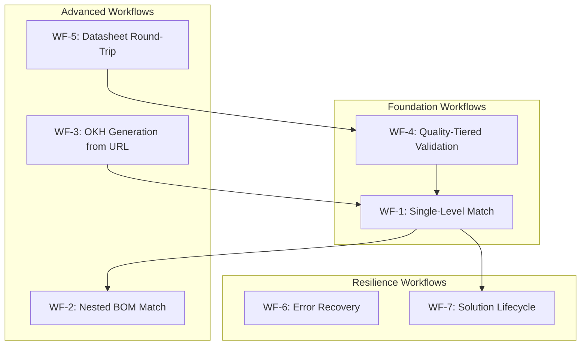

# Canonical Test Workflows

**Document Status**: Living Document
**Created**: February 2026
**Purpose**: Define automation-ready test workflows for the design-to-manufacturing pipeline

---

## Overview

This directory contains **7 canonical test workflows** that cover the complete OHM (Open Hardware Manager) design-to-manufacturing pipeline. Each workflow is:

- **Automation-ready**: Structured to map directly to pytest test cases (see Issue 1.1.3)
- **Parameterized**: Designed for multiple input variations per workflow
- **Observable**: Includes specific assertions, performance targets, and success criteria
- **Traceable**: Links back to source code, test data, and related issues

These workflows serve as the **single source of truth** for what "correct behaviour" means across the system, and as the specification that drives automated end-to-end tests.

---

## Workflow Index

| ID | Name | Category | Markers | Key Services | Status |
|----|------|----------|---------|--------------|--------|
| [WF-1](wf01-single-level-matching.md) | Single-Level Matching | Foundation | `@pytest.mark.e2e` | `MatchingService` | **PASSING** (69/69) |
| [WF-2](wf02-nested-bom-matching.md) | Nested BOM Matching | Advanced | `@pytest.mark.e2e`, `@pytest.mark.slow` | `MatchingService`, `BOMResolutionService` | **PASSING** (68/68) |
| [WF-3](wf03-okh-generation-from-url.md) | OKH Generation from URL | Advanced | `@pytest.mark.e2e`, `@pytest.mark.llm` | `OKHService`, `GenerationEngine` | **PASSING** (33/34, 1 skip) |
| [WF-4](wf04-quality-tiered-validation.md) | Quality-Tiered Validation | Foundation | `@pytest.mark.e2e` | `ValidationContext`, domain validators | **PASSING** (23/23) |
| [WF-5](wf05-datasheet-round-trip.md) | Datasheet Round-Trip | Advanced | `@pytest.mark.e2e` | `DatasheetConverter` | Not started |
| [WF-6](wf06-error-recovery.md) | Error Recovery | Resilience | `@pytest.mark.e2e` | All services | Not started |
| [WF-7](wf07-solution-lifecycle.md) | Solution Lifecycle | Resilience | `@pytest.mark.e2e` | `StorageService` | Not started |

---

## Workflow Relationships



**Dependency reading**: An arrow from A to B means "A produces outputs that B consumes or A must pass before B is meaningful."

- **WF-4** (validation) feeds into **WF-1** -- matching requires a valid OKH manifest.
- **WF-1** (single-level) is the foundation for **WF-2** (nested) and **WF-7** (solution lifecycle).
- **WF-3** (generation) produces OKH manifests that feed into **WF-1** (matching).
- **WF-5** (datasheet) round-trips through **WF-4** (validation) to verify fidelity.

---

## Workflow Categories

### Foundation Workflows

These must pass before any advanced workflow is meaningful. They test the core primitives: validation and single-level matching.

### Advanced Workflows

These build on foundation workflows to test complex multi-step pipelines: nested BOM matching, LLM-powered generation, and format conversion.

### Resilience Workflows

These test system behaviour under failure conditions and across lifecycle boundaries: error recovery, graceful degradation, and solution persistence.

---

## Pytest Integration

### Markers

All workflow tests use these pytest markers:

- `@pytest.mark.e2e` -- All canonical workflow tests
- `@pytest.mark.slow` -- Tests that take more than 10 seconds (nested matching, LLM generation)
- `@pytest.mark.llm` -- Tests that require LLM API access (mock in CI, real in nightly)

### Target Test Structure

```
tests/e2e/
    conftest.py                              # Shared fixtures
    test_wf01_single_level_matching.py
    test_wf02_nested_bom_matching.py
    test_wf03_okh_generation.py
    test_wf04_quality_tiered_validation.py
    test_wf05_datasheet_round_trip.py
    test_wf06_error_recovery.py
    test_wf07_solution_lifecycle.py
```

### Running Workflows

```bash
# All e2e workflows
pytest tests/e2e/ -m e2e

# Foundation only
pytest tests/e2e/test_wf01*.py tests/e2e/test_wf04*.py

# Skip LLM-dependent tests in CI
pytest tests/e2e/ -m "e2e and not llm"

# Skip slow tests for fast feedback
pytest tests/e2e/ -m "e2e and not slow"
```

---

## Workflow Document Template

Every workflow document follows this structure:

```markdown
## Workflow: WF-N: [Name]

### Overview
[Brief description of what this workflow validates]

### Prerequisites
- **Fixtures**: [pytest fixtures needed]
- **Test data**: [specific files from synthetic_data/ or tests/data/]
- **Services**: [which services must be initialized]

### Steps
1. [Action] -> [Expected result]
2. ...

### Assertions
[Grouped by category: functional, structural, scoring]

### Parameterization
[Input variations to test, as a table]

### Performance Targets
[Timing expectations per step and overall]

### LLM Handling
[Mock strategy for CI, real strategy for nightly -- if applicable]

### Edge Cases
[Boundary conditions specific to this workflow]

### Gap Flags
[What test data or features Issue 1.1.2 / other issues need to provide]

### Pytest Mapping
- **Target file**: tests/e2e/test_wfNN_name.py
- **Fixtures**: [list]
- **Markers**: [list]
- **Parameterize**: [list of parameter axes]
```

---

## Data Dependencies

### Existing Synthetic Data (`synthetic_data/`)

| Design Type | OKH Files | Processes |
|-------------|-----------|-----------|
| 3D-printed prosthetic hand | 5 versions | 3DP, Post-processing, Assembly |
| Arduino IoT sensor node | 9 versions | PCB, 3DP, Assembly |
| CNC machined aluminum bracket | 7 versions | CNC, Deburring, Anodizing |
| Laser-cut acrylic display case | 17 versions | LASER, Assembly |
| Sheet metal enclosure | 10 versions | SHEET, Welding, Painting |

| Facility Type | OKW Files | Capabilities |
|---------------|-----------|--------------|
| Rapid prototyping lab | 4 | FFF 3D printing, SLA, CNC milling |
| Professional machine shop | 7 | CNC milling, CNC turning, grinding (+ augmented variants with 3DP/Post-proc/Assembly/Laser/Sheet) |
| Electronics assembly house | 7 | PCB fabrication, SMT, THT, testing |
| Community makerspace | 3 | 3D printing, laser cutting, basic CNC |
| Industrial manufacturing plant | 4 | CNC, sheet metal, welding (+ augmented with painting) |
| Full-Service CNC Shop | 1 | CNC milling, deburring, anodizing |
| Laser Fabrication Lab | 3 | Laser cutting, assembly (+ augmented with CNC/sheet/welding/painting) |

**Total**: ~48 OKH files, 29 OKW files, 3 edge-case files

### Edge-Case Test Files

| File | Purpose | For Workflow |
|------|---------|-------------|
| `minimal-okh-test.json` | Bare-minimum valid OKH (required fields only) | WF-4, WF-6 |
| `unmatchable-okh-test.json` | OKH with exotic process (`quantum_lithography`) | WF-6 |
| `empty-equipment-okw-test.json` | OKW facility with no equipment | WF-6 |

### Remaining Test Data Gaps (for Issue 1.1.2)

- ~~OKH manifests with exotic/unmatchable manufacturing processes~~ (done: `unmatchable-okh-test.json`)
- ~~OKH manifests at intentionally different completeness levels~~ (done: `minimal-okh-test.json`)
- ~~OKH manifests with 2+ levels of nested sub-parts~~ (existing data already has 2-level nesting; WF-2 tests pass)
- Malformed OKH/OKW files (invalid JSON, missing required fields, wrong types) (needed for WF-6)
- OKH manifests with no manufacturing_processes field (needed for WF-6)

---

## Related Issues

- **Issue 1.1.1**: This document (canonical workflow definitions) -- **COMPLETE**
- **Issue 1.1.2**: Test dataset creation (fills gaps flagged by workflows) -- **IN PROGRESS** (synthetic data expanded, edge cases created)
- **Issue 1.1.3**: Automated test framework (implements these workflows as pytest tests) -- **IN PROGRESS** (WF-1, WF-2, WF-3, WF-4 implemented)
- **Issue 1.1.4**: Performance benchmarks (uses performance targets from workflows) -- Not started

## Progress Log

- **2026-02-12**: WF-1 through WF-7 workflow documents created (Issue 1.1.1 complete)
- **2026-02-12**: WF-1 E2E tests implemented (`test_wf01_single_level_matching.py`, 69 tests)
- **2026-02-12**: Fixed namespace mismatch bug in `_can_satisfy_requirements` (URI normalization)
- **2026-02-12**: Fixed URI gating bug in `_generate_supply_tree` (scoring normalization)
- **2026-02-13**: Expanded synthetic data: added 5 new facility templates, 10 matched OKH+OKW pairs, 3 edge-case files
- **2026-02-13**: Fixed `--match` reconciliation in `generate_synthetic_data.py` for manufacturing domain
- **2026-02-13**: WF-1 suite: 69 passed, 0 failed, 0 skipped, 0 xfailed
- **2026-02-13**: Changed `match_with_nested_components` return type to `Set[SupplyTreeSolution]` for consistency
- **2026-02-13**: WF-2 E2E tests implemented (`test_wf02_nested_bom_matching.py`, 68 tests)
- **2026-02-13**: WF-2 suite: 68 passed, 0 failed, 0 skipped, 0 xfailed
- **2026-02-13**: WF-4 E2E tests implemented (`test_wf04_quality_tiered_validation.py`, 23 tests)
- **2026-02-13**: WF-4 suite: 23 passed, 0 failed, 0 skipped (0.06s)
- **2026-02-13**: Surfaced known gap: validator rejects TSDC short codes as invalid manufacturing processes (expects Wikipedia URIs)
- **2026-02-13**: Created canonical ProcessTaxonomy (`src/core/taxonomy/process_taxonomy.py`) as single source of truth for process identification
- **2026-02-13**: Refactored all 6 normalization sites to delegate to ProcessTaxonomy
- **2026-02-13**: Fixed validator gap: TSDC codes, Wikipedia URIs, and plain names now all accepted
- **2026-02-13**: Process taxonomy tests: 164 passed (TSDC codes, Wikipedia URIs, plain names, hierarchy, edge cases)
- **2026-02-13**: All existing E2E tests confirmed passing after taxonomy consolidation (WF-1: 69, WF-2: 68, WF-4: 23)
- **2026-02-14**: WF-3 E2E tests implemented (`test_wf03_okh_generation.py`, 34 tests across 9 test classes)
- **2026-02-14**: Verified LLM infrastructure: Anthropic (cloud) and Ollama (local) providers both working
- **2026-02-14**: 3-layer graceful degradation confirmed: system produces valid manifests without LLM layer
- **2026-02-14**: 4-layer generation confirmed: Anthropic and Ollama both produce parseable OKH manifests
- **2026-02-14**: WF-3 suite: 33 passed, 0 failed, 1 skipped (matching skip: no manufacturing_processes in 3-layer output)
